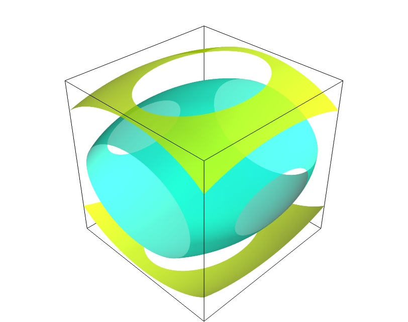
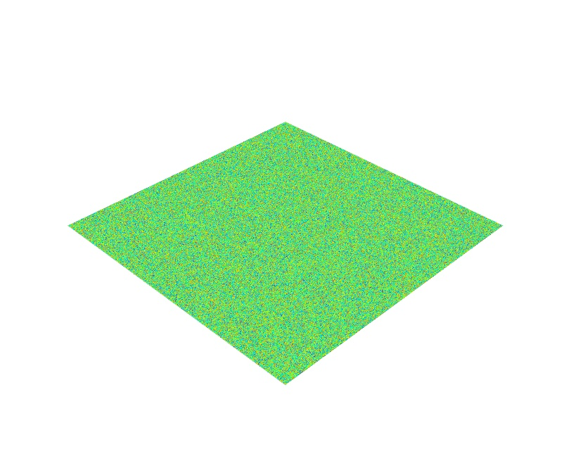
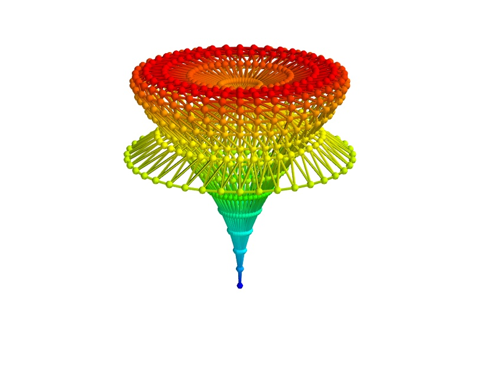
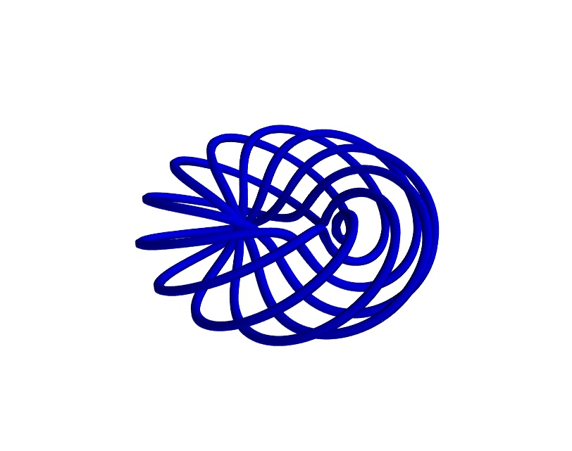
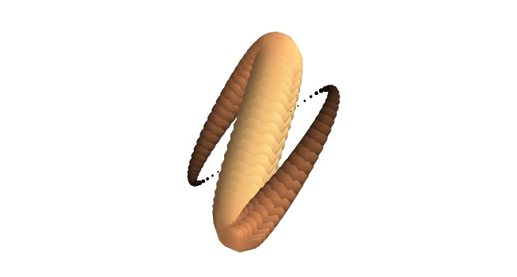
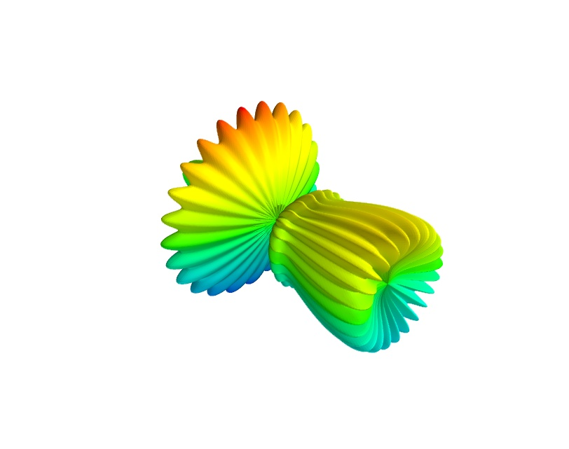
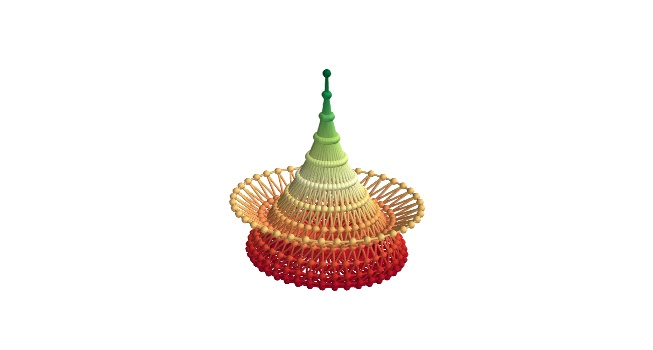
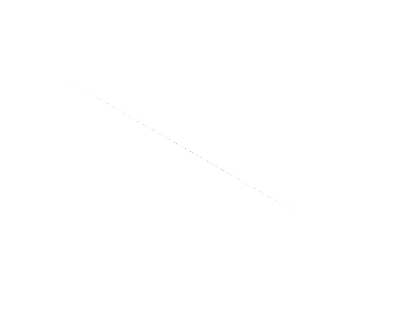

==============
Mayavi - MLab
==============

This is not a documentation as the API is not fixed. This should be
considered as a window to the progress on mlab. Function calls and
behavior are likely to change at any moments.

Report generated on Wed Jan  2 15:53:44 2008

Helper functions
=================

contour3d
--------------------------

Documentation::

    
    Plots iso-surfaces for a 3D volume of data suplied as arguments.
    
    Function signatures
    -------------------
    
        contour3d(scalars, ...)
        contour3d(scalarfield, ...)
    
    Keyword arguments
    -----------------
    
        opacity -- The overall opactiy of the vtk object.
                   
        colormap -- type of colormap to use.
                    
        vmin -- vmin is used to scale the colormap
                If None, the min of the data will be used
                
        color -- the color of the vtk object. Overides the colormap,
                 if any, when specified.
                 
        contours -- Integer/list specifying number/list of
                    contours. Specifying 0 shows no contours.
                    Specifying a list of values will only give the
                    requested contours asked for.
                    
        extent -- [xmin, xmax, ymin, ymax, zmin, zmax]
                  Default is the x, y, z arrays extents.
                  
        vmax -- vmax is used to scale the colormap
                If None, the max of the data will be used
                
        transparent -- make the opacity of the actor depend on the
                       scalar.
                       
        name -- the name of the vtk object created.
                

Example::

    def test_contour3d():
        dims = [64, 64, 64]
        xmin, xmax, ymin, ymax, zmin, zmax = [-5,5,-5,5,-5,5]
        x, y, z = numpy.ogrid[xmin:xmax:dims[0]*1j,
                              ymin:ymax:dims[1]*1j,
                              zmin:zmax:dims[2]*1j]
        x = x.astype('f')
        y = y.astype('f')
        z = z.astype('f')
    
        sin = numpy.sin
        scalars = x*x*0.5 + y*y + z*z*2.0
    
        obj = contour3d(scalars, contours=4, transparent=True)
        return obj, scalars
    

contour_surf
--------------------------

Documentation::

    
    Plots a the contours of asurface using grid spaced data supplied as 2D
    arrays.
    
    Function signatures
    -------------------
    
        contour_surf(s, ...)
        contour_surf(x, y, s, ...)
        contour_surf(x, y, f, ...)
    
    If only one array s is passed the x and y arrays are assumed to be made
    of the indices of s.
    s is the elevation matrix.
    
    Keyword arguments
    -----------------
    
        opacity -- The overall opactiy of the vtk object.
                   
        colormap -- type of colormap to use.
                    
        color -- the color of the vtk object. Overides the colormap,
                 if any, when specified.
                 
        extent -- [xmin, xmax, ymin, ymax, zmin, zmax]
                  Default is the x, y, z arrays extents.
                  
        vmax -- vmax is used to scale the colormap
                If None, the max of the data will be used
                
        transparent -- make the opacity of the actor depend on the
                       scalar.
                       
        warp_scale -- scale of the warp scalar
                      
        name -- the name of the vtk object created.
                
        vmin -- vmin is used to scale the colormap
                If None, the min of the data will be used
                
        contours -- Integer/list specifying number/list of
                    contours. Specifying 0 shows no contours.
                    Specifying a list of values will only give the
                    requested contours asked for.
                    

.. image:: contour_surf.jpg

Example::

    def test_contour_surf():
        """Test contour_surf on regularly spaced co-ordinates like MayaVi."""
        def f(x, y):
            sin, cos = numpy.sin, numpy.cos
            return sin(x+y) + sin(2*x - y) + cos(3*x+4*y)
    
        x, y = numpy.mgrid[-7.:7.05:0.1, -5.:5.05:0.05]
        s = contour_surf(x, y, f)
        return s
    

flow
--------------------------

Documentation::

    
    Creates streamlines following the flow of a vector field.
    
    Function signatures
    -------------------
    
        flow(u, v, w, ...)
        flow(x, y, z, u, v, w, ...)
        flow(x, y, z, f, ...)
    
    If only 3 arrays u, v, w are passed the x, y and z arrays are assumed to be
    made from the indices of vectors.
    
    If the x, y and z arrays are passed they are supposed to have been
    generated by `numpy.mgrid`. The function builds a scalar field assuming
    the points are regularily spaced.
    
    If 4 positional arguments are passed the last one must be a callable, f,
    that returns vectors.
    
    Keyword arguments
    -----------------
    
        opacity -- The overall opactiy of the vtk object.
                   
        extent -- [xmin, xmax, ymin, ymax, zmin, zmax]
                  Default is the x, y, z arrays extents.
                  
        colormap -- type of colormap to use.
                    
        seedtype -- the widget used as a seed for the streamlines. Must be
                    'line' or 'plane' or 'point' or 'sphere'. Default: sphere
                    
        color -- the color of the vtk object. Overides the colormap,
                 if any, when specified.
                 
        linetype -- the type of line-like object used to display the
                    streamline. Must be 'line' or 'ribbon' or 'tube'. Default:
                    line
                    
        vmax -- vmax is used to scale the colormap
                If None, the max of the data will be used
                
        transparent -- make the opacity of the actor depend on the
                       scalar.
                       
        name -- the name of the vtk object created.
                
        vmin -- vmin is used to scale the colormap
                If None, the min of the data will be used
                
        scalars -- optional scalar data.
                   

.. image:: flow.jpg

Example::

    def test_flow():
        dims = [32, 32, 32]
        xmin, xmax, ymin, ymax, zmin, zmax = [-5,5,-5,5,-5,5]
        x, y, z = numpy.mgrid[xmin:xmax:dims[0]*1j,
                              ymin:ymax:dims[1]*1j,
                              zmin:zmax:dims[2]*1j]
        x = x.astype('f')
        y = y.astype('f')
        z = z.astype('f')
    
        sin = numpy.sin
        cos = numpy.cos
        u = cos(x/2.)
        v = sin(y/2.)
        w = sin(x*z/4.)
    
        obj = flow(x, y, z, u, v, w, extent=(-1,1, -1,1, -1,1))
    
        return u, v, w, obj
    

imshow
--------------------------

Documentation::

    
    Allows one to view a 2D Numeric array as an image.  This works
    best for very large arrays (like 1024x1024 arrays).
    
    Function signatures
    -------------------
    
        imshow(2darray, ...)
    
    Keyword arguments
    -----------------
    
        opacity -- The overall opactiy of the vtk object.
                   
        colormap -- type of colormap to use.
                    
        vmin -- vmin is used to scale the colormap
                If None, the min of the data will be used
                
        color -- the color of the vtk object. Overides the colormap,
                 if any, when specified.
                 
        extent -- [xmin, xmax, ymin, ymax, zmin, zmax]
                  Default is the x, y, z arrays extents.
                  
        vmax -- vmax is used to scale the colormap
                If None, the max of the data will be used
                
        representation -- the representation type used for the surface. Must
                          be 'surface' or 'wireframe' or 'points'. Default:
                          surface
                          
        transparent -- make the opacity of the actor depend on the
                       scalar.
                       
        name -- the name of the vtk object created.
                

Example::

    def test_imshow():
        return imshow(numpy.random.random((10,10)), colormap='gist_earth')
    

mesh
--------------------------

Documentation::

    
    Plots a surface using-grid spaced data supplied as 2D arrays.
    
    Function signatures
    -------------------
    
        mesh(x, y, z, ...)
    
    
    
    Keyword arguments
    -----------------
    
        opacity -- The overall opactiy of the vtk object.
                   
        scale_factor -- scale factor of the glyphs used to represent
                        the vertices, in fancy_mesh mode. Default: 0.05
                        
        colormap -- type of colormap to use.
                    
        color -- the color of the vtk object. Overides the colormap,
                 if any, when specified.
                 
        extent -- [xmin, xmax, ymin, ymax, zmin, zmax]
                  Default is the x, y, z arrays extents.
                  
        vmax -- vmax is used to scale the colormap
                If None, the max of the data will be used
                
        tube_radius -- radius of the tubes used to represent the
                       lines, in mesh mode. If None, simple lines are used.
                       
        transparent -- make the opacity of the actor depend on the
                       scalar.
                       
        name -- the name of the vtk object created.
                
        vmin -- vmin is used to scale the colormap
                If None, the min of the data will be used
                
        scale_mode -- the scaling mode for the glyphs
                      ('vector', 'scalar', or 'none').
                      
        scalars -- optional scalar data.
                   
        mode -- the mode of the glyphs. Must be '2darrow' or '2dcircle' or
                '2dcross' or '2ddash' or '2ddiamond' or '2dhooked_arrow' or
                '2dsquare' or '2dthick_arrow' or '2dthick_cross' or
                '2dtriangle' or '2dvertex' or 'arrow' or 'cone' or 'cube' or
                'cylinder' or 'point' or 'sphere'. Default: sphere
                
        representation -- the representation type used for the surface. Must
                          be 'surface' or 'wireframe' or 'points' or 'mesh' or
                          'fancymesh'. Default: surface
                          
        tube_sides -- number of sides of the tubes used to
                      represent the lines. Default: 6
                      

Example::

    def test_mesh():
        """A very pretty picture of spherical harmonics translated from
        the octaviz example."""
        pi = numpy.pi
        cos = numpy.cos
        sin = numpy.sin
        dphi, dtheta = pi/250.0, pi/250.0
        [phi,theta] = numpy.mgrid[0:pi+dphi*1.5:dphi,0:2*pi+dtheta*1.5:dtheta]
        m0 = 4; m1 = 3; m2 = 2; m3 = 3; m4 = 6; m5 = 2; m6 = 6; m7 = 4;
        r = sin(m0*phi)**m1 + cos(m2*phi)**m3 + sin(m4*theta)**m5 + cos(m6*theta)**m7
        x = r*sin(phi)*cos(theta)
        y = r*cos(phi)
        z = r*sin(phi)*sin(theta);
    
        return mesh(x, y, z, colormap="bone")
    

plot3d
--------------------------

Documentation::

    
    Draws lines between points.
    
    Function signatures
    -------------------
    
    plot3d(x, y, z, ...)
    plot3d(x, y, z, s, ...)
    
    Keyword arguments
    -----------------
    
        opacity -- The overall opactiy of the vtk object.
                   
        tube_radius -- radius of the tubes used to represent the
                       lines Default: 0.025
                       
        colormap -- type of colormap to use.
                    
        color -- the color of the vtk object. Overides the colormap,
                 if any, when specified.
                 
        extent -- [xmin, xmax, ymin, ymax, zmin, zmax]
                  Default is the x, y, z arrays extents.
                  
        vmax -- vmax is used to scale the colormap
                If None, the max of the data will be used
                
        transparent -- make the opacity of the actor depend on the
                       scalar.
                       
        name -- the name of the vtk object created.
                
        vmin -- vmin is used to scale the colormap
                If None, the min of the data will be used
                
        representation -- the representation type used for the surface. Must
                          be 'surface' or 'wireframe' or 'points'. Default:
                          surface
                          
        tube_sides -- number of sides of the tubes used to
                      represent the lines. Default: 6
                      

Example::

    def test_plot3d():
        """Generates a pretty set of lines."""
        n_mer, n_long = 6, 11
        pi = numpy.pi
        dphi = pi/1000.0 
        phi = numpy.arange(0.0, 2*pi + 0.5*dphi, dphi, 'd')
        mu = phi*n_mer
        x = numpy.cos(mu)*(1+numpy.cos(n_long*mu/n_mer)*0.5)
        y = numpy.sin(mu)*(1+numpy.cos(n_long*mu/n_mer)*0.5)
        z = numpy.sin(n_long*mu/n_mer)*0.5
    
        l = plot3d(x, y, z, numpy.sin(mu), tube_radius=0.025, colormap='Spectral')
        return l
    

points3d
--------------------------

Documentation::

    
    Plots glyphs (like points) at the position of the supplied data.
    
    Function signatures
    -------------------
    
        points3d(scalardata, ...)
        points3d(x, y, z...)
        points3d(x, y, z, s, ...)
        points3d(x, y, z, f, ...)
    
    If only one positional argument is passed, it should be VTK data
    object with scalar data.
    
    If only 3 arrays x, y, z all the points are drawn with the same size
    and color
    
    If 4 positional arguments are passed the last one can be an array s
    or a callable f that gives the size and color of the glyph.
    
    Keyword arguments
    -----------------
    
        opacity -- The overall opactiy of the vtk object.
                   
        scale_factor -- the scaling applied to the glyphs. The
                        size of the glyph is by default in drawing
                        units. Default: 1.0
                        
        colormap -- type of colormap to use.
                    
        vmin -- vmin is used to scale the colormap
                If None, the min of the data will be used
                
        color -- the color of the vtk object. Overides the colormap,
                 if any, when specified.
                 
        scale_mode -- the scaling mode for the glyphs
                      ('vector', 'scalar', or 'none').
                      
        mode -- the mode of the glyphs. Must be '2darrow' or '2dcircle' or
                '2dcross' or '2ddash' or '2ddiamond' or '2dhooked_arrow' or
                '2dsquare' or '2dthick_arrow' or '2dthick_cross' or
                '2dtriangle' or '2dvertex' or 'arrow' or 'cone' or 'cube' or
                'cylinder' or 'point' or 'sphere'. Default: sphere
                
        extent -- [xmin, xmax, ymin, ymax, zmin, zmax]
                  Default is the x, y, z arrays extents.
                  
        vmax -- vmax is used to scale the colormap
                If None, the max of the data will be used
                
        transparent -- make the opacity of the actor depend on the
                       scalar.
                       
        name -- the name of the vtk object created.
                

Example::

    def test_points3d():
        t = numpy.linspace(0, 4*numpy.pi, 100)
        cos = numpy.cos
        sin = numpy.sin
    
        x = sin(2*t)
        y = cos(t)
        z = sin(2*t)
        s = sin(t)
    
        points3d(x, y, z, s, colormap="copper")
    

quiver3d
--------------------------

Documentation::

    
    Plots glyphs (like arrows) indicating the direction of the vectors
    for a 3D volume of data supplied as arguments.
    
    Function signatures
    -------------------
    
        quiver3d(u, v, w, ...)
        quiver3d(x, y, z, u, v, w, ...)
        quiver3d(x, y, z, f, ...)
    
    If only 3 arrays u, v, w are passed the x, y and z arrays are assumed to be
    made from the indices of vectors.
    
    If 4 positional arguments are passed the last one must be a callable, f,
    that returns vectors.
    
    Keyword arguments
    -----------------
    
        opacity -- The overall opactiy of the vtk object.
                   
        scale_factor -- the scaling applied to the glyphs. The
                        size of the glyph is by default in drawing
                        units. Default: 1.0
                        
        colormap -- type of colormap to use.
                    
        vmin -- vmin is used to scale the colormap
                If None, the min of the data will be used
                
        color -- the color of the vtk object. Overides the colormap,
                 if any, when specified.
                 
        scale_mode -- the scaling mode for the glyphs
                      ('vector', 'scalar', or 'none').
                      
        mode -- the mode of the glyphs. Must be '2darrow' or '2dcircle' or
                '2dcross' or '2ddash' or '2ddiamond' or '2dhooked_arrow' or
                '2dsquare' or '2dthick_arrow' or '2dthick_cross' or
                '2dtriangle' or '2dvertex' or 'arrow' or 'cone' or 'cube' or
                'cylinder' or 'point' or 'sphere'. Default: 2darrow
                
        extent -- [xmin, xmax, ymin, ymax, zmin, zmax]
                  Default is the x, y, z arrays extents.
                  
        vmax -- vmax is used to scale the colormap
                If None, the max of the data will be used
                
        transparent -- make the opacity of the actor depend on the
                       scalar.
                       
        name -- the name of the vtk object created.
                

.. image:: quiver3d.jpg

Example::

    def test_quiver3d():
        dims = [8, 8, 8]
        xmin, xmax, ymin, ymax, zmin, zmax = [-5,5,-5,5,-5,5]
        x, y, z = numpy.mgrid[xmin:xmax:dims[0]*1j,
                              ymin:ymax:dims[1]*1j,
                              zmin:zmax:dims[2]*1j]
        x = x.astype('f')
        y = y.astype('f')
        z = z.astype('f')
    
        sin = numpy.sin
        cos = numpy.cos
        u = cos(x)
        v = sin(y)
        w = sin(x*z)
    
        obj = quiver3d(x, y, z, u, v, w, mode='cone', extent=(0,1, 0,1, 0,1),
                scale_factor=0.9)
    
        return u, v, w, obj
    

surf
--------------------------

Documentation::

    
    Plots a surface using regularly spaced elevation data supplied as a 2D
    array.
    
    Function signatures
    -------------------
    
        surf(s, ...)
        surf(x, y, s, ...)
        surf(x, y, f, ...)
    
    If only one array z is passed the x and y arrays are assumed to be made
    of the indices of z.
    z is the elevation matrix.
    
    Keyword arguments
    -----------------
    
        opacity -- The overall opactiy of the vtk object.
                   
        colormap -- type of colormap to use.
                    
        color -- the color of the vtk object. Overides the colormap,
                 if any, when specified.
                 
        extent -- [xmin, xmax, ymin, ymax, zmin, zmax]
                  Default is the x, y, z arrays extents.
                  
        vmax -- vmax is used to scale the colormap
                If None, the max of the data will be used
                
        transparent -- make the opacity of the actor depend on the
                       scalar.
                       
        warp_scale -- scale of the warp scalar
                      
        name -- the name of the vtk object created.
                
        vmin -- vmin is used to scale the colormap
                If None, the min of the data will be used
                
        representation -- the representation type used for the surface. Must
                          be 'surface' or 'wireframe' or 'points'. Default:
                          surface
                          

Example::

    def test_surf():
        """Test surf on regularly spaced co-ordinates like MayaVi."""
        def f(x, y):
            sin, cos = numpy.sin, numpy.cos
            return sin(x+y) + sin(2*x - y) + cos(3*x+4*y)
    
        x, y = numpy.mgrid[-7.:7.05:0.1, -5.:5.05:0.05]
        s = surf(x, y, f)
        #cs = contour_surf(x, y, f, contour_z=0)
        return s
    

Examples
=================

fancy_mesh
--------------------------

    Create a fancy looking mesh using mesh (example taken from octaviz).

Example::

    def test_fancy_mesh():
        """Create a fancy looking mesh using mesh (example taken from octaviz)."""
        pi = numpy.pi
        cos = numpy.cos
        sin = numpy.sin
        du, dv = pi/20.0, pi/20.0
        u, v = numpy.mgrid[0.01:pi+du*1.5:du, 0:2*pi+dv*1.5:dv]
        x = (1- cos(u))*cos(u+2*pi/3) * cos(v + 2*pi/3.0)*0.5
        y = (1- cos(u))*cos(u+2*pi/3) * cos(v - 2*pi/3.0)*0.5
        z = -cos(u-2*pi/3.)
    
        m = mesh(x, y, z, representation='fancymesh',
                       tube_radius=0.0075, colormap="RdYlGn")
    

mesh_sphere
--------------------------

    Create a simple sphere and test the mesh.

.. image:: mesh_sphere.jpg

Example::

    def test_mesh_sphere():
        """Create a simple sphere and test the mesh."""
        pi = numpy.pi
        cos = numpy.cos
        sin = numpy.sin    
        du, dv = pi/20.0, pi/20.0
        phi, theta = numpy.mgrid[0.01:pi+du*1.5:du, 0:2*pi+dv*1.5:dv]
        r = 1.0
        x = r*sin(phi)*cos(theta)
        y = r*sin(phi)*sin(theta)
        z = r*cos(phi)
        s = mesh(x, y, z, representation='mesh', colormap='jet',
                        tube_radius=None)
    

molecule
--------------------------

    Generates and shows a Caffeine molecule.

.. image:: molecule.jpg

Example::

    def test_molecule():
        """Generates and shows a Caffeine molecule."""
        o = [[30, 62, 19],[8, 21, 10]]
        ox, oy, oz = map(numpy.array, zip(*o))
        n = [[31, 21, 11], [18, 42, 14], [55, 46, 17], [56, 25, 13]]
        nx, ny, nz = map(numpy.array, zip(*n))
        c = [[5, 49, 15], [30, 50, 16], [42, 42, 15], [43, 29, 13], [18, 28, 12],
             [32, 6, 8], [63, 36, 15], [59, 60, 20]]
        cx, cy, cz = map(numpy.array, zip(*c))
        h = [[23, 5, 7], [32, 0, 16], [37, 5, 0], [73, 36, 16], [69, 60, 20],
             [54, 62, 28], [57, 66, 12], [6, 59, 16], [1, 44, 22], [0, 49, 6]]
        hx, hy, hz = map(numpy.array, zip(*h))
    
        oxygen = points3d(ox, oy, oz, scale_factor=16, scale_mode='none',
                                            color=(1,0,0), name='Oxygen')
        nitrogen = points3d(nx, ny, nz, scale_factor=20, scale_mode='none', 
                                            color=(0,0,1), name='Nitrogen')
        carbon = points3d(cx, cy, cz, scale_factor=20, scale_mode='none', 
                                            color=(0,1,0), name='Carbon')
        hydrogen = points3d(hx, hy, hz, scale_factor=10, scale_mode='none', 
                                            color=(1,1,1), name='Hydrogen')
    
        atoms = oxygen, nitrogen, carbon, hydrogen
        for atom in atoms:
            atom.glyph.glyph_source.glyph_source.theta_resolution = 20
            atom.glyph.glyph_source.glyph_source.phi_resolution = 20
        return oxygen, nitrogen, carbon, hydrogen
    

quiver3d_2d_data
--------------------------

.. image:: quiver3d_2d_data.jpg

Example::

    def test_quiver3d_2d_data():
        dims = [32, 32]
        xmin, xmax, ymin, ymax = [-5,5,-5,5]
        x, y = numpy.mgrid[xmin:xmax:dims[0]*1j,
                           ymin:ymax:dims[1]*1j]
        x = x.astype('f')
        y = y.astype('f')
    
        sin = numpy.sin
        cos = numpy.cos
        u = cos(x)
        v = sin(y)
        w = numpy.zeros_like(x)
    
        return quiver3d(x, y, w, u, v, w, colormap="Purples",
                                    scale_factor=0.5, mode="2dthick_arrow")
    

simple_surf
--------------------------

    Test Surf with a simple collection of points.

Example::

    def test_simple_surf():
        """Test Surf with a simple collection of points."""
        x, y = numpy.mgrid[0:3:1,0:3:1]
        return surf(x, y, numpy.asarray(x, 'd'))
    

