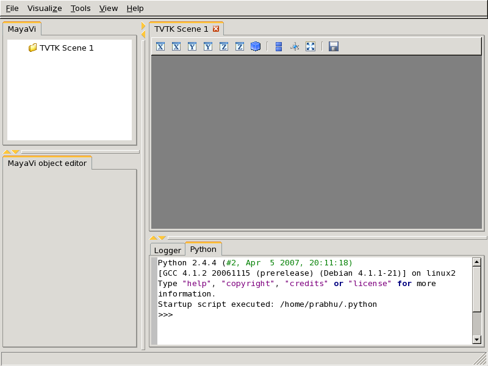

===================
MayaVi2 Users Guide
===================
:Author: Prabhu Ramachandran
:Contact: prabhu[at]aero.iitb.ac.in

.. contents::

Vision
======

MayaVi2_ seeks to provide easy and interactive visualization of 3D
data.  It does this by the following:

    * an (optional) rich user interface with dialogs to interact with
      all data and objects in the visualization.

    * a simple and clean scripting interface in Python_, including
      one-liners, a-la mlab_, or object-oriented programming interface.

    * harnesses the power of the VTK_ toolkit without forcing you to
      learn it.

Additionally Mayavi2 strives to be a reusable tool that can be
embedded in your applications in different ways or combined with the
envisage_ application-building framework to assemble domain-specific
tools.

.. _MayaVi2: https://svn.enthought.com/enthought/wiki/MayaVi
.. _MayaVi: https://svn.enthought.com/enthought/wiki/MayaVi
.. _mlab: https://svn.enthought.com/enthought/attachment/wiki/MayaVi/mlab.pdf
.. _Python: http://www.python.org
.. _VTK: http://www.vtk.org
.. _envisage: https://svn.enthought.com/enthought/wiki/Envisage

Introduction
============

MayaVi2 is a general purpose, cross-platform tool for 3-D scientific
data visualization. Its features include:

    * Visualization of scalar, vector and tensor data in 2 and 3
      dimensions

    * Easy scriptability using Python

    * Easy extendability via custom sources, modules, and data filters

    * Reading several file formats: VTK_ (legacy and XML), PLOT3D,
      etc.

    * Saving of visualizations

    * Saving rendered visualization in a variety of image formats

    * Convenient functionality for rapid scientific plotting via mlab
      (see `Using mlab`_)

Unlike its predecessor MayaVi1_, MayaVi2 has been designed with
scriptability and extensibility in mind from the ground up.  While the
mayavi2 application is usable by itself, it may be used as an Envisage
plugin which allows it to be embedded in user applications natively.
Alternatively, it may be used as a visualization engine for any
application.

.. _MayaVi1: http://mayavi.sourceforge.net

Technical details
-----------------

MayaVi-2 provides a general purpose visualization engine based on a
pipeline architecture similar to that used in VTK.  MayaVi2 also
provides an Envisage plug-in for 2D/3D scientific data visualization.
MayaVi2 uses the Enthought Tool Suite (ETS_) in the form of Traits_,
TVTK_ and Envisage_. Here are some of its features:

    * Allows users to easily visualize scalar, vector and (eventually)
      tensor field data in 2 and 3 dimensions.

    * Easier to script than MayaVi-1 due to a much cleaner MVC_ design.

    * Easy to extend with added sources, components, modules and data
      filters.

    * Envisage plugin. This implies that it is:

          - easy to use other envisage plugins in mayavi.  For
            example, Mayavi provides an embedded Python shell.  This
            is an Envisage plugin and requires one line of code to
            include in Mayavi.

          - easy to use Mayavi inside Envisage based applications.
            Thus, any envisage based application can readily use
            the mayavi plugin and script it to visualize data.

    * wxPython/Qt4 based GUI (thanks entirely to Traits, PyFace and
      Envisage).  It is important to note that there is no wxPython or
      Qt4 code used directly in Mayavi source.

    * Persistent visualizations like in MayaVi1_.

    * Ability to save rendered visualizations to various image
      formats.

.. _ETS: http://code.enthought.com/ets
.. _Traits: https://svn.enthought.com/enthought/wiki/Traits
.. _TVTK: https://svn.enthought.com/enthought/wiki/TVTK
.. _MVC: http://en.wikipedia.org/wiki/Model-view-controller

Installation
============

Up-to-date install instructions are always available at the MayaVi2_
web page.  The following instructions are likely not up-to-date but
should give you a good idea of the general installation procedure and
a start on where to look.

Requirements
------------

Mayavi requires at the very minimum the following packages:

    * VTK_ >= 4.4 (5.x is ideal)
    * numpy_ >= 1.0.1
    * wxPython_ 2.6.x
    * setuptools_ (for installation and egg builds)
    * TVTK_ (`enthought.tvtk`)
    * Traits_ >= 2.0 (`enthought.traits`)
    * Envisage_ == 2.x (`enthought.envisage`)

One can install the requirements in several ways.  

   * Win32: Under Win32 the best way to get all the dependencies is to
     use Enthought's enstaller_.

   * Linux: Most Linux distributions will have installable binaries
     available for the some of the above.  For example, under Debian_
     or Ubuntu_ you would need ``python-vtk``, ``python-wxgtk2.6``,
     ``python-setuptools``, ``python-numpy``.

   * Mac OS X: The best available instructions for this platform are
     available on the IntelMacPython25_ page.

There are several ways to install TVTK_, Traits_ and MayaVi.  These
are described in the following.

.. _numpy: http://www.scipy.org
.. _wxPython: http://www.wxpython.org
.. _setuptools: http://peak.telecommunity.com/DevCenter/setuptools
.. _enstaller: http://code.enthought.com/enstaller
.. _Debian: http://www.debian.org
.. _Ubuntu: http://www.ubuntu.com
.. _IntelMacPython25: https://svn.enthought.com/enthought/wiki/IntelMacPython25

Eggs
-----

MayaVi_ is part of the Enthought Tool Suite (ETS_).  ETS has been
organized into several different Python packages.  These packages are
distributed as Python Eggs_.  Python eggs are fairly sophisticated and
carry information on dependencies with other eggs.  As such they are
rapidly becoming the standard for distributing Python packages.

Introduction to Eggs
~~~~~~~~~~~~~~~~~~~~

There are primarily two ways to use ETS eggs.
 
  1. The first and easiest is to use pre-built eggs built for your
     particular platform.  More instructions on this follow. 

  2. The second is to build the eggs from the source tarballs.  This
     is also fairly easy to do if you have a decent build environment.

Given this background please see the following:

  * InstallWithEggs_ describes how ETS can be installed with
    eggs. Check this page first.

  * If there aren't any pre-built eggs for your platform, first make
    sure the requirements are installed, and then build and install
    the eggs like so::

     $ easy_install -f http://code.enthought.com/enstaller/eggs/source \
     > enthought.mayavi

    This one command will download, build and install all the required
    ETS related modules that mayavi needs.  If you run into trouble
    please check the InstallWithEggs_ pages.  Note that the above is
    really one line, it has been split with the ``\`` character into
    two lines in order to fit on the printed version of this document.

  * Install_ describes the various ways to install the ETS of which
    mayavi2 is a part.

  * Additionally, non-modular source tarballs can be downloaded at

    http://code.enthought.com/downloads/source/

    giving the different ETS dependencies for mayavi as a set of
    monolithic downloads.

.. _Eggs: http://peak.telecommunity.com/DevCenter/PythonEggs
.. _InstallWithEggs: https://svn.enthought.com/enthought/wiki/InstallWithEggs
.. _Install: https://svn.enthought.com/enthought/wiki/Install

The bleeding edge: SVN
----------------------

If you want to get the latest development version of mayavi, we
recommend that you check it out from SVN.

* Currently the easiest way to get mayavi from the SVN repository is
  to do the following:

   1. Make sure you have all the requirements installed. 

   2. Checkout the branches (current development is occurring in the branches)::

        svn co https://svn.enthought.com/svn/enthought/branches 

   3. Run ``egg_builder.py`` like so (the built eggs will be put
      in the ``dist`` directory)::

       cd branches
       python egg_builder.py

   4. Install the necessary packages and pull any packages not in the
      branches from the last stable release::

       $ cd branches
       $ easy_install -f http://code.enthought.com/enstaller/eggs/source \
       > -f dist enthought.mayavi

   5. You should be all set. Try any of the examples in your working
      copy.

The easiest way to test if your install is OK is to run the mayavi2
command like so::

 mayavi2

To get more help on the command try this::

 mayavi2 -h

``mayavi2`` is the mayavi application.  On some platforms like win32
you will need to double click on the ``mayavi2.exe`` program found in
your ``Python2X\Scripts`` folder.  Make sure this directory is in your
path.

.. note:: 
  Mayavi can be used in a variety of other ways but the the
  ``mayavi2`` application is the easiest to start with.

If you have the source tarball of mayavi or downloaded it via SVN, you
can run the examples in ``enthought.mayavi*/examples``.  There are
plenty of example scripts illustrating various features.  Tests are
available in the ``enthought.mayavi*/tests`` sub-directory.

An overview of MayaVi
=====================

All the following sections assume you have a working mayavi
Installation_.

As a user there are two primary ways to use mayavi:

  1. Use the ``mayavi2`` application completely graphically.  More
     information on this is in the `Using MayaVi`_ section.

  2. Script MayaVi from Python.  MayaVi features a powerful and
     general purpose scripting API.  

      a. You can script mayavi while using the ``mayavi2`` application
         in order to automate tasks and extend mayavi's behavior.

      b. You can script mayavi from your own Python based application.

      c. You can embed mayavi into your application in a variety of
         ways either using Envisage_ or otherwise.

     More details on this are available in the `Scripting MayaVi`_
     chapter.

MayaVi is a scientific data visualizer.  There are two primary ways to
make your data available to it.

  1. Use a supported file format like VTK legacy or VTK XML files
     etc. See `VTK file formats`_ for more information on the VTK
     formats.

  2. Generate a TVTK dataset via numpy_ arrays or any other sequence.

More information on datasets in general and how to create VTK files or
create them from numpy arrays is available in the `Creating data for
MayaVi`_ section.

MayaVi uses a pipeline architecture like VTK_.  As far as a user is
concerned this basically boils down to a simple hierarchy.

  * The user visualizes data on a `TVTK Scene` -- this is an area
    where the 3D visualization is performed.  New scenes may be
    created by using the `File->New->VTK Scene` menu.

  * On each scene the user loads data (either using a file or created
    from a script).  Any number of data files or data objects may be
    opened.

  * This data is optionally processed using `Filters` that operate on
    the data and visualized using visualization `Modules`.  The
    Filters and Modules are accessible via the `Visualize` menu on the
    UI or may be instantiated as Python objects.

More information on each of these are available in the following
sections.

.. _VTK file formats: http://www.vtk.org/pdf/file-formats.pdf

Quick tour
==========

To get acquainted with mayavi you may start up ``mayavi2`` like so::

  $ mayavi2

On windows you can double click on the installed ``mayavi2.exe``
executable (usually in the ``Python2X\Scripts`` directory).

Once mayavi starts, you may resize the various panes of the user
interface to get a comfortable layout.  These settings will become the
default "perspective" of the mayavi application.  More details on the
UI are available in the `General layout of UI`_ section.

Before proceeding on the quick tour it is important to locate some
data to experiment with.  The mayavi sources ship with several useful
data files for examples and testing.  These may be found in the
``examples/data`` directory inside the root of the mayavi source tree.
If these are not installed, the sources may be downloaded from here:
http://code.enthought.com/enstaller/eggs/source/

If for some reason the sample data files are not available or there is
no Internet access to download them, one can always create some
interesting looking surfaces using the `File->Open->Create Parametric
surface source` menu item.  This will let us create very pretty
looking surfaces without reference to any external data.  This is
described in the `Parametric surfaces example`_ section below.

``heart.vtk`` example
---------------------

This section describes a simple example with the ``heart.vtk`` file.
This is a simple volume of 3D data (32 x 32 x 12 points) with scalars
at each point (the points are equally spaced).  The data is a
structured dataset (an `ImageData` in fact), we'll read more about
these later but you can think of it as a cube of points regularly
spaced with some scalar data associated with each point.  The data
apparently represents a CT scan of a heart.  I have no idea whose
heart!  The file is a readable text file, look at it in a text editor
if you'd like to.

  1. With ``mayavi2`` started, we start by opening the data file.  Go
     to the `File->Open->VTK File` menu item and then in the file
     dialog, navigate to the directory that contains the sample data.
     There select the ``heart.vtk`` file.

     Once you choose the data, you will see a new node on the MayaVi
     tree view on the left that says `VTK file (heart.vtk)`.  Note
     that you **will not** see anything visualized on the TVTK scene
     yet.

  2. To see an outline (a box) of the data, navigate to the
     `Visualize->Modules` menu item and select the `Outline` module.
     You will immediately see a white box on the TVTK scene.  You
     should also see two new nodes on the tree view, one called
     `Modules` and one underneath that called `Outline`.  

  3. You can change properties of the outline displayed by clicking on
     the `Outline` node on the left.  This will create an object
     editor window on left bottom of the window (the object editor
     tab) below the tree view.  Play with the settings here and look
     at the results.  If you double-click a node on the tree view it
     will pop up the editor dialog rather than show it in the embedded
     object editor.

     Note that in general, the editor window for a `Module` will have
     a section for the `Actor`, one for the `Mapper` and one for
     `Property`.  These refer to TVTK/VTK terminology.  You may think
     of Properties as those related to the color, representation
     (surface, wireframe, etc.), line size etc.  Things grouped under
     `Actor` are related to the object that is rendered on screen and
     typically the editor will let you toggle its visibility.  In VTK
     parlance, the word `Mapper` refers to an object that converts the
     data to graphics primitives.  Properties related to it will be
     grouped under the `Mapper` head.

  4. To interact with the TVTK scene window, look at the section on
     `Interaction with the scene`_ for more details.  Experiment with
     these options till you are comfortable.

  5. Now create an iso-surface by selecting the
     `Visualize->Modules->IsoSurface` menu item.  You will see a new
     `IsoSurface` node on the left and an iso-contour of the scalar
     data on the scene.  The iso-surface is colored as per the
     particular iso-value chosen.  Experiment with the settings of
     this module.

  6. To produce meaningful visualizations you need to know what each
     color means.  To display this legend on the scene, click on the
     `Modules` node on the tree view and on the object editor activate
     the `Show scalar bar` check-box.  This will show you a legend on
     the TVTK scene.  The legend can be moved around on the scene by
     clicking on it and dragging on it.  It can also be resized by
     clicking and dragging on its edges.  You can change the nature of
     the color-mapping by choosing various options on the object
     editor.

  7. Create a simple "grid plane" to obtain an idea of the actual
     points on the grid.  This can be done using the `GridPlane`
     module, and created via the `Visualize->Modules->GridPlane` menu
     item.

  8. You can delete a particular module by right clicking on it and
     choosing delete.  Try this on the `GridPlane` module.  Try the
     other right click menu options as well.

  9. Experiment with the `ContourGridPlane` module and also the
     `ScalarCutPlane` module a little.  

     The `ScalarCutPlane` module features a very powerful feature
     called *3D widgets*.  On the TVTK scene window you will see a cut
     plane that slices through your data showing you colors
     representing your data.  This cut plane will have a red outline
     and an arrow sticking out of it.  You can click directly on the
     cut plane and move it by dragging it.  Click on the arrow head to
     rotate the plane.  You can also reset its position by using the
     editor window for the scalar cut plane.

  10. You can save the visualization to an image produced by clicking
      on the little save icon on the TVTK scene or via any of the
      options on the `File->Save Scene As` menu.

You should have a visualization that looks something like the one
shown below.

.. image:: images/heart.png
   :alt: Sample visualization of the ``heart.vtk`` dataset.

The nice thing about mayavi is that although in this case all of the
above was done using the user interface, all of it can be done using
pure Python scripts as well.  More details on this are available in
the `Scripting MayaVi`_ section.  

Opening data files and starting up modules can also be done from the
command line.  For example we could simply have done::

 $ mayavi2 -d /path/to/heart.vtk -m Outline -m IsoSurface \
 > -m GridPlane -m ScalarCutPlane

More details are available in the `Command line arguments`_ section.

``fire_ug.vtu`` example
-----------------------

Like ``heart.vtk``, the ``fire_ug.vtu`` example dataset is available
in the ``examples/data`` directory.  This dataset is an unstructured
grid stored in a VTK XML file.  It represents a room with a fire in
one corner.  A simulation of the fluid flow generated by this fire was
performed and the resulting data at a particular instant of time is
stored in the file.  The dataset was provided by Dr. Philip Rubini,
who at the time was at Cranfield University.  A VRML file
(``room_vis.wrl``) is also provided to show the context of the room in
which the fire is taking place.

  1. With mayavi2 started, select `File->Open->VTK XML file` to load
     the data.  Again, you will see a node on the tree view on the
     left but nothing on the TVTK scene.  This dataset contains
     different scalars and vectors in the same data file.  If you
     select the `VTK XML file ...` node on the left you will see a
     drop list of all the scalars, vectors etc. in this data file.
     Select any that you wish to view.

  2. Create an outline of the data as described earlier using an
     `Outline` module.  View an iso-surface of the data by creating an
     `IsoSurface` module.  Also experiment with the `ScalarCutPlane`
     module.

  3. Show the scalar bar that represents the color mapping (via a Look
     up table that maps scalar values to colors) by clicking on the
     `Modules` and enabling the `Show scalar bar`.  Experiment with
     the different color maps provided by default.

  4. Now click on the `VTK XML file ...` and select different scalar
     values to see how the data has changed.  Your legend should
     automatically update when the scalar value is changed.
  
  5. This data also features vectors.  The scalar data has `u`, `v`
     and `w` but not the magnitude of the velocity.  Lets say we'd
     like to be able to view iso-contours of the magnitude of the
     velocity.  To do this lets use the `ExtractVectorNorm` filter.
     This is created by choosing the `Visualize->Filters->Extract
     Vector Norm` menu.

  6. If you now create a `ScalarCutPlane`, you will see a new
     `Modules` node under the `ExtractVectorNorm` node.  This scalar
     cut plane is displaying colors for the velocity magnitude that
     the filter has created.  You can drag the iso-surface module from
     the other `Modules` node and drop it on this `Modules` node so
     that the IsoSurface generated is for the velocity magnitude and
     not for the scalars chosen in the data.

     Note that the view on the left represents a pipeline of the flow
     of the data from `source -> filter -> modules`. Essentially the
     data flows from the parent node down to the children nodes below
     it.

     Now if you want to visualize something on a different "branch" of
     the pipeline, lets say you want to view iso-surfaces of the
     temperature data you must first click on the modules or the
     source object (the `VTK XML File ...` node) itself and then
     select the menu item.  When you select an item on the tree, it
     makes that item the *current object* and menu selections made
     after that will in general create new modules/filters below the
     current object.

  7. You can filter "filtered data".  So select the
     `ExtractVectorNorm` node to make it the active object.  Now
     create a Threshold filter by selecting
     `Visualize->Filters->Threshold`.  Now set the upper and lower
     thresholds on the object editor for the Threshold to something
     like 0.5 and 3.0.  If you create a `VectorCutPlane` module at
     this point and move the cut plane you should see arrows but only
     arrows that are between the threshold values you have selected.
     Thus, you can create pretty complicated visualization pipelines
     using this approach.

  8. There are several vector modules.  `VectorCutPlane`, `Vectors`,
     `WarpVectorCutPlane` and `Streamlines`.  If you view streamlines
     then mayavi will generate streamlines of vector data in your
     dataset.  To view streamlines of the original dataset you can
     click on the original `Outline` module (or the source) and then
     choose the `Streamline` menu item.  The streamline lets you move
     different type of seeds on screen using 3D widgets.  Seed points
     originating from these positions are used to trace out the
     streamlines.  Sphere, line and plane sources may be used here to
     initialize the streamline seeds.

  9. You can view the room in which the fire is taking place by
     opening the VRML file by the `File->Open->VRML2 file` menu item
     and selecting the ``room_vis.wrl`` file included with the data.

  10. Once you setup a complex visualization pipeline and want to save
      it for later experimentation you may save the entire
      visualization via the `File->Save Visualization` menu.  A saved
      file can be loaded later using the `File->Load Visualization`
      menu item.  This option is not 100% robust and is still
      experimental.  Future versions will improve this feature.
      However, it does work and can be used for the time being.

Once again, the visualization in this case was created by using the
user interface.  It is possible to script this entirely using Python
scripts.  A simple script demonstrating several of the above modules
is available in ``examples/streamline.py``.  This file may be studied.
It can be run either like so::

 $ cd examples
 $ python streamline.py

or so::

 $ mayavi2 -x streamline.py

As can be seen from the example, it is quite easy to script mayavi to
visualize data.  An image of a resulting visualization generated from
this script is shown below.

.. image:: images/streamline.png
   :alt: Sample visualization of the ``fire_ug.vtu`` dataset.

Parametric surfaces example
---------------------------

Parametric surfaces are particularly handy if you are unable to find
any data to play with right away.  Parametric surfaces are surfaces
parametrized typically by 2 variables, u and v.  VTK has a bunch of
classes that let users explore Parametric surfaces.  This
functionality is also available in MayaVi.  The data basically is a 2D
surface embedded in 3D.  Scalar data is also available on the surface.
More details on parametric surfaces in VTK may be obtained from Andrew
Maclean's `Parametric Surfaces`_ document.

  1. After starting mayavi2, create a simple Parametric surface source
     by selecting `File->Open->Create Parametric Surface source`.
     Once you create the data, you will see a new node on the MayaVi
     tree view on the left that says `ParametricSurface`.  Note that
     you **will not** see anything visualized on the TVTK scene yet.

     You can modify the nature of the parametric surface by clicking
     on the node for the `ParametricSurface` source object.

  2. To see an outline (a box) of the data, navigate to the
     `Visualize->Modules` menu item and select the `Outline` module.
     You will immediately see a white box on the TVTK scene.  You
     should also see two new nodes on the tree view, one called
     `Modules` and one underneath that called `Outline`.  

  3. You can change properties of the outline displayed by clicking on
     the `Outline` node on the left.  This will create an object
     editor window on left bottom of the window (the object editor
     tab) below the tree view.  Play with the settings here and look
     at the results.  If you double-click a node on the left it will
     pop up the editor dialog rather than show it in the embedded
     object editor.

  4. To navigate the scene look at the section on `Interaction with
     the scene`_ section for more details.  Experiment with these.

  5. To view the actual surface create a `Surface` module by selecting
     `Visualize->Modules->Surface`.  You can show contours of the
     scalar data on this surface by clicking on the `Surface` node on
     the left and switching on the `Enable contours` check-box.

  6. To look at the color legend click on the `Modules` node on the
     tree view and on the object editor activate the `Show scalar bar`
     check-box.  This will show you a legend on the TVTK scene.  The
     legend can be moved around on the scene by clicking on it and
     dragging on it.  It can also be resized by clicking and dragging
     on its edges.  You can change the nature of the color-mapping by
     choosing various options on the object editor.

  7. You can add as many modules as you like.  Not all modules make
     sense for all data.  MayaVi does not yet grey out menu items and
     options if they are invalid for the particular data chosen.  This
     will be implemented in the future.  However making a mistake
     should not in general be disastrous, so go ahead and experiment.

  8. You may add as many data sources as you like.  It is possible to
     view two different parametric surfaces on the same scene.
     Whether this makes sense or not is up to the user.  You may also
     create as many scenes you want to and view anything in those.
     You can cut/paste/copy sources and modules between any nodes on
     the tree view using the right click options.

  9. To delete the `Outline` module say, right click on the `Outline`
     node and select the Delete option.  You may also want to
     experiment with the other options.

  10. You can save the rendered visualization to a variety of file
      formats using the `File->Save Scene As` menu.

  11. The visualization may itself be saved out to a file via the
      `File->Save Visualization` menu and reloaded using the `Load
      visualization` menu.

Shown below is an example visualization made using the parametric
source.  Note that the positioning of the different surfaces was
effected by moving the actors on screen using the actor mode of the
scene via the 'a' key.  For more details on this see the section on
`Interaction with the scene`_.

.. image:: images/param.png
   :alt: Sample visualization using parametric surfaces.

The examples detailed above should provide a good general idea of how
to visualize data with MayaVi2 and also an idea of its features and
capabilities.

.. _Parametric Surfaces: http://www.vtk.org/pdf/ParametricSurfaces.pdf

Using MayaVi
============

This chapter primarily concerns using the ``mayavi2`` application.
Some of the things mentioned here also apply when mayavi is scripted.
We recommend that new users read this chapter before going to the more
advanced ones.

Command line arguments
----------------------

The ``mayavi2`` application features several useful command line
arguments that are described in the following section.  These options
are described in the ``mayavi2`` man page as well.

MayaVi can be run like so::

       mayavi2 [options] [args]

Where ``arg1``, ``arg2`` etc.  are optional file names that correspond
to saved MayaVi2 visualizations (``filename.mv2``) or MayaVi2 scripts
(``filename.py``).  If no options or arguments are provided mayavi
will start up with a default blank scene.

The options are:

-h
      This prints all the available command line options and exits.
      Also available through --help.

-V
      This prints the MayaVi version on the command line and exits.
      Also available through --version.

-z file_name
      This loads a previously saved MayaVi2 visualization.  Also
      available through --viz file_name or --visualization
      file_name.

-d vtk_file
      Opens a (legacy or XML) VTK file (``*.vt*``) passed as the
      argument.  Also available through --vtk.

-p plot3d_xyz_file
      This opens a PLOT3D co-ordinate file passed as the argument.
      The plot3d-xyz-file must be a PLOT3D single block
      co-ordinate file. Also available through --plot3d-xyz.

-q plot3d_q_file
      This opens a PLOT3D (single block) solution file passed as the
      argument. Please note that this option must always follow a
      -p or --plot3d-xyz option.  Also available through
      --plot3d-q.

-w vrml-file
      Imports a VRML2 scene given an appropriate file.  Also available
      through --vrml.

-3 threed-studio-file
      Imports a 3D Studio scene given an appropriate file.  Also
      available through --3ds.

-m module-name
      A module is an object that actually visualizes the data.  The
      given ``module-name`` is loaded in the current ``ModuleManager``.
      The module name must be a valid one if not you will get an error
      message.

      If a module is specified as ``package.sub.module.SomeModule``
      then the module (``SomeModule``) is imported from
      ``package.sub.module``.  Standard modules provided with
      ``mayavi2`` do not need the full path specification.  For
      example::

         mayavi2 -d data.vtk -m Outline -m m2_user_modules.TestModule

      In this example ``Outline`` is a standard module and
      ``m2_user_modules.TestModule`` is some user defined module.
      Also available through --module.

-f filter-name
      A filter is an object that filters out the data in some way or
      the other.  The given ``filter-name`` is loaded with respect to
      the current source/filter object.  The filter name must be a
      valid one if not you will get an error message.

      If the filter is specified as ``package.sub.filter.SomeFilter``
      then the filter (``SomeFilter``) is imported from
      ``package.sub.filter``.  Standard modules provided with
      ``mayavi2`` do not need the full path specification.  For
      example::

         mayavi2 -d data.vtk -f ExtractVectorNorm -f m2_user_filters.TestFilter

      In this example ``ExtractVectorNorm`` is a standard filter and
      ``m2_user_filters.TestFilter`` is some user defined filter.
      Also available through --filter.

-M
      Starts up a new module manager on the MayaVi pipeline. Also
      available through --module-mgr.

-n
      Creates a new window/scene. Any options passed after this will
       apply to this newly created scene.  Also available through
       --new-window.

-x script-file
      This executes the given script in a namespace where we guarantee
      that the name 'mayavi' is MayaVi's script instance -- just like
      in the embedded Python interpreter.  Also available through
      --exec.

.. warning::
 Note that ``-x`` or ``--exec`` uses `execfile`, so this can be
 dangerous if the script does something nasty!

It is important to note that mayavi's **command line arguments are
processed sequentially** in the same order they are given.  This
allows users to do interesting things.

Here are a few examples of the command line arguments::

  $ mayavi2 -d heart.vtk -m Axes -m Outline -m GridPlane \
  > -m ContourGridPlane -m IsoSurface

  $ mayavi2 -d fire_ug.vtu -m Axes -m Outline -m VectorCutPlane \
  > -f MaskPoints -m Glyph

In the above examples, ``heart.vtk`` and ``fire_ug.vtu`` VTK files can
be found in the ``examples/data`` directory in the source.  They may
also be installed on your computer depending on your particular
platform.

General layout of UI
--------------------

When the `mayavi2` application is started it will provide a user
interface that looks something like the figure shown below.

.. figure:: images/mayavi_ui_first.png
   :alt: Figure of MayaVi's initial UI window.

   Figure of MayaVi's initial UI window.

The UI features several sections described below.

  Menus
    The menus let you open files, load modules, set preferences etc.

  The MayaVi engine tree view
    This is a tree view of the mayavi pipeline.
      * Right click a tree node to rename, delete, copy the objects.

      * Left click on a node to edit its properties on the object
        editor below the tree.

      * It is possible to drag the nodes around on the tree.  For
        example it is possible to drag and move a module from one set
        of Modules to another, or to move a visualization from one
        scene to another.

  The object editor 
    This is where the properties of mayavi pipeline objects can be
    changed when an object on the engine's pipeline is clicked.

  TVTK scenes
    This is where the visualization of the data happens.  One can
    interact with this scene via the mouse and the keyboard.  More
    details are in the following sections.

  Python interpreter
    The built-in Python interpreter that can be used to script mayavi
    and do other things.  You can drag nodes from the mayavi tree and
    drop them on the interpreter and then script it!

  Logger
    Application log messages may be seen here.

MayaVi's UI layout is highly configurable:

 * the line in-between the sections can be dragged to resize
   particular views.

 * most of the "tabs" on the widgets can be dragged around to move
   them anywhere in the application.

 * Each view area (the mayavi engine view, object editor, python shell
   and logger) can all be disabled and enabled at will using the
   `View` menu by toggling the views on and off.

Each time you change the appearance of mayavi it is saved and the next
time you start up the application it will have the same configuration.
In addition, you can save different layouts into different
"perspectives" using the `View->Perspectives` menu item.

Shown below is a specifically configured mayavi user interface view.
In this view the size of the various parts are changed.  The Python
shell is activated by default.

   Figure of MayaVi's UI after being configured by a user.

Interaction with the scene
--------------------------

The TVTK scenes on the UI can be closed by clicking on the little 'x'
icon on the tab.  Each scene features a toolbar that supports various
features:

  * Buttons to set the view to view along the positive or negative X,
    Y and Z axes or obtain an isometric view.

  * A button to turn on parallel projection instead of the default
    perspective projection.  This is particularly useful when one is
    looking at 2D plots.

  * A button to turn on an axes to indicate the x, y and z axes.

  * A button to turn on full-screen viewing.  Note that once
    full-screen mode is entered one must press 'q' or 'e' to get back
    a normal window.

  * A button to save the scene to a variety of image formats.  The
    image format to use is determined by the extension provided for
    the file.

The primary means to interact with the scene is to use the mouse and
keyboard.

Mouse interaction
~~~~~~~~~~~~~~~~~

There are two modes of mouse interaction:

  * Camera mode: the default, where the camera is operated on with
    mouse moves.  This mode is activated by pressing the 'c' key.

  * Actor mode: in this mode the mouse actions operate on the actor
    the mouse is currently above.  This mode is activated by pressing
    the 'a' key.

The view on the scene can be changed by using various mouse actions.
Usually these are accomplished by holding down a mouse button and
dragging.

  * holding the left mouse button down and dragging will rotate the
    camera/actor in the direction moved.

        - Holding down "SHIFT" when doing this will pan the scene --
          just like the middle button.

        - Holding down "CONTROL" will rotate about the camera's focal
          point.

        - Holding down "SHIFT" and "CONTROL" and dragging up will zoom
          in and dragging down will zoom out.  This is like the right
          button.

  * holding the right mouse button down and dragging upwards will zoom
    in (or increase the actors scale) and dragging downwards will zoom
    out (or reduce scale).

  * holding the middle mouse button down and dragging will pan the
    scene or translate the object.

  * Rotating the mouse wheel upwards will zoom in and downwards will
    zoom out.

Keyboard interaction
~~~~~~~~~~~~~~~~~~~~

The scene supports several features activated via keystrokes.  These
are:
 
 * '3': Turn on/off stereo rendering.  This may not work if the
   'stereo' preference item is not set to True.

 * 'a': Use actor mode for mouse interaction instead of camera mode.

 * 'c': Use camera mode for mouse interaction instead of actor mode.

 * 'e'/'q': Exit full-screen mode.

 * 'f': Move camera's focal point to current mouse location.  This
   will move the camera focus to center the view at the current mouse
   position.

 * 'j': Use joystick mode for the mouse interaction.  In joystick mode
   the mouse somewhat mimics a joystick.  For example, holding the
   mouse left button down when away from the center will rotate the
   scene.

 * 'l': Configure the lights that are illumining the scene.  This will
   pop-up a window to change the light configuration.

 * 'p': Pick the data at the current mouse point.  This will pop-up a
   window with information on the current pick.  The UI will also
   allow one to change the behavior of the picker to pick cells,
   points or arbitrary points.

 * 'r': Reset the camera focal point and position.  This is very handy.
 
 * 't': Use trackball mode for the mouse interaction.  This is the
   default mode for the mouse interaction.

 * '='/'+': Zoom in.

 * '-': Zoom out.

 * 'left'/'right'/'up'/'down' arrows: Pressing the left, right, up and
   down arrow let you rotate the camera in those directions.  When
   "SHIFT" modifier is also held down the camera is panned.

The embedded Python interpreter
-------------------------------

The embedded Python interpreter offers extremely powerful
possibilities.  The interpreter features command completion, automatic
documentation tooltips and some multi-line editing.  In addition it
supports the following features:

 * The name ``mayavi`` is bound to the
   ``enthought.mayavi.script.Script`` instance.  This may be used to
   easily script mayavi.

 * The name ``application`` is bound to the envisage application.

 * If a Python file is opened via the ``File->Open File...`` menu item
   one can edit it with a color syntax capable editor.  To execute
   this script in the embedded Python interpreter, the user may type
   ``Control-r`` on the editor window.  To save the file press
   ``Control-s``.  This is a very handy feature when developing simple
   mayavi scripts.

 * As mentioned earlier, one may drag and drop nodes from the MayaVi
   engine tree view onto the Python shell.  The object may then be
   scripted as one normally would.  A commonly used pattern when this
   is done is the following::

     >>> tvtk_scene_1
     <enthought.mayavi.core.scene.Scene object at 0x9f4cbe3c>
     >>> s = _

   In this case the name ``s`` is bound to the dropped tvtk_scene
   object.  The ``_`` variable stores the last evaluated expression
   which is the dropped object.  Using ``tvtk_scene_1`` will also work
   but is a mouthful.

Visualizing data
----------------

MayaVi modules can be used to visualize the data as described in the
`An overview of MayaVi`_ section and the `Quick tour`_ section.  One
needs to have some data or the other loaded before a `Module` or
`Filter` may be used.  MayaVi supports several data file formats most
notably VTK data file formats.  More information on this is available
here in the `Creating data for MayaVi`_ section.

Once data is loaded one can optionally use a variety of `Filters`_ to
filter or modify the data in some way or the other and then visualize
the data using several `Modules`_.  The Modules and Filters are
briefly described in the subsequent sections.

Modules
-------

Here is a list of the MayaVi modules along with a brief description.

   Axes   
         Draws simple axes.

   ContourGridPlane
          A contour grid plane module. This module lets one take a
          slice of input grid data and view contours of the data.

   CustomGridPlane
          A custom grid plane with a lot more flexibility than
          GridPlane module.

   Glyph  
          Displays different types of glyphs oriented and colored
          as per scalar or vector data at the input points.

   GridPlane
          A simple grid plane module.

   ImagePlaneWidget
          A simple module to view image data.

   IsoSurface
          A module that allows the user to make contours of input
          point data.

   OrientationAxes
          Creates a small axes on the side that indicates the
          position of the co-ordinate axes and thereby marks the
          orientation of the scene. Requires VTK-4.5 and above.

   Outline
          A module that draws an outline for the given data.

   ScalarCutPlane
          Takes a cut plane of any input data set using an
          implicit plane and plots the data with optional
          contouring and scalar warping.

   SliceUnstructuredGrid
          This module takes a slice of the unstructured grid data
          and shows the cells that intersect or touch the slice.

   Streamline
          Allows the user to draw streamlines for given vector
          data. This supports various types of seed objects (line,
          sphere, plane and point seeds). It also allows the user
          to draw ribbons or tubes and further supports different
          types of interactive modes of calculating the
          streamlines.

   StructuredGridOutline
          Draws a grid-conforming outline for structured grids.

   Surface
          Draws a surface for any input dataset with optional contouring.

   Text   
          This module allows the user to place text on the screen.

   VectorCutPlane
          Takes an arbitrary slice of the input data using an
          implicit cut plane and places glyphs according to the
          vector field data. The glyphs may be colored using
          either the vector magnitude or the scalar attributes.

   Vectors
          Displays different types of glyphs oriented and colored
          as per vector data at the input points. This is merely a
          convenience module that is entirely based on the Glyph
          module.

   Volume 
          The Volume module visualizes scalar fields using
          volumetric visualization techniques.

   WarpVectorCutPlane
          Takes an arbitrary slice of the input data using an
          implicit cut plane and warps it according to the vector
          field data. The scalars are displayed on the warped
          surface as colors.

Filters
-------

Here is a list of the MayaVi Filters.

   CellToPointData
          Transforms cell attribute data to point data by
          averaging the cell data from the cells at the point.

   Delaunay2D
          Performs a 2D Delaunay triangulation.

   Delaunay3D
          Performs a 3D Delaunay triangulation.

   ExtractGrid
          Allows a user to select a part of a structured grid.

   ExtractUnstructuredGrid
          Allows a user to select a part of an unstructured grid.

   ExtractVectorNorm
          Computes the norm (Euclidean) of the input vector data
          (with optional scaling between [0, 1]). This is useful
          when the input data has vector input but no scalar data
          for the magnitude of the vectors.

   MaskPoints
          Selectively passes the input points downstream. This can
          be used to subsample the input points.  Note that this
          does not pass geometry data, this means all grid
          information is lost.

   PointToCellData
          Does the inverse of the CellToPointData filter.

   PolyDataNormals
          Computes normals from input data. This gives meshes a
          smoother appearance. This should work for any input
          dataset. Note: this filter is called "Compute Normals"
          in MayaVi2 GUI (Visualize/Filters/Compute Normals).

   Threshold
          A simple filter that thresholds on input data.

   TransformData
          Performs a linear transformation to input data.

   WarpScalar
          Warps the input data along a particular direction
          (either the normals or a specified direction) with a
          scale specified by the local scalar value. Useful for
          making carpet plots.

   WarpVector
          Warps the input data along a the point vector attribute
          scaled as per a scale factor.  Useful for showing flow
          profiles or displacements.

Scripting MayaVi
================

As elaborated in the `Quick tour`_ section, mayavi can be scripted
from Python in order to visualize data.  MayaVi2 was designed from the
ground up to be highly scriptable.  Everything that can be done from
the user interface can be achieved using Python scripts. 

If you are not looking to script mayavi itself but looking for quick
ways to get your visualization done with simple code you may want to
check out mayavi's mlab module.  This is described in more detail in
the `Using mlab`_ section.

To best understand how to script mayavi, a reasonable understanding of
the mayavi internals is necessary.  The following sections provides an
overview of the basic design and objects in the mayavi pipeline.
Subsequent sections consider specific example scripts that are
included with the mayavi sources that illustrate the ideas.

MayaVi2 uses Traits_ and TVTK_ internally.  Traits_ in many ways
changes the way we program.  So it is important to have a good idea of
Traits in order to understand mayavi's internals.  If you are unsure
of traits it is a good idea to get a general idea about traits now.
Trust me, your efforts learning Traits will not be wasted!

Design Overview
---------------

This section provides a brief introduction to mayavi's internal
architecture.

The "big picture" of a visualization in mayavi is that an ``Engine``
(``enthought.mayavi.engine.Engine``) object manages the entire
visualization.  The ``Engine`` manages a collection of ``Scene``
(``enthought.mayavi.core.scene.Scene``) objects.  In each ``Scene``, a
user may have created any number of ``Source``
(``enthought.mayavi.core.source.Source``) objects.  A ``Source``
object can further contain any number of ``Filters``
(``enthought.mayavi.core.filter.Filter``) or ``ModuleManager``
(``enthought.mayavi.core.module_manager.ModuleManager``) objects.  A
``Filter`` may contain either other filters or ``ModuleManagers``.  A
``ModuleManager`` manages any number of ``Modules``.  The figure below
shows this hierarchy in a graphical form.

.. figure:: images/m2_big_picture.png
   :alt: Illustration of the various objects in the mayavi pipeline.

   Illustration of the various objects in the mayavi pipeline.

This hierarchy is precisely what is seen in the MayaVi tree view on
the UI.  The UI is therefore merely a graphical representation of this
internal world-view.  A little more detail on these objects is given
below.  For even more details please refer to the sources.

All objects in the mayavi pipeline feature ``start`` and ``stop``
methods.  The reasoning for this is that any object in mayavi is not
usable (i.e. it may not provide any outputs) unless it has been
started.  Similarly the ``stop`` method "deactivates" the object.
This is done because mayavi is essentially driving VTK objects
underneath.  These objects require inputs in order to do anything
useful.  Thus, an object that is not connected to the pipeline cannot
be used.  For example, consider an ``IsoSurface`` module.  It requires
some data in order to contour anything.  Thus, the module in isolation
is completely useless.  It is usable only when it is added to the
mayavi pipeline.  When an object is added to the pipeline, its inputs
are setup and its ``start`` method is called automatically.  When the
object is removed from the pipeline its ``stop`` method is called
automatically.

Apart from the ``Engine`` object, all other objects in the mayavi
pipeline feature a ``scene`` trait which refers to the current
``enthought.pyface.tvtk.tvtk_scene.TVTKScene`` instance that the
object is associated with.  The objects also feature an ``add_child``
method that lets one build up the pipeline by adding "children"
objects.  The ``add_child`` method is "intelligent" and will try to
appropriately add the child in the right place.

Here is a brief description of the key objects in the mayavi pipeline.

 ``Engine``
    The MayaVi engine is defined in the ``enthought.mayavi.engine``
    module.

     * It possesses a ``scenes`` trait which is a Trait ``List`` of
       ``Scene`` objects.

     * Features several methods that let one add a
       ``Filter/Source/Module`` instance to it.  It allows one to
       create new scenes and delete them.  Also has methods to load
       and save the entire visualization.

     * The ``EnvisageEngine`` defined in the
       ``enthought.mayavi.envisage_engine`` module is a subclass of
       ``Engine`` and is the one used in the ``mayavi2`` application.
       The ``Engine`` object is not abstract and itself perfectly
       usable.  It is useful when users do not want to use Envisage_
       but still desire to use mayavi for visualization.

 ``Scene``
    Defined in the ``enthought.mayavi.core.scene`` module.

     * ``scene`` attribute: manages a ``TVTKScene``
       (``enthought.pyface.tvtk.tvtk_scene``) object which is where
       all the rendering occurs.

     * The ``children`` attribute is a ``List`` trait that manages a
       list of ``Source`` objects.

 ``PipelineBase``   
    Defined in the ``enthought.mayavi.core.pipeline_base`` module.
    Derives from ``Base`` which merely abstracts out common
    functionality.  The ``PipelineBase`` is the base class for all
    objects in the mayavi pipeline except the ``Scene`` and ``Engine``
    (which really isn't *in* the pipeline but contains the pipeline).

     * This class is characterized by two events, ``pipeline_changed``
       and ``data_changed``.  These are ``Event`` traits.  They
       determine when the pipeline has been changed and when the data
       has changed.  Therefore, if one does::

             object.pipeline_changed = True 

       then the ``pipeline_changed`` event is fired.  Objects
       downstream of ``object`` in the pipeline are automatically
       setup to listen to events from an upstream object and will call
       their ``update_pipeline`` method.  Similarly, if the
       ``data_changed`` event is fired then downstream objects will
       automatically call their ``update_data`` methods.

     * The ``outputs`` attribute is a trait ``List`` of outputs
       produced by the object.
 

 ``Source``
    Defined in the ``enthought.mayavi.core.source`` module.  All the
    file readers, Parametric surface etc. are subclasses of the
    ``Source`` class.

     * Contains the rest of the pipeline via its ``children`` trait.
       This is a ``List`` of either ``Modules`` or other ``Filters``.
    
     * The ``outputs`` attribute is a trait ``List`` of outputs
       produced by the source.
 
 ``Filter``
    Defined in the ``enthought.mayavi.core.filter`` module.  All the
    ``Filters`` described in the Filters_ section are subclasses of
    this.

     * Contains the rest of the pipeline via its ``children`` trait.
       This is a ``List`` of either ``Modules`` or other ``Filters``.
    
     * The ``inputs`` attribute is a trait ``List`` of input data
       objects that feed into the filter.

     * The ``outputs`` attribute is a trait ``List`` of outputs
       produced by the filter.
       
     * Also features the three methods:

       - ``setup_pipeline``: used to create the underlying
          TVTK pipeline objects if needed.

       - ``update_pipeline``: a method that is called when the
         upstream pipeline has been changed, i.e. an upstream object
         fires a ``pipeline_changed`` event.

       - ``update_data``: a method that is called when the upstream
         pipeline has **not** been changed but the data in the
         pipeline has been changed.  This happens when the upstream
         object fires a ``data_changed`` event.

 ``ModuleManager``
    Defined in the ``enthought.mayavi.core.module_manager`` module.
    This object is the one called *Modules* in the tree view on the
    UI.  The main purpose of this object is to manage ``Modules`` and
    share common data between them.  All modules typically will use
    the same lookup table (LUT) in order to produce a meaningful
    visualization.  This lookup table is managed by the module
    manager.

     * The ``source`` attribute is the ``Source`` or ``Filter`` object
       that is the input of this object.

     * Contains a list of ``Modules`` in its ``children`` trait.
    
     * The ``scalar_lut_manager`` attribute is an instance of a
       ``LUTManager`` which basically manages the color mapping from
       scalar values to colors on the visualizations.  This is
       basically a mapping from scalars to colors.

     * The ``vector_lut_manager`` attribute is an instance of a
       ``LUTManager`` which basically manages the color mapping from
       vector values to colors on the visualizations.

     * The class also features a ``lut_data_mode`` attribute that
       specifies the data type to use for the LUTs.  This can be
       changed between 'auto', 'point data' and 'cell data'.  Changing
       this setting will change the data range and name of the lookup
       table/legend bar.  If set to 'auto' (the default), it
       automatically looks for cell and point data with point data
       being preferred over cell data and chooses the one available.
       If set to 'point data' it uses the input point data for the LUT
       and if set to 'cell data' it uses the input cell data.

 ``Module`` 
    Defined in the ``enthought.mayavi.core.module`` module.
    These objects are the ones that typically produce a visualization
    on the TVTK scene.  All the modules defined in the Modules_
    section are subclasses of this.

     * The ``components`` attribute is a trait ``List`` of various
       reusable components that are used by the module.  These usually
       are never used directly by the user.  However, they are
       extremely useful when creating new modules.  A ``Component`` is
       basically a reusable piece of code that is used by various
       other objects.  For example, almost every ``Module`` uses a
       TVTK actor, mapper and property.  These are all "componentized"
       into a reusable `Actor` component that the modules use.  Thus,
       components are a means to promote reuse between mayavi pipeline
       objects.

     * The ``module_manager`` attribute specifies the
       ``ModuleManager`` instance that it is attached to.

     * Like the ``Filter`` modules also feature the three methods:

       - ``setup_pipeline``: used to create the underlying
          TVTK pipeline objects if needed.

       - ``update_pipeline``: a method that is called when the
         upstream pipeline has been changed, i.e. an upstream object
         fires a ``pipeline_changed`` event.

       - ``update_data``: a method that is called when the upstream
         pipeline has **not** been changed but the data in the
         pipeline has been changed.  This happens when the upstream
         object fires a ``data_changed`` event.

The following figures show the class hierarchy of the various objects
involved.

.. figure:: images/design2c.png
   :alt: The ``Engine`` object.

   The ``Engine`` object and its important attributes and methods.

.. figure:: images/design2a.png
   :alt: Basic object hierarchy

   This hierarchy depicts the ``Base`` object, the ``Scene``,
   ``PipelineBase`` and the ``ModuleManager``.

.. figure:: images/design2b.png
   :alt: More object hierarchy

   This hierarchy depicts the ``PipelineBase`` object, the ``Source``,
   ``Filter``, ``Module`` and the ``Component``.

Scripting the ``mayavi2`` application
-------------------------------------

The ``mayavi2`` application is implemented in the
``enthought.mayavi.scripts.mayavi2`` module (look at the
``mayavi2.py`` file and not the ``mayavi2`` script).  This code
handles the command line argument parsing and runs the application.

``mayavi2`` is an Envisage_ application.  It starts the Envisage
application in its ``main`` method.  The code for this is in the
``enthought.mayavi.app`` module.  Mayavi uses several envisage plugins
to build up its functionality.  These plugins are defined in the
``enthought.mayavi.plugin_definitions`` module.  In this module there
are two lists of plugins defined, ``PLUGIN_DEFINITIONS`` and the
``NONGUI_PLUGIN_DEFINITIONS``.  The default application uses the
former which produces a GUI that the user can use.  If one uses the
latter (``NONGUI_PLUGIN_DEFINITIONS``) then the mayavi tree view,
object editor and menu items will not be available when the
application is run.  This allows a developer to create an application
that uses mayavi but does not show its user interface.  An example of
how this may be done is provided in ``examples/nongui.py``.

Scripting from the UI
~~~~~~~~~~~~~~~~~~~~~

When using the ``mayavi2`` application, it is possible to script from
the embedded Python interpreter on the UI.  On the interpreter the
name ``mayavi`` is automatically bound to an
``enthought.mayavi.script.Script`` instance that may be used to easily
script mayavi.  This instance is a simple wrapper object that merely
provides some nice conveniences while scripting from the UI.  It has
an ``engine`` trait that is a reference to the running mayavi engine.

As described in `The embedded Python interpreter`_ section, one can
always drag a mayavi object from the tree and drop it on the
interpreter to script it directly.

One may select the `File->Open File...` menu to open an existing
Python file in the text editor, or choose the `File->New File` menu to
create a new file.  The text editor is Python-aware and one may write
a script assuming that the ``mayavi`` name is bound to the ``Script``
instance as it is on the shell.  To execute this script one can press
``Control-r`` as described earlier.  ``Control-s`` will save the
script.

The nice thing about this kind of scripting is that if one scripts
something on the interpreter or on the editor, one may save the
contents to a file, say ``script.py`` and then the next time mayavi
run it like so::

  $ mayavi2 -x script.py

This will execute the script for automatically.  The name ``mayavi``
is available to the script and is bound to the ``Script`` instance.
This is very convenient.  It is possible to have mayavi execute
multiple scripts.  For example::

 $ mayavi2 -d foo.vtk -m IsoSurface -x setup_iso.py -x script2.py

will load the ``foo.vtk`` file, create an ``IsoSurface`` module, then
run ``setup_iso.py`` and then run ``script2.py``.

There are several scripts in the mayavi ``examples`` directory that
should show how this can be done.  The ``examples/README.txt``
contains some information on the recommended ways to script.

Scripting from IPython
~~~~~~~~~~~~~~~~~~~~~~

It is possible to script MayaVi using IPython_.  IPython will have to
be invoked with the ``-wthread`` command line option in order to allow
one to interactively script the mayavi application::

 $ ipython -wthread

To start a visualization do the following::

 from enthought.mayavi.app import main
 # Note, this does not process any command line arguments.
 mayavi = main()
 # 'mayavi' is the mayavi Script instance.

It is also possible to use mlab (see `Using mlab`_) for this purpose::

 from enthought.mayavi.tools import mlab
 f = mlab.figure() # Returns the current scene.
 mayavi = mlab.get_mayavi() # Returns the Script instance.

With this it should be possible to script mayavi just the way it is
done on the embedded interpreter or on the text editor.

.. _IPython: http://ipython.scipy.org

An example
~~~~~~~~~~

Here is an example script that illustrates various features of
scripting mayavi::

  # Create a new mayavi scene.
  mayavi.new_scene()

  # Get the current active scene.
  s = mayavi.engine.current_scene

  # Read a data file.
  from enthought.mayavi.sources.api import VTKXMLFileReader
  d = VTKXMLFileReader()
  # You must specify the full path to the data here.
  d.initialize('fire_ug.vtu')
  mayavi.add_source(d)

  # Import a few modules.
  from enthought.mayavi.modules.api import Outline, IsoSurface, Streamline

  # Show an outline.
  o = Outline()
  mayavi.add_module(o)
  o.actor.property.color = 1, 0, 0 # red color.

  # Make a few contours.
  iso = IsoSurface()
  mayavi.add_module(iso)
  iso.contour.contours = [450, 570]
  # Make them translucent.
  iso.actor.property.opacity = 0.4
  # Show the colormapping.
  iso.module_manager.scalar_lut_manager.show_scalar_bar = True

  # A streamline.
  st = Streamline()
  mayavi.add_module(st)
  # Position the seed center.
  st.seed.widget.center = 3.5, 0.625, 1.25
  st.streamline_type = 'tube'

  # Save the resulting image.
  s.scene.save('test.png')

  # Make an animation:
  for i in range(36):
      # Rotate the camera by 10 degrees.
      s.scene.camera.azimuth(10)

      # Resets the camera clipping plane so everything fits and then
      # renders.
      s.scene.reset_zoom()

      # Save the scene.
      s.scene.save_png('anim%d.png'%i)

Sometimes, given a mayavi ``Script`` instance or ``Engine``, it is
handy to be able to navigate to a particular module/object.  In the
above this could be achieved as follows::

  x = mayavi.engine.scenes[0].children[0].children[0].children[-1]
  print x

In this case ``x`` will be set to the ``Streamline`` instance that we
just created.

There are plenty of examples illustrating various things in the
``examples`` directory.  These are all fairly well documented.  

In particular, the ``standalone.py`` example illustrates how one can
script mayavi without using the envisage application at all.  The
``offscreen.py`` example illustrates how this may be done using off
screen rendering (if supported by your particular build of VTK).

``examples/README.txt`` contains some information on the recommended
ways to script and some additional information.

Using ``mlab``
--------------

Mlab was originally written by the author of this document to provide
a simple way for users to do visualization using just a few lines of
code.  It has since been completely rewritten by Gaël Varoquaux.  The
idea is to provide quick one-liners as done in the matplotlib_
``pylab`` interface with an emphasis on 3D visualization using
mayavi2.  This allows users to perform quick 3D visualization while
being able to use mayavi's powerful features.

The best way to use mayavi's mlab is to use IPython_.  IPython will
have to be invoked with the ``-wthread`` command line option like so::

 $ ipython -wthread

Once started, here is a pretty example showing a spherical harmonic::

 from numpy import *
 from enthought.mayavi.tools import mlab
 # Create the data.
 dphi, dtheta = pi/250.0, pi/250.0
 [phi,theta] = mgrid[0:pi+dphi*1.5:dphi,0:2*pi+dtheta*1.5:dtheta]
 m0 = 4; m1 = 3; m2 = 2; m3 = 3; m4 = 6; m5 = 2; m6 = 6; m7 = 4;
 r = sin(m0*phi)**m1 + cos(m2*phi)**m3 + sin(m4*theta)**m5 + cos(m6*theta)**m7
 x = r*sin(phi)*cos(theta)
 y = r*cos(phi)
 z = r*sin(phi)*sin(theta);
 # View it.
 f = mlab.figure()
 s = mlab.mesh(x, y, z)

Bulk of the code in the above example is to create the data.  One line
suffices to visualize it.  This produces the following visualization
in a mayavi window.

.. image:: mlab/surf.jpg

The data and visualization modules are all created by the single
command ``surf`` in the above.  One can now change the visualization
using mayavi as described in other parts of this manual.

This is just a sampling of what you can do with mlab.  More
documentation on mlab is available here:
 
 https://svn.enthought.com/enthought/attachment/wiki/MayaVi/mlab.pdf

.. _matplotlib: http://matplotlib.sf.net

Using the mayavi envisage plugins
---------------------------------

The mayavi related plugin definitions to use are:

  * ``mayavi_plugin_definition.py``
  * ``mayavi_ui_plugin_definition.py``

These are in the ``enthought.mayavi`` package.  To see an example of
how to use this see the ``enthought.mayavi.plugin_definitions``
module and the ``enthought.mayavi.app`` module.

If you are writing Envisage plugins for an application and desire to
use the mayavi plugins from your plugins/applications then it is
important to note that mayavi creates three application objects for
your convenience.  These are:

  * ``enthought.mayavi.services.IMAYAVI``: This is an
    ``enthought.mayavi.script.Script`` instance that may be used to
    easily script mayavi.  It is a simple wrapper object that merely
    provides some nice conveniences while scripting from the UI.  It
    has an ``engine`` trait that is a reference to the running mayavi
    engine.

  * ``enthought.mayavi.services.IMAYAVI_ENGINE``: This is the running
    mayavi engine instance.

  * ``enthought.mayavi.services.IMAYAVI_ENGINE_VIEW``:  This is the
    view of the engine and is only exposed if the
    ``mayavi_ui_plugin_definition.py`` is used.

A simple example that demonstrates the use of the mayavi plugin in an
envisage application is included in the ``examples/explorer``
directory.  This may be studied to understand how you may do the same
in your envisage applications.

Creating data for MayaVi
========================

This section of the user guide will be improved later.  For now, the
following two presentations best describe how one can create data
objects or data files for MayaVi and TVTK.

 * Presentation on TVTK and MayaVi2 for course at IIT Bombay

   https://svn.enthought.com/enthought/attachment/wiki/MayaVi/tvtk_mayavi2.pdf

   This presentation provides information on graphics in general, 3D
   data representation, creating VTK data files, creating datasets
   from numpy in Python, and also about mayavi.

 * Presentation on making TVTK datasets using numpy arrays made for SciPy07.

   https://svn.enthought.com/enthought/attachment/wiki/MayaVi/tvtk_datasets.pdf

   This presentation focuses on creating TVTK datasets using numpy
   arrays.

There are several examples in the mayavi sources that highlight the
creation of the most important datasets from numpy arrays.  These may
be found in the ``examples`` directory.  Specifically they are:

   * ``polydata.py``:  Demonstrates how to create Polydata datasets
     from numpy arrays and visualize them in mayavi.

   * ``structured_points2d.py``: Demonstrates how to create a 2D
     structured points (or image data) dataset from numpy arrays and
     visualize them in mayavi.  This is basically a square of
     equispaced points.

   * ``structured_points3d.py``: Demonstrates how to create a 3D
     structured points (or image data) dataset from numpy arrays and
     visualize them in mayavi.  This is a cube of points that are
     regularly spaced.

   * ``structured_grid.py``: Demonstrates the creation and
     visualization of a 3D structured grid.

   * ``unstructured_grid.py``: Demonstrates the creation and
     visualization of an unstructured grid.

These scripts may be run like so::

  $ mayavi2 -x structured_grid.py

or better yet, all in one go like so::

  $ mayavi2 -x polydata.py -x structured_points2d.py \
  > -x structured_points3d.py -x structured_grid.py -x unstructured_grid.py
 

.. Creating datasets from numpy arrays
   -----------------------------------
   
   Add content here from the presentations.

.. VTK Data files
   --------------

   Add content here from the presentations.

Tips and Tricks
===============

Below are a few common tips and tricks.

Customizing mayavi2
-------------------

See the ``examples/mayavi_custom_ui.py`` example that documents and
shows how the UI of mayavi2 can be modified.  The module documents how
this can be done and provides a simple example.

Off screen rendering
--------------------

Often you write mayavi scripts to render a whole batch of images to
make an animation or so and find that each time you save an image,
mayavi "raises" the window to make it the active window thus
disrupting your work.  This is needed since VTK internally grabs the
window to make a picture.  To get around this behavior you may click
on the scene and set the "Off screen rendering" option on.  Or from a
script::

  mayavi.engine.current_scene.scene.off_screen_rendering = True

This will stop raising the window.  However, this may not be enough.
If you are using win32 then off screen rendering should work well out
of the box.  On Linux and the Mac you will need VTK-5.1 (currently
from CVS) to get this working properly.

If upgrading VTK is a problem there is another approach for any OS
that supports X11.  This option should work irrespective of the
version of VTK you are using.  The idea is to use the virtual
framebuffer X server for X11 like so:

  * Make sure you have the `xvfb` package installed.

  * Create the virtual framebuffer X server like so::

      xvfb :1 -screen 0 1280x1024x24

    This creates the display ":1" and creates a screen of size
    1280x1024 with 24 bpp.  For more options check your ``xvfb`` man
    page.

  * Export display to :1 like so (on bash)::

      $ export DISPLAY=:1

  * Now run your mayavi script.  It should run uninterrupted on this X
    server and produce your saved images.
  
This probably will have to be fine tuned to suit your taste.

Note that if you want to use mayavi without the envisage UI or even a
traits UI (i.e. with a pure TVTK window) and do off screen rendering
with Python scripts you may be interested in the
``examples/offscreen.py`` example.  This simple example shows how you
can use MayaVi without using Envisage or the MayaVi envisage
application and still do off screen rendering.

Miscellaneous
=============

Tests for MayaVi2
-----------------

MayaVi features a few simple tests.  These are in the ``tests``
directory.  The testing is performed using the same technique that
VTK_ employs.  Basically, a visualization is scripted and the
resulting visualization window is captured and compared with an
existing test image.  If there are differences in the images then
there is an error, if not the test passes.  The test cases are
themselves relatively simple and the magic of the actual generation of
test images etc. is all in the ``tests/common.py`` module.

To run a test you may do something like the following::

 $ cd tests
 $ python test_array_source.py

Getting help
------------

Most of the user and developer discussion for mayavi2 occurs on the
Enthought OSS developers mailing list
(enthought-dev@mail.enthought.com).  This list is also available via
gmane from here:
http://dir.gmane.org/gmane.comp.python.enthought.devel

Discussion and bug reports are also sometimes sent to the mayavi-users
mailing list (MayaVi-users@lists.sourceforge.net).  We recommend
sending messages to the enthought-dev list though.

The MayaVi web page: https://svn.enthought.com/enthought/wiki/MayaVi

is a trac page where one can also enter bug reports and feature
requests.

If this manual, the mayavi web page and google are of no help feel
free to post on the enthought-dev mailing list for help.

Helping out
-----------

We are always on the lookout for people to help this project grow.
Feel free to send us patches -- these are best sent to the mailing
list.  Depending on your contributions we might grant you SVN checkin
privileges.  Thanks!

..
   Local Variables:
   mode: rst
   indent-tabs-mode: nil
   sentence-end-double-space: t
   fill-column: 70
   End:

..  LocalWords:  prabhu aero iitb ac Enthought mlab VTK Mayavi scriptability Qt
..  LocalWords:  extendability XML mayavi plugin ETS TVTK MVC plugins wxPython
..  LocalWords:  GUI PyFace numpy setuptools enthought tvtk enstaller Ubuntu co
..  LocalWords:  installable vtk wxgtk IntelMacPython tarballs InstallWithEggs
..  LocalWords:  pre SVN svn py dist cd exe tarball API mayavi's UI ImageData
..  LocalWords:  CT iso IsoSurface GridPlane ContourGridPlane ScalarCutPlane
..  LocalWords:  alt vtu Rubini Cranfield VRML wrl ExtractVectorNorm Maclean's
..  LocalWords:  VectorCutPlane WarpVectorCutPlane parametrized args arg vrml
..  LocalWords:  ParametricSurface ModuleManager SomeModule TestModule MayaVi's
..  LocalWords:  SomeFilter TestFilter namespace execfile MaskPoints vti glyphs
..  LocalWords:  trackball tooltips CustomGridPlane ImagePlaneWidget Delaunay
..  LocalWords:  OrientationAxes SliceUnstructuredGrid StructuredGridOutline
..  LocalWords:  CellToPointData ExtractGrid ExtractUnstructuredGrid WarpScalar
..  LocalWords:  PointToCellData PolyDataNormals TransformData WarpVector rst
..  LocalWords:  MayaVi Ramachandran natively Debian dataset datasets resize
..  LocalWords:  wireframe resized scriptable ModuleManagers EnvisageEngine lut
..  LocalWords:  TVTKScene PipelineBase lookup LUTManager LUTs IIT IPython SciPy
..  LocalWords:  wthread VTKXMLFileReader png matplotlib pylab ipython CVS xvfb
..  LocalWords:  framebuffer google checkin
