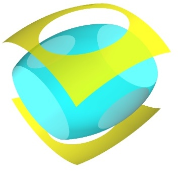

contour3d
~~~~~~~~~

Plots iso-surfaces for a 3D volume of data suplied as arguments.

**Function signatures**::

    contour3d(scalars, ...)
    contour3d(scalarfield, ...)

**Keyword arguments:**

    :opacity: The overall opactiy of the vtk object.

    :colormap: type of colormap to use.

    :vmin: vmin is used to scale the colormap
           If None, the min of the data will be used

    :color: the color of the vtk object. Overides the colormap,
            if any, when specified.

    :contours: Integer/list specifying number/list of
               contours. Specifying 0 shows no contours.
               Specifying a list of values will only give the
               requested contours asked for.

    :extent: [xmin, xmax, ymin, ymax, zmin, zmax]
             Default is the x, y, z arrays extents.

    :vmax: vmax is used to scale the colormap
           If None, the max of the data will be used

    :transparent: make the opacity of the actor depend on the
                  scalar.

    :name: the name of the vtk object created.

Example::

    def test_contour3d():
        dims = [64, 64, 64]
        xmin, xmax, ymin, ymax, zmin, zmax = [-5,5,-5,5,-5,5]
        x, y, z = numpy.ogrid[xmin:xmax:dims[0]*1j,
                              ymin:ymax:dims[1]*1j,
                              zmin:zmax:dims[2]*1j]
        x = x.astype('f')
        y = y.astype('f')
        z = z.astype('f')
    
        sin = numpy.sin
        scalars = x*x*0.5 + y*y + z*z*2.0
    
        obj = contour3d(scalars, contours=4, transparent=True)
        return obj, scalars
    

    