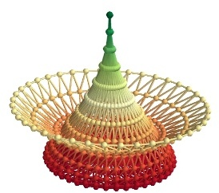

fancy_mesh
~~~~~~~~~~

Create a fancy looking mesh using mesh (example taken from octaviz).

Example::

        def test_fancy_mesh():
        """Create a fancy looking mesh using mesh (example taken from octaviz)."""
        pi = numpy.pi
        cos = numpy.cos
        sin = numpy.sin
        du, dv = pi/20.0, pi/20.0
        u, v = numpy.mgrid[0.01:pi+du*1.5:du, 0:2*pi+dv*1.5:dv]
        x = (1- cos(u))*cos(u+2*pi/3) * cos(v + 2*pi/3.0)*0.5
        y = (1- cos(u))*cos(u+2*pi/3) * cos(v - 2*pi/3.0)*0.5
        z = -cos(u-2*pi/3.)
    
        m = mesh(x, y, z, representation='fancymesh',
                       tube_radius=0.0075, colormap="RdYlGn")
    

    