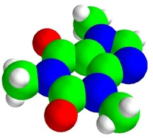

molecule
~~~~~~~~

Generates and shows a Caffeine molecule.

Example::

        def test_molecule():
        """Generates and shows a Caffeine molecule."""
        o = [[30, 62, 19],[8, 21, 10]]
        ox, oy, oz = map(numpy.array, zip(*o))
        n = [[31, 21, 11], [18, 42, 14], [55, 46, 17], [56, 25, 13]]
        nx, ny, nz = map(numpy.array, zip(*n))
        c = [[5, 49, 15], [30, 50, 16], [42, 42, 15], [43, 29, 13], [18, 28, 12],
             [32, 6, 8], [63, 36, 15], [59, 60, 20]]
        cx, cy, cz = map(numpy.array, zip(*c))
        h = [[23, 5, 7], [32, 0, 16], [37, 5, 0], [73, 36, 16], [69, 60, 20],
             [54, 62, 28], [57, 66, 12], [6, 59, 16], [1, 44, 22], [0, 49, 6]]
        hx, hy, hz = map(numpy.array, zip(*h))
    
        oxygen = points3d(ox, oy, oz, scale_factor=16, scale_mode='none',
                                            color=(1,0,0), name='Oxygen')
        nitrogen = points3d(nx, ny, nz, scale_factor=20, scale_mode='none', 
                                            color=(0,0,1), name='Nitrogen')
        carbon = points3d(cx, cy, cz, scale_factor=20, scale_mode='none', 
                                            color=(0,1,0), name='Carbon')
        hydrogen = points3d(hx, hy, hz, scale_factor=10, scale_mode='none', 
                                            color=(1,1,1), name='Hydrogen')
    
        atoms = oxygen, nitrogen, carbon, hydrogen
        for atom in atoms:
            atom.glyph.glyph_source.glyph_source.theta_resolution = 20
            atom.glyph.glyph_source.glyph_source.phi_resolution = 20
        return oxygen, nitrogen, carbon, hydrogen
    

    