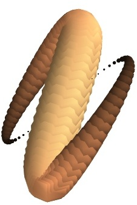

points3d
~~~~~~~~

Plots glyphs (like points) at the position of the supplied data.

**Function signatures**::

    points3d(scalardata, ...)
    points3d(x, y, z...)
    points3d(x, y, z, s, ...)
    points3d(x, y, z, f, ...)

If only one positional argument is passed, it should be VTK data
object with scalar data.

If only 3 arrays x, y, z all the points are drawn with the same size
and color

If 4 positional arguments are passed the last one can be an array s
or a callable f that gives the size and color of the glyph.

**Keyword arguments:**

    :opacity: The overall opactiy of the vtk object.

    :scale_factor: the scaling applied to the glyphs. The
                   size of the glyph is by default in drawing
                   units. Default: 1.0

    :colormap: type of colormap to use.

    :vmin: vmin is used to scale the colormap
           If None, the min of the data will be used

    :color: the color of the vtk object. Overides the colormap,
            if any, when specified.

    :scale_mode: the scaling mode for the glyphs
                 ('vector', 'scalar', or 'none').

    :mode: the mode of the glyphs. Must be '2darrow' or '2dcircle' or
           '2dcross' or '2ddash' or '2ddiamond' or '2dhooked_arrow' or
           '2dsquare' or '2dthick_arrow' or '2dthick_cross' or
           '2dtriangle' or '2dvertex' or 'arrow' or 'cone' or 'cube' or
           'cylinder' or 'point' or 'sphere'. Default: sphere

    :extent: [xmin, xmax, ymin, ymax, zmin, zmax]
             Default is the x, y, z arrays extents.

    :vmax: vmax is used to scale the colormap
           If None, the max of the data will be used

    :transparent: make the opacity of the actor depend on the
                  scalar.

    :name: the name of the vtk object created.

Example::

    def test_points3d():
        t = numpy.linspace(0, 4*numpy.pi, 100)
        cos = numpy.cos
        sin = numpy.sin
    
        x = sin(2*t)
        y = cos(t)
        z = sin(2*t)
        s = sin(t)
    
        points3d(x, y, z, s, colormap="copper")
    

    