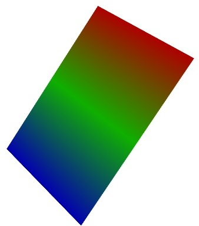

simple_surf
~~~~~~~~~~~

Test Surf with a simple collection of points.

Example::

        def test_simple_surf():
        """Test Surf with a simple collection of points."""
        x, y = numpy.mgrid[0:3:1,0:3:1]
        return surf(x, y, numpy.asarray(x, 'd'))
    

    