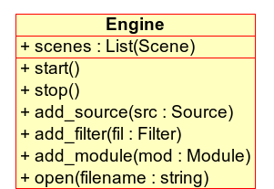
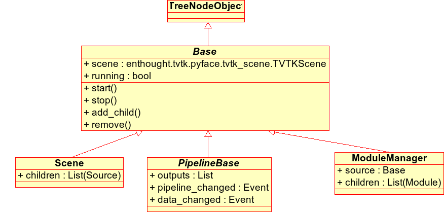

.. _advanced-scripting-with-mayavi:

Advanced Scripting with Mayavi
===============================

As elaborated in the :ref:`an-overview-of-mayavi` section, mayavi can be
scripted from Python in order to visualize data.  Mayavi2 was designed
from the ground up to be highly scriptable.  Everything that can be done
from the user interface can be achieved using Python scripts. 

If you are not looking to script mayavi itself but looking for quick
ways to get your visualization done with simple code you may want to
check out mayavi's mlab module.  This is described in more detail in the
:ref:`simple-scripting-with-mlab` section.  In addition to this mayavi
features an automatic script recording feature that automatically writes
Python scripts for you as you use the GUI.  This is described in more
detail in the :ref:`automatic-script-generation` chapter.  This is
probably the easiest and most powerful way to script mayavi.

However, to best understand how to script mayavi, a reasonable
understanding of the mayavi internals is necessary.  The following
sections provides an overview of the basic design and objects in the
mayavi pipeline.  Subsequent sections consider specific example scripts
that are included with the mayavi sources that illustrate the ideas.

Mayavi2 uses Traits_ and TVTK_ internally.  Traits_ in many ways
changes the way we program.  So it is important to have a good idea of
Traits in order to understand mayavi's internals.  If you are unsure
of traits it is a good idea to get a general idea about traits now.
Trust me, your efforts learning Traits will not be wasted!

.. _Traits: http://code.enthought.com/projects/traits
.. _TVTK: http://code.enthought.com/projects/mayavi

Design Overview
---------------

This section provides a brief introduction to mayavi's internal
architecture.

The "big picture" of a visualization in mayavi is that an ``Engine``
(``enthought.mayavi.engine.Engine``) object manages the entire
visualization.  The ``Engine`` manages a collection of ``Scene``
(``enthought.mayavi.core.scene.Scene``) objects.  In each ``Scene``, a
user may have created any number of ``Source``
(``enthought.mayavi.core.source.Source``) objects.  A ``Source``
object can further contain any number of ``Filters``
(``enthought.mayavi.core.filter.Filter``) or ``ModuleManager``
(``enthought.mayavi.core.module_manager.ModuleManager``) objects.  A
``Filter`` may contain either other filters or ``ModuleManagers``.  A
``ModuleManager`` manages any number of ``Modules``.  The figure below
shows this hierarchy in a graphical form.

.. image:: images/m2_big_picture.png
   :alt: Illustration of the various objects in the mayavi pipeline.

*Illustration of the various objects in the mayavi pipeline.*

This hierarchy is precisely what is seen in the Mayavi tree view on
the UI.  The UI is therefore merely a graphical representation of this
internal world-view.  A little more detail on these objects is given
below.  For even more details please refer to the sources.

All objects in the mayavi pipeline feature ``start`` and ``stop``
methods.  The reasoning for this is that any object in mayavi is not
usable (i.e. it may not provide any outputs) unless it has been
started.  Similarly the ``stop`` method "deactivates" the object.
This is done because mayavi is essentially driving VTK objects
underneath.  These objects require inputs in order to do anything
useful.  Thus, an object that is not connected to the pipeline cannot
be used.  For example, consider an ``IsoSurface`` module.  It requires
some data in order to contour anything.  Thus, the module in isolation
is completely useless.  It is usable only when it is added to the
mayavi pipeline.  When an object is added to the pipeline, its inputs
are setup and its ``start`` method is called automatically.  When the
object is removed from the pipeline its ``stop`` method is called
automatically.  Note that if you are looking to remove an object from
the mayavi pipeline, you can use the ``remove`` method to do so.  For
example (the following will require that you use ``ipython -wthread``)::

  >>> from enthought.mayavi.api import Engine
  >>> e = Engine()
  >>> e.start()
  >>> s = e.new_scene()
  >>> from enthought.mayavi.sources.api import ParametricSurface
  >>> p = ParametricSurface()
  >>> e.add_source(p) # calls p.start internally.
  >>> p.remove() # Removes p from the engine. 

Apart from the ``Engine`` object, all other objects in the mayavi
pipeline feature a ``scene`` trait which refers to the current
``enthought.tvtk.pyface.tvtk_scene.TVTKScene`` instance that the
object is associated with.  The objects also feature an ``add_child``
method that lets one build up the pipeline by adding "children"
objects.  The ``add_child`` method is "intelligent" and will try to
appropriately add the child in the right place.

Here is a brief description of the key objects in the mayavi pipeline.

 ``Engine``
    The Mayavi engine is defined in the ``enthought.mayavi.engine``
    module.

     * It possesses a ``scenes`` trait which is a Trait ``List`` of
       ``Scene`` objects.

     * Features several methods that let one add a
       ``Filter/Source/Module`` instance to it.  It allows one to
       create new scenes and delete them.  Also has methods to load
       and save the entire visualization.

     * The ``EnvisageEngine`` defined in the
       ``enthought.mayavi.envisage_engine`` module is a subclass of
       ``Engine`` and is the one used in the ``mayavi2`` application.
       The ``Engine`` object is not abstract and itself perfectly
       usable.  It is useful when users do not want to use Envisage_
       but still desire to use mayavi for visualization.

 ``Scene``
    Defined in the ``enthought.mayavi.core.scene`` module.

     * ``scene`` attribute: manages a ``TVTKScene``
       (``enthought.tvtk.pyface.tvtk_scene``) object which is where
       all the rendering occurs.

     * The ``children`` attribute is a ``List`` trait that manages a
       list of ``Source`` objects.

 ``PipelineBase``   
    Defined in the ``enthought.mayavi.core.pipeline_base`` module.
    Derives from ``Base`` which merely abstracts out common
    functionality.  The ``PipelineBase`` is the base class for all
    objects in the mayavi pipeline except the ``Scene`` and ``Engine``
    (which really isn't *in* the pipeline but contains the pipeline).

     * This class is characterized by two events, ``pipeline_changed``
       and ``data_changed``.  These are ``Event`` traits.  They
       determine when the pipeline has been changed and when the data
       has changed.  Therefore, if one does::

             object.pipeline_changed = True 

       then the ``pipeline_changed`` event is fired.  Objects
       downstream of ``object`` in the pipeline are automatically
       setup to listen to events from an upstream object and will call
       their ``update_pipeline`` method.  Similarly, if the
       ``data_changed`` event is fired then downstream objects will
       automatically call their ``update_data`` methods.

     * The ``outputs`` attribute is a trait ``List`` of outputs
       produced by the object.

     * The ``remove`` method can be used to remove the object (if added)
       from the mayavi pipeline.

 ``Source``
    Defined in the ``enthought.mayavi.core.source`` module.  All the
    file readers, Parametric surface etc. are subclasses of the
    ``Source`` class.

     * Contains the rest of the pipeline via its ``children`` trait.
       This is a ``List`` of either ``Modules`` or other ``Filters``.
    
     * The ``outputs`` attribute is a trait ``List`` of outputs
       produced by the source.
 
 ``Filter``
    Defined in the ``enthought.mayavi.core.filter`` module.  All the
    ``Filters`` described in the :ref:`filters` section are subclasses of
    this.

     * Contains the rest of the pipeline via its ``children`` trait.
       This is a ``List`` of either ``Modules`` or other ``Filters``.
    
     * The ``inputs`` attribute is a trait ``List`` of input data
       objects that feed into the filter.

     * The ``outputs`` attribute is a trait ``List`` of outputs
       produced by the filter.
       
     * Also features the three methods:

       - ``setup_pipeline``: used to create the underlying
          TVTK pipeline objects if needed.

       - ``update_pipeline``: a method that is called when the
         upstream pipeline has been changed, i.e. an upstream object
         fires a ``pipeline_changed`` event.

       - ``update_data``: a method that is called when the upstream
         pipeline has **not** been changed but the data in the
         pipeline has been changed.  This happens when the upstream
         object fires a ``data_changed`` event.

 ``ModuleManager``
    Defined in the ``enthought.mayavi.core.module_manager`` module.
    This object is the one called *Modules* in the tree view on the
    UI.  The main purpose of this object is to manage ``Modules`` and
    share common data between them.  All modules typically will use
    the same lookup table (LUT) in order to produce a meaningful
    visualization.  This lookup table is managed by the module
    manager.

     * The ``source`` attribute is the ``Source`` or ``Filter`` object
       that is the input of this object.

     * Contains a list of ``Modules`` in its ``children`` trait.
    
     * The ``scalar_lut_manager`` attribute is an instance of a
       ``LUTManager`` which basically manages the color mapping from
       scalar values to colors on the visualizations.  This is
       basically a mapping from scalars to colors.

     * The ``vector_lut_manager`` attribute is an instance of a
       ``LUTManager`` which basically manages the color mapping from
       vector values to colors on the visualizations.

     * The class also features a ``lut_data_mode`` attribute that
       specifies the data type to use for the LUTs.  This can be
       changed between 'auto', 'point data' and 'cell data'.  Changing
       this setting will change the data range and name of the lookup
       table/legend bar.  If set to 'auto' (the default), it
       automatically looks for cell and point data with point data
       being preferred over cell data and chooses the one available.
       If set to 'point data' it uses the input point data for the LUT
       and if set to 'cell data' it uses the input cell data.

 ``Module`` 
    Defined in the ``enthought.mayavi.core.module`` module.
    These objects are the ones that typically produce a visualization
    on the TVTK scene.  All the modules defined in the :ref:`modules`
    section are subclasses of this.

     * The ``components`` attribute is a trait ``List`` of various
       reusable components that are used by the module.  These usually
       are never used directly by the user.  However, they are
       extremely useful when creating new modules.  A ``Component`` is
       basically a reusable piece of code that is used by various
       other objects.  For example, almost every ``Module`` uses a
       TVTK actor, mapper and property.  These are all "componentized"
       into a reusable `Actor` component that the modules use.  Thus,
       components are a means to promote reuse between mayavi pipeline
       objects.

     * The ``module_manager`` attribute specifies the
       ``ModuleManager`` instance that it is attached to.

     * Like the ``Filter`` modules also feature the three methods:

       - ``setup_pipeline``: used to create the underlying
          TVTK pipeline objects if needed.

       - ``update_pipeline``: a method that is called when the
         upstream pipeline has been changed, i.e. an upstream object
         fires a ``pipeline_changed`` event.

       - ``update_data``: a method that is called when the upstream
         pipeline has **not** been changed but the data in the
         pipeline has been changed.  This happens when the upstream
         object fires a ``data_changed`` event.

The following figures show the class hierarchy of the various objects
involved.

*The ``Engine`` object and its important attributes and methods.*

*This hierarchy depicts the ``Base`` object, the ``Scene``,
``PipelineBase`` and the ``ModuleManager``.*

.. image:: images/design2b.png
   :alt: More object hierarchy

*This hierarchy depicts the ``PipelineBase`` object, the ``Source``,
``Filter``, ``Module`` and the ``Component``.*

Scripting the ``mayavi2`` application
-------------------------------------

The ``mayavi2`` application is implemented in the
``enthought.mayavi.scripts.mayavi2`` module (look at the
``mayavi2.py`` file and not the ``mayavi2`` script).  This code
handles the command line argument parsing and runs the application.

``mayavi2`` is an Envisage_ application.  It starts the Envisage
application in its ``main`` method.  The code for this is in the
``enthought.mayavi.plugins.app`` module.  Mayavi uses several envisage plugins
to build up its functionality.  These plugins are defined in the
``enthought.mayavi.plugins.app`` module.  In this module there
are two functions that return a list of default plugins, ``get_plugins`` and the
``get_non_gui_plugins``.  The default application uses the
former which produces a GUI that the user can use.  If one uses the
latter (``get_non_gui_plugins``) then the mayavi tree view,
object editor and menu items will not be available when the
application is run.  This allows a developer to create an application
that uses mayavi but does not show its user interface.  An example of
how this may be done is provided in ``examples/mayavi/nongui.py``.

.. _Envisage: http://code.enthought.com/projects/envisage

Scripting from the UI
~~~~~~~~~~~~~~~~~~~~~

When using the ``mayavi2`` application, it is possible to script from
the embedded Python interpreter on the UI.  On the interpreter the name
``mayavi`` is automatically bound to an
``enthought.mayavi.plugins.script.Script`` instance that may be used to
easily script mayavi.  This instance is a simple wrapper object that
merely provides some nice conveniences while scripting from the UI.  It
has an ``engine`` trait that is a reference to the running mayavi
engine.  Note that it is just as convenient to use an
``Engine`` instance itself to script mayavi.

As described in :ref:`the-embedded-python-interpreter` section, one can
always drag a mayavi pipeline object from the tree and drop it on the
interpreter to script it directly.

One may select the `File->Open Text File...` menu to open an existing
Python file in the text editor, or choose the `File->New Text File` menu
to create a new file.  The text editor is Python-aware and one may write
a script assuming that the ``mayavi`` name is bound to the ``Script``
instance as it is on the shell.  To execute this script one can press
``Control-r`` as described earlier.  ``Control-s`` will save the script.
``Control-b`` increases the font size and ``Control-n`` reduces it.

The nice thing about this kind of scripting is that if one scripts
something on the interpreter or on the editor, one may save the
contents to a file, say ``script.py`` and then the next time this script
can be run like so::

  $ mayavi2 -x script.py

This will execute the script for automatically.  The name ``mayavi``
is available to the script and is bound to the ``Script`` instance.
This is very convenient.  It is possible to have mayavi execute
multiple scripts.  For example::

 $ mayavi2 -d foo.vtk -m IsoSurface -x setup_iso.py -x script2.py

will load the ``foo.vtk`` file, create an ``IsoSurface`` module, then
run ``setup_iso.py`` and then run ``script2.py``.

There are several scripts in the mayavi ``examples`` directory that
should show how this can be done.  The ``examples/README.txt``
contains some information on the recommended ways to script.

Scripting from IPython
~~~~~~~~~~~~~~~~~~~~~~

It is possible to script Mayavi using IPython_.  IPython will have to
be invoked with the ``-wthread`` command line option in order to allow
one to interactively script the mayavi application::

 $ ipython -wthread

To start a visualization do the following::

 from enthought.mayavi.app import main
 # Note, this does not process any command line arguments.
 mayavi = main()
 # 'mayavi' is the mayavi Script instance.

It is also possible to use mlab (see :ref:`simple-scripting-with-mlab`) for
this purpose::

 from enthought.mayavi import mlab
 f = mlab.figure() # Returns the current scene.
 engine = mlab.get_engine() # Returns the running mayavi engine.

With this it should be possible to script mayavi just the way it is
done on the embedded interpreter or on the text editor.

.. _IPython: http://ipython.scipy.org

An example
~~~~~~~~~~

Here is an example script that illustrates various features of scripting
mayavi (note that this will work if you execute the following from the
embedded Python shell inside Mayavi or if you run it as ``mayavi2 -x
script.py``)::

  # Create a new mayavi scene.
  mayavi.new_scene()

  # Get the current active scene.
  s = mayavi.engine.current_scene

  # Read a data file.
  d = mayavi.open('fire_ug.vtu')

  # Import a few modules.
  from enthought.mayavi.modules.api import Outline, IsoSurface, Streamline

  # Show an outline.
  o = Outline()
  mayavi.add_module(o)
  o.actor.property.color = 1, 0, 0 # red color.

  # Make a few contours.
  iso = IsoSurface()
  mayavi.add_module(iso)
  iso.contour.contours = [450, 570]
  # Make them translucent.
  iso.actor.property.opacity = 0.4
  # Show the scalar bar (legend).
  iso.module_manager.scalar_lut_manager.show_scalar_bar = True

  # A streamline.
  st = Streamline()
  mayavi.add_module(st)
  # Position the seed center.
  st.seed.widget.center = 3.5, 0.625, 1.25
  st.streamline_type = 'tube'

  # Save the resulting image to a PNG file.
  s.scene.save('test.png')

  # Make an animation:
  for i in range(36):
      # Rotate the camera by 10 degrees.
      s.scene.camera.azimuth(10)

      # Resets the camera clipping plane so everything fits and then
      # renders.
      s.scene.reset_zoom()

      # Save the scene.
      s.scene.save_png('anim%d.png'%i)

Sometimes, given a mayavi ``Script`` instance or ``Engine``, it is
handy to be able to navigate to a particular module/object.  In the
above this could be achieved as follows::

  x = mayavi.engine.scenes[0].children[0].children[0].children[-1]
  print x

In this case ``x`` will be set to the ``Streamline`` instance that we
just created.

There are plenty of examples illustrating various things in the
``examples/mayavi`` directory.  These are all fairly well documented.  

In particular, the ``standalone.py`` example illustrates how one can
script mayavi without using the envisage application at all.  The
``offscreen.py`` example illustrates how this may be done using off
screen rendering (if supported by your particular build of VTK).

``examples/README.txt`` contains some information on the recommended
ways to script and some additional information.

Using the mayavi envisage plugins
---------------------------------

The mayavi related plugin definitions to use are:

  * ``mayavi_plugin.py``
  * ``mayavi_ui_plugin.py``

These are in the ``enthought.mayavi.plugins`` package.  To see an
example of how to use this see the ``enthought.mayavi.plugins.app``
module.  The explorer3D example in ``examples/mayavi/explorer`` also
demonstrates how to use mayavi as an envisage plugin.

If you are writing Envisage plugins for an application and desire to use
the mayavi plugins from your plugins/applications then it is important
to note that mayavi creates three workbench service offers for your
convenience.  These are:

  * ``enthought.mayavi.plugins.script.Script``: This is an
    ``enthought.mayavi.plugins.script.Script`` instance that may be used
    to easily script mayavi.  It is a simple wrapper object that merely
    provides some nice conveniences while scripting from the UI.  It has
    an ``engine`` trait that is a reference to the running mayavi
    engine.

  * ``enthought.mayavi.core.engine.Engine``: This is the running
    mayavi engine instance.

A simple example that demonstrates the use of the mayavi plugin in an
envisage application is included in the ``examples/mayavi/explorer``
directory.  This may be studied to understand how you may do the same
in your envisage applications.

..
   Local Variables:
   mode: rst
   indent-tabs-mode: nil
   sentence-end-double-space: t
   fill-column: 70
   End:

