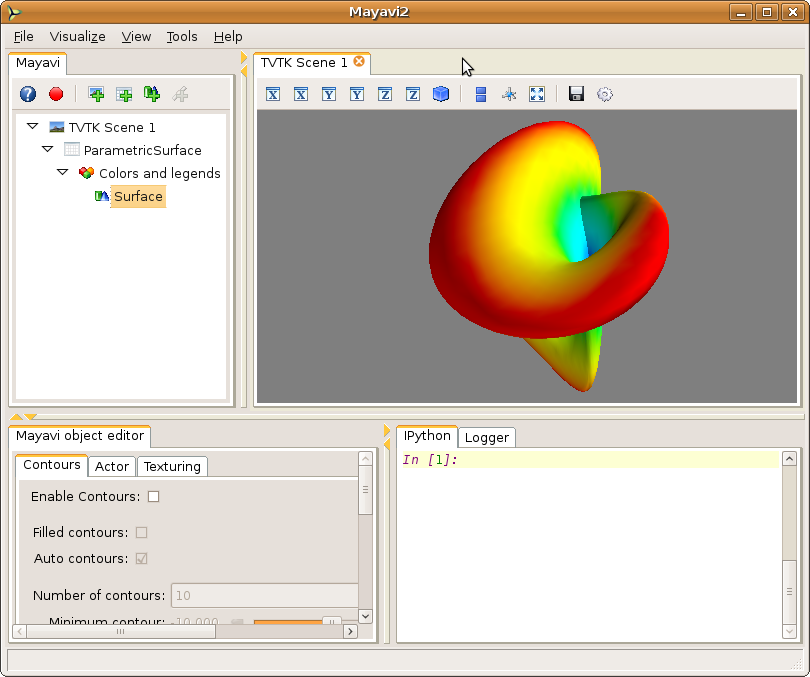

.. _using-the-mayavi-application:

Using the Mayavi application
=============================

This chapter primarily concerns using the ``mayavi2`` application.
Some of the things mentioned here also apply when mayavi is scripted.
We recommend that new users read this chapter before going to the more
advanced ones.

.. _general-layout-of-ui:

General layout of UI
--------------------

When the `mayavi2` application is started it will provide a user
interface that looks something like the figure shown below.

.. image:: images/mayavi_ui_first.png
   :alt: Figure of Mayavi's initial UI window.

*Figure of Mayavi's initial UI window.*

The UI features several sections described below.

  Menus
    The menus let you open files, load modules, set preferences etc.

  The Mayavi engine tree view
    This is a tree view of the mayavi pipeline.
      * Right click a tree node to rename, delete, copy the objects.

      * Left click on a node to edit its properties on the object
        editor below the tree.

      * It is possible to drag the nodes around on the tree.  For
        example it is possible to drag and move a module from one set
        of Modules to another, or to move a visualization from one
        scene to another.

  The object editor 
    This is where the properties of mayavi pipeline objects can be
    changed when an object on the engine's pipeline is clicked.

  TVTK scenes
    This is where the visualization of the data happens.  One can
    interact with this scene via the mouse and the keyboard.  More
    details are in the following sections.

  Python interpreter
    The built-in Python interpreter that can be used to script mayavi
    and do other things.  You can drag nodes from the mayavi tree and
    drop them on the interpreter and then script the object represented
    by the node!

  Logger
    Application log messages may be seen here.

Mayavi's UI layout is highly configurable:

 * the line in-between the sections can be dragged to resize
   particular views.

 * most of the "tabs" on the widgets can be dragged around to move
   them anywhere in the application.

 * Each view area (the mayavi engine view, object editor, python shell
   and logger) can be enabled and disabled in the 'View' menu.

Each time you change the appearance of mayavi it is saved and the next
time you start up the application it will have the same configuration.
In addition, you can save different layouts into different
"perspectives" using the `View->Perspectives` menu item.

Shown below is a specifically configured mayavi user interface view.
In this view the size of the various parts are changed.  The Python
shell is activated by default.

*Figure of Mayavi's UI after being configured by a user.*

Visualizing data
----------------

Mayavi modules can be used to visualize the data as described in the 
:ref:`an-overview-of-mayavi` section and the :ref:`learning-mayavi-by-example`
section.  One needs to have some data or the other loaded before a
`Module` or `Filter` may be used.  Mayavi supports several data file
formats most notably VTK data file formats.  More information on this is
available here in the :ref:`creating-data-for-mayavi` section.

Once data is loaded one can optionally use a variety of `Filters`_ to
filter or modify the data in some way or the other and then visualize
the data using several `Modules`_. 

.. _modules:

Modules
~~~~~~~

Modules are the objects that perform the visualization itself: they use
data to create the visual elements on the scene.

Here is a list of the Mayavi modules along with a brief description.

   Axes   
         Draws simple axes.

   ContourGridPlane
          A contour grid plane module. This module lets one take a
          slice of input grid data and view contours of the data.

   CustomGridPlane
          A custom grid plane with a lot more flexibility than
          GridPlane module.

   Glyph  
          Displays different types of glyphs oriented and colored
          as per scalar or vector data at the input points.

   GridPlane
          A simple grid plane module.

   HyperStreamline
          A  module that integrates through a tensor field to generate a
          hyperstreamline. The integration is along the maximum
          eigenvector and the cross section of the hyperstreamline is
          defined by the two other eigenvectors. Thus the shape of the
          hyperstreamline is "tube-like", with the cross  section being
          elliptical. Hyperstreamlines are used to visualize tensor
          fields.

   ImageActor
          A simple module to view image data efficiently.

   ImagePlaneWidget
          A simple module to view image data.

   IsoSurface
          A module that allows the user to make contours of input
          point data.

   Labels
          Allows a user to label the current dataset or the current
          actor of the active module.

   OrientationAxes
          Creates a small axes on the side that indicates the
          position of the co-ordinate axes and thereby marks the
          orientation of the scene. Requires VTK-4.5 and above.

   Outline
          A module that draws an outline for the given data.

   ScalarCutPlane
          Takes a cut plane of any input data set using an
          implicit plane and plots the data with optional
          contouring and scalar warping.

   SliceUnstructuredGrid
          This module takes a slice of the unstructured grid data
          and shows the cells that intersect or touch the slice.

   Streamline
          Allows the user to draw streamlines for given vector
          data. This supports various types of seed objects (line,
          sphere, plane and point seeds). It also allows the user
          to draw ribbons or tubes and further supports different
          types of interactive modes of calculating the
          streamlines.

   StructuredGridOutline
          Draws a grid-conforming outline for structured grids.

   Surface
          Draws a surface for any input dataset with optional contouring.

   TensorGlyph
          Displays tensor glyphs oriented and colored as per scalar or
          vector data at the input points.

   Text   
          This module allows the user to place text on the screen.

   VectorCutPlane
          Takes an arbitrary slice of the input data using an
          implicit cut plane and places glyphs according to the
          vector field data. The glyphs may be colored using
          either the vector magnitude or the scalar attributes.

   Vectors
          Displays different types of glyphs oriented and colored
          as per vector data at the input points. This is merely a
          convenience module that is entirely based on the Glyph
          module.

   Volume 
          The Volume module visualizes scalar fields using
          volumetric visualization techniques.

   WarpVectorCutPlane
          Takes an arbitrary slice of the input data using an
          implicit cut plane and warps it according to the vector
          field data. The scalars are displayed on the warped
          surface as colors.

.. _filters:

Filters
~~~~~~~
Filters transform the data, but do not display it. They are used as an
intermediate between the data sources and the modules.

Here is a list of the Mayavi Filters.

   CellDerivatives
          Computes derivatives from input point scalar and vector data
          and produces cell data on the gradients.  Can be used to
          approximately calcuate the vorticity for example.

   CellToPointData
          Transforms cell attribute data to point data by
          averaging the cell data from the cells at the point.

   Contour
          A contour filter that wraps around the Contour component to
          generate iso-surfaces on any input dataset.
    
   CutPlane
          This class represents a cut plane that can be used to slice
          through any dataset.  It also provides a 3D widget interface
          to position and move the slice interactively.

   DecimatePro
          Reduces the number of triangles in a triangular mesh by
          approximating the original mesh.

   Delaunay2D
          Performs a 2D Delaunay triangulation.

   Delaunay3D
          Performs a 3D Delaunay triangulation.

   ElevationFilter
          Creates scalar data corresponding to the elevation of the
          points along a line.

   ExtractEdges
          This filter extracts cell edges from any input data.

   ExtractGrid
          Allows a user to select a part of a structured grid.

   ExtractTensorComponents
          Wraps the TVTK ``ExtractTensorComponents`` filter to extract
          components from a tensor field.

   ExtractUnstructuredGrid
          Allows a user to select a part of an unstructured grid.

   ExtractVectorNorm
          Computes the norm (Euclidean) of the input vector data
          (with optional scaling between [0, 1]). This is useful
          when the input data has vector input but no scalar data
          for the magnitude of the vectors.
	  
   ExtractVectorComponents
	  Wraps the TVTK ExtractVectorComponents filter to extract
	  components of a vector. This is useful for analysing
	  individual components of a vector data.

   GaussianSplatter
          This filter splat points into a volume with an elliptical,
          Gaussian distribution.

   GreedyTerrainDecimation
          Approximates a height field (image data) with a triangle mesh,
          keeping the number of triangles minimum.

   ImageChangeInformation
          A filter that can be used to change the origin, spacing and
          extents of an input image data dataset without changing the
          data itself.

   ImageDataProbe
          A filter that can be used to probe any dataset using a
          Structured Points dataset.  The filter also allows one to
          convert the scalar data to an unsigned short array so that the
          scalars can be used for volume visualization.

   MaskPoints
          Selectively passes the input points downstream. This can
          be used to subsample the input points.  Note that this
          does not pass geometry data, this means all grid
          information is lost.

   PointToCellData
          Does the inverse of the CellToPointData filter.

   PolyDataNormals
          Computes normals from input data. This gives meshes a
          smoother appearance. This should work for any input
          dataset. Note: this filter is called "Compute Normals"
          in Mayavi2 GUI (Visualize/Filters/Compute Normals).

   QuadricDecimation
          Reduce triangles in a mesh, forming a good approximation of the
          original mesh.

   SelectOutput
          A filter that allows a user to select one among several of the
          outputs of a given input.  This is typically very useful for a
          multi-block data source.

   SetActiveAttribute
          This filter lets a user set the active data attribute
          (scalars, vectors and tensors) on a VTK dataset.  This is
          particularly useful if you need to do something like compute
          contours of one scalar on the contour of another scalar.

   Threshold
          A simple filter that thresholds on input data.

   TransformData
          Performs a linear transformation to input data.

   Tube
          Turns lines into tubes.

   UserDefined
          This filter lets the user define their own filter
          dynamically/interactively.  It is like `FilterBase` but allows
          a user to specify the class without writing any code.
    
   Vorticity
          This filter computes the vorticity of an input vector field.
          For convenience, the filter allows one to optionally
          pass-through the given input vector field.  The filter also
          allows the user to show the component of the vorticity along a
          particular cartesian co-ordinate axes.  It produces point data
          on output which is ready to visualize.
    
   WarpScalar
          Warps the input data along a particular direction
          (either the normals or a specified direction) with a
          scale specified by the local scalar value. Useful for
          making carpet plots.

   WarpVector
          Warps the input data along a the point vector attribute
          scaled as per a scale factor.  Useful for showing flow
          profiles or displacements.

.. _interaction-with-the-scene:

Interaction with the scene
--------------------------

The TVTK scenes on the UI can be closed by clicking on the little 'x'
icon on the tab.  Each scene features a toolbar that supports various
features:

  * Buttons to set the view to view along the positive or negative X,
    Y and Z axes or obtain an isometric view.

  * A button to turn on parallel projection instead of the default
    perspective projection.  This is particularly useful when one is
    looking at 2D plots.

  * A button to turn on an axes to indicate the x, y and z axes.

  * A button to turn on full-screen viewing.  Note that once
    full-screen mode is entered one must press 'q' or 'e' to get back
    a normal window.

  * A button to save the scene to a variety of image formats.  The
    image format to use is determined by the extension provided for
    the file.

  * A button that provides a UI to configure the scene properties.

The primary means to interact with the scene is to use the mouse and
keyboard.

Mouse interaction
~~~~~~~~~~~~~~~~~

There are two modes of mouse interaction:

  * Camera mode: the default, where the camera is operated on with
    mouse moves.  This mode is activated by pressing the 'c' key.

  * Actor mode: in this mode the mouse actions operate on the actor
    the mouse is currently above.  This mode is activated by pressing
    the 'a' key.

The view on the scene can be changed by using various mouse actions.
Usually these are accomplished by holding down a mouse button and
dragging.

  * holding the left mouse button down and dragging will rotate the
    camera/actor in the direction moved.

        - Holding down "SHIFT" when doing this will pan the scene --
          just like the middle button.

        - Holding down "CONTROL" will rotate about the camera's focal
          point.

        - Holding down "SHIFT" and "CONTROL" and dragging up will zoom
          in and dragging down will zoom out.  This is like the right
          button.

  * holding the right mouse button down and dragging upwards will zoom
    in (or increase the actors scale) and dragging downwards will zoom
    out (or reduce scale).

  * holding the middle mouse button down and dragging will pan the
    scene or translate the object.

  * Rotating the mouse wheel upwards will zoom in and downwards will
    zoom out.

Keyboard interaction
~~~~~~~~~~~~~~~~~~~~

The scene supports several features activated via keystrokes.  These
are:
 
 * '3': Turn on/off stereo rendering.  This may not work if the
   'stereo' preference item is not set to True.

 * 'a': Use actor mode for mouse interaction instead of camera mode.

 * 'c': Use camera mode for mouse interaction instead of actor mode.

 * 'e'/'q'/'Esc': Exit full-screen mode.

 * 'f': Move camera's focal point to current mouse location.  This
   will move the camera focus to center the view at the current mouse
   position.

 * 'j': Use joystick mode for the mouse interaction.  In joystick mode
   the mouse somewhat mimics a joystick.  For example, holding the
   mouse left button down when away from the center will rotate the
   scene.

 * 'l': Configure the lights that are illumining the scene.  This will
   pop-up a window to change the light configuration.

 * 'p': Pick the data at the current mouse point.  This will pop-up a
   window with information on the current pick.  The UI will also
   allow one to change the behavior of the picker to pick cells,
   points or arbitrary points.

 * 'r': Reset the camera focal point and position.  This is very handy.

 * 's': Save the scene to an image, this will first popup a file
   selection dialog box so you can choose the filename, the extension of
   the filename determines the image type.

 * 't': Use trackball mode for the mouse interaction.  This is the
   default mode for the mouse interaction.

 * '='/'+': Zoom in.

 * '-': Zoom out.

 * 'left'/'right'/'up'/'down' arrows: Pressing the left, right, up and
   down arrow let you rotate the camera in those directions.  When
   "SHIFT" modifier is also held down the camera is panned.

.. _the-embedded-python-interpreter:

The embedded Python interpreter
-------------------------------

The embedded Python interpreter offers extremely powerful
possibilities.  The interpreter features command completion, automatic
documentation, tooltips and some multi-line editing.  In addition it
supports the following features:

 * The name ``mayavi`` is automatically bound to the
   ``enthought.mayavi.script.Script`` instance.  This may be used to
   easily script mayavi.

 * The name ``application`` is bound to the envisage application.

 * If a Python file is opened via the ``File->Open File...`` menu item
   one can edit it with a color syntax capable editor.  To execute
   this script in the embedded Python interpreter, the user may type
   ``Control-r`` on the editor window.  To save the file press
   ``Control-s``.  This is a very handy feature when developing simple
   mayavi scripts. You can also increase and decrease the font size using
   ``Control-n`` and ``Control-s``.

 * As mentioned earlier, one may drag and drop nodes from the Mayavi
   engine tree view onto the Python shell.  The object may then be
   scripted as one normally would.  A commonly used pattern when this
   is done is the following::

     >>> tvtk_scene_1
     <enthought.mayavi.core.scene.Scene object at 0x9f4cbe3c>
     >>> s = _

   In this case the name ``s`` is bound to the dropped tvtk_scene
   object.  The ``_`` variable stores the last evaluated expression
   which is the dropped object.  Using ``tvtk_scene_1`` will also work
   but is a mouthful.

.. _command-line-arguments:

Command line arguments
----------------------

The ``mayavi2`` application features several useful command line
arguments that are described in the following section.  These options
are described in the ``mayavi2`` man page as well.

Mayavi can be run like so::

       mayavi2 [options] [args]

Where ``arg1``, ``arg2`` etc.  are optional file names that correspond
to saved Mayavi2 visualizations (``filename.mv2``),  Mayavi2 scripts
(``filename.py``) or any datafile supported by Mayavi.  If no options or
arguments are provided mayavi will start up with a default blank scene.

The options are:

-h
      This prints all the available command line options and exits.
      Also available through ``--help``.

-V
      This prints the Mayavi version on the command line and exits.
      Also available through ``--version``.

-z file_name
      This loads a previously saved Mayavi2 visualization.  Also
      available through ``--viz file_name`` or ``--visualization
      file_name``.

-d data_file
      Opens any of the supported data file formats or non-file
      associated data source objects.  This includes VTK file formats
      (*.vtk, *.xml, *.vt[i,p,r,s,u], *.pvt[i,p,r,s,u]), VRML2 (*.wrl),
      3D Studio (*.3ds), PLOT3D (*.xyz) and various others that are
      supported.

      ``data_file`` can also be a source object not associated with a file,
      for example ``ParametricSurface`` or ``PointLoad`` will load the
      corresponding data sources into Mayavi.  Also available through
      ``--data``.

-m module-name
      A module is an object that actually visualizes the data.  The
      given ``module-name`` is loaded in the current ``ModuleManager``.
      The module name must be a valid one if not you will get an error
      message.

      If a module is specified as ``package.sub.module.SomeModule``
      then the module (``SomeModule``) is imported from
      ``package.sub.module``.  Standard modules provided with
      ``mayavi2`` do not need the full path specification.  For
      example::

         mayavi2 -d data.vtk -m Outline -m user_modules.AModule

      In this example ``Outline`` is a standard module and
      ``user_modules.AModule`` is some user defined module.
      Also available through ``--module``.

-f filter-name
      A filter is an object that filters out the data in some way or
      the other.  The given ``filter-name`` is loaded with respect to
      the current source/filter object.  The filter name must be a
      valid one if not you will get an error message.

      If the filter is specified as ``package.sub.filter.SomeFilter``
      then the filter (``SomeFilter``) is imported from
      ``package.sub.filter``.  Standard modules provided with
      ``mayavi2`` do not need the full path specification.  For
      example::

         mayavi2 -d data.vtk -f ExtractVectorNorm -f user_filters.AFilter

      In this example ``ExtractVectorNorm`` is a standard filter and
      ``user_filters.AFilter`` is some user defined filter.
      Also available through ``--filter``.

-M
      Starts up a new module manager on the Mayavi pipeline. Also
      available through ``--module-mgr``.

-n
      Creates a new window/scene. Any options passed after this will
      apply to this newly created scene.  Also available through
      ``--new-window``.

-o
      Run Mayavi in offscreen mode without any graphical user interface.
      This is most useful for scripts that need to render images
      offscreen (for an animation say) in the background without an
      intrusive user interface popping up.  Mayavi scripts (run via the
      ``-x`` argument) should typically work fine in this mode.  Also
      available through, ``--offscreen``.

-x script-file
      This executes the given script in a namespace where we guarantee
      that the name 'mayavi' is Mayavi's script instance -- just like
      in the embedded Python interpreter.  Also available through
      ``--exec``.

-s python-expression
      Execute the python-expression on the last created object.  For
      example, lets say the previous object was a module.  If you want
      to set the color of that object and save the scene, you may do::

       $ mayavi2 [...] -m Outline -s"actor.property.color = (1,0,0)" \
        -s "scene.save('test.png', size=(800, 800))"

      You should use quotes for the expression.  This is also available
      through ``--set``.

.. warning::
 Note that ``-x`` or ``--exec`` uses `execfile`, so this can be
 dangerous if the script does something nasty!  Similarly, ``-s`` or
 ``--set`` uses `exec`, which can also be dangerous if abused.

It is important to note that mayavi's **command line arguments are
processed sequentially** in the same order they are given.  This
allows users to do interesting things.

Here are a few examples of the command line arguments::

  $ mayavi2 -d ParametricSurface -s "function='dini'" -m Surface \
    -s "module_manager.scalar_lut_manager.show_scalar_bar = True" \
    -s "scene.isometric_view()" -s "scene.save('snapshot.png')"

  $ mayavi2 -d heart.vtk -m Axes -m Outline -m GridPlane \
    -m ContourGridPlane -m IsoSurface

  $ mayavi2 -d fire_ug.vtu -m Axes -m Outline -m VectorCutPlane \
    -f MaskPoints -m Glyph

In the above examples, ``heart.vtk`` and ``fire_ug.vtu`` VTK files can
be found in the ``examples/data`` directory in the source.  They may
also be installed on your computer depending on your particular
platform.

..
   Local Variables:
   mode: rst
   indent-tabs-mode: nil
   sentence-end-double-space: t
   fill-column: 70
   End:

