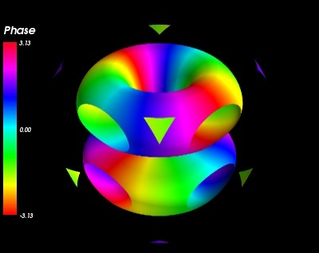

.. _example_atomic_orbital:

Atomic orbital example
--------------------------------------------------------------------

An example showing the norm and phase of an atomic orbital: isosurfaces of
the norm, with colors  displaying the phase.

This example shows how you can apply a filter on one data set, and dislay
a second data set on the output of the filter. Here we use the contour
filter to extract isosurfaces of the norm of a complex field, and we
display the phase of the field with the colormap.

The field we choose to plot is a simplified version of the 3P_y atomic
orbital for hydrogen-like atoms.

The first step is to create a data source with two scalar datasets. The
second step is to apply filters and modules, using the
'set_active_attribute' filter to select on which data these apply.

Creating a data source with two scalar datasets is actually slightly
tricky, as it requires some understanding of the layout of the datasets
in TVTK. The reader is referred to :ref:`data-structures-used-by-mayavi`
for more details.

**Python source code:** :download:`atomic_orbital.py`

.. literalinclude:: atomic_orbital.py
    :lines: 22-

    