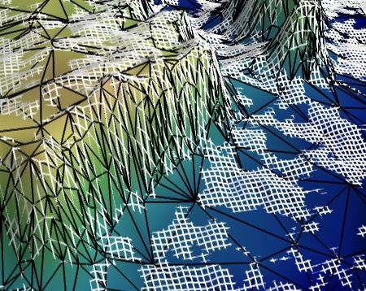

.. _example_canyon_decimation:

Canyon decimation example
--------------------------------------------------------------------

Use the greedy-terrain-decimator to display a decimated terrain view.

This example illustrates decimating a terrain. We use the
greedy-terrain-decimator to create a reduced mesh with an optimized grid that
approximates the initial regular grid.

The initial grid is displayed in white, and the optimized grid is displayed in
black, with the surface it creates. The initial grid can be seen
disappearing as it goes under the surface of the approximated grid:
although the decimated mesh follows closely the original, it is not
exactly the same.

One can see that the reduction in number of polygons is huge: the white
grid is much finer than the black grid. It is interesting to note that
the decimated mesh follows closely the original mesh, including in number
of polygons, in spots where the terrain changes most quickly.

This example uses the Grand Canyon topological radar data, from NASA.

The greedy-terrain-decimator is only useful to decimate a surface
warped from 2D data. To decimated more general meshes, you can use the
less-efficient decimate-pro filter (see :ref:`example_julia_set_decimation`).

**Python source code:** :download:`canyon_decimation.py`

.. literalinclude:: canyon_decimation.py
    :lines: 25-

    