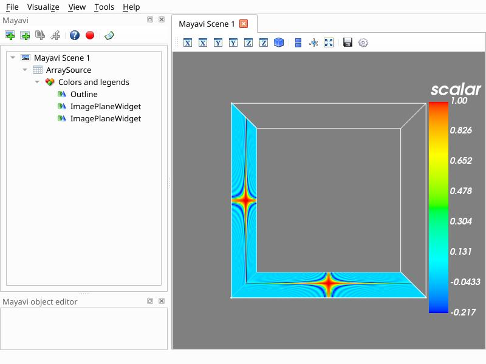

.. _example_compute_in_thread:

Compute in thread example
--------------------------------------------

This script demonstrates how one can do a computation in another thread
and update the mayavi pipeline. It also shows how to create a numpy array
data and visualize it as image data using a few modules.

**Python source code:** :download:`compute_in_thread.py`

.. literalinclude:: compute_in_thread.py
    :lines: 7-

    