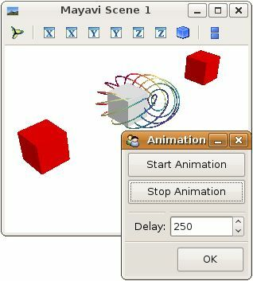

.. _example_mlab_visual:

Mlab visual example
--------------------------------------------

A very simple example to show how you can use TVTK's visual module
with mlab and create simple animations.

In the example, the grey box bounces back and forth between the two red
ones.

The `tvtk.tools.visual` module exposes an API similar to
`VPython <http://vpython.org/>`_ and is useful to create animation based
on rigid object movement.

The `@animate` decorator ( :func:`mayavi.mlab.animate` ) is
detailed on section :ref:`animating_a_visualization`.

If you want to modify the data plotted by the mlab (as in the
`mlab.test_plot3d()` call) to create an animation, please see section
:ref:`mlab-animating-data`.

**Python source code:** :download:`mlab_visual.py`

.. literalinclude:: mlab_visual.py
    :lines: 21-

    