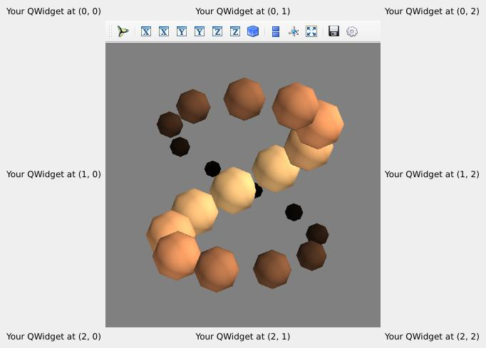

.. _example_qt_embedding:

Qt embedding example
--------------------------------------------

This example demonstrates using Mayavi as a component of a large Qt
application.

For this use, Mayavi is embedded in a QWidget. To understand this
example, please read section :ref:`building_applications`.

**Python source code:** :download:`qt_embedding.py`

.. literalinclude:: qt_embedding.py
    :lines: 8-

    