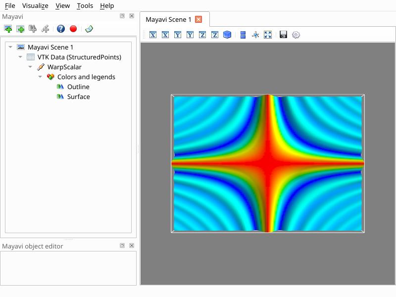

.. _example_surf_regular_mlab:

Surf regular mlab example
--------------------------------------------

Shows how to view data created by `tvtk.tools.mlab` with
mayavi2.

**Python source code:** :download:`surf_regular_mlab.py`

.. literalinclude:: surf_regular_mlab.py
    :lines: 5-

    