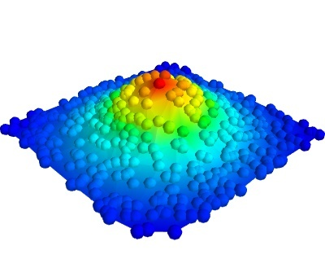

.. _example_surface_from_irregular_data:

Surface from irregular data example
--------------------------------------------------------------------

An example which shows how to plot a surface from data acquired
irregularly.

Data giving the variation of a parameter 'z' as a function of two others
('x' and 'y') is often plotted as a `carpet plot`, using a surface to
visualize the underlying function. when the data has been acquired on a
regular grid for parameters 'x' and 'y', it can simply be view with the
mlab.surf function. However, when there are some missing points, or the
data has been acquired at random, the surf function cannot be used.

The difficulty stems from the fact that points positioned in 3D do
not define a surface if no connectivity information is given. With the
surf function, this information is implicit from the shape of the input
arrays.

In this example, randomly-positioned points in the (x, y) plane are
embedded in a surface in the z axis. We first visualize the points using
mlab.points3d. We then use the delaunay2d filter to extract the mesh by
nearest-neighboor matching, and visualize it using the surface module.

**Python source code:** :download:`surface_from_irregular_data.py`

.. literalinclude:: surface_from_irregular_data.py
    :lines: 22-

    