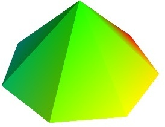
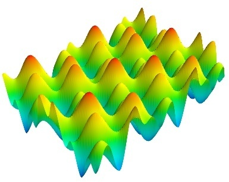
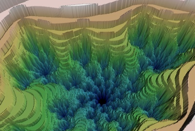
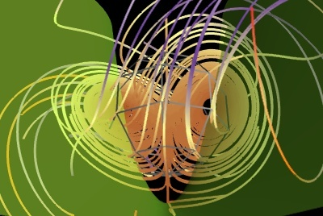
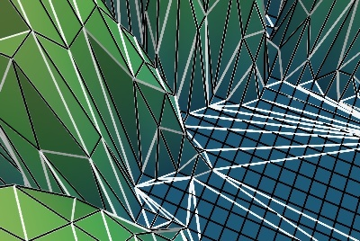
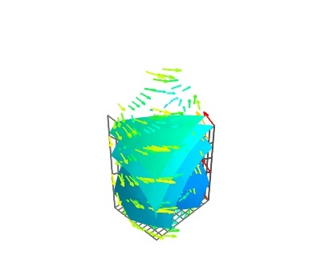
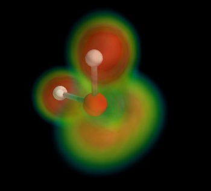
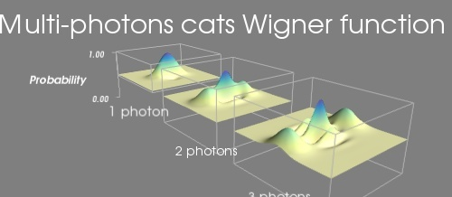
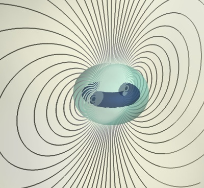
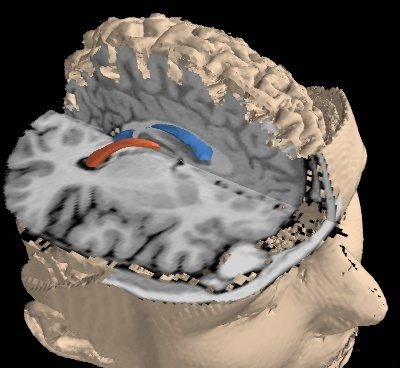

.. _example_gallery:

Example gallery
=================

Mlab functions gallery
----------------------

These are the examples of the mlab plotting functions. They are
copied out here for convenience. Please refer to the corresponding
section of the user guide for more information (
:ref:`mlab_plotting_functions`).

.. currentmodule:: mayavi.mlab

+------------------+-------------------------+---------------------+
| :func:`plot3d`   | :func:`points3d`        | :func:`imshow`      |
|                  |                         |                     |
| |plot3d.jpg|     | |points3d.jpg|          | |imshow.jpg|        |
+------------------+-------------------------+---------------------+
| :func:`surf`     | :func:`contour_surf`    | :func:`mesh`        |
|                  |                         |                     |
| |surf.jpg|       | |contour_surf.jpg|      | |mesh.jpg|          |
+------------------+-------------------------+---------------------+
| :func:`barchart` | :func:`triangular_mesh` | :func:`contour3d`   |
|                  |                         |                     |
| |barchart.jpg|   | |triangular_mesh.jpg|   | |contour3d.jpg|     |
+------------------+-------------------------+---------------------+
| :func:`quiver3d` | :func:`flow`            |                     |
|                  |                         |                     |
| |quiver3d.jpg|   |  |flow.jpg|             |                     |
+------------------+-------------------------+---------------------+

.. |plot3d.jpg| image:: ../generated_images/enthought_mayavi_mlab_plot3d.jpg
     :width: 150

.. |points3d.jpg| image:: ../generated_images/enthought_mayavi_mlab_points3d.jpg
     :width: 150

.. |contour_surf.jpg| image:: ../generated_images/enthought_mayavi_mlab_contour_surf.jpg
     :width: 150

.. |mesh.jpg| image:: ../generated_images/enthought_mayavi_mlab_mesh.jpg
     :width: 150

.. |barchart.jpg| image:: ../generated_images/enthought_mayavi_mlab_barchart.jpg
     :width: 150

.. |contour3d.jpg| image:: ../generated_images/enthought_mayavi_mlab_contour3d.jpg
     :width: 150

.. |flow.jpg| image:: ../generated_images/enthought_mayavi_mlab_flow.jpg
     :width: 150

Advanced mlab examples
-----------------------

.. toctree::
   :hidden:

   example_julia_set.rst
   example_boy.rst
   example_bunny.rst
   example_dragon.rst
   example_lucy.rst
   example_custom_colormap.rst
   example_surface_from_irregular_data.rst
   example_spherical_harmonics.rst
   example_lorenz.rst
   example_canyon.rst
   example_julia_set_decimation.rst
   example_simple_structured_grid.rst
   example_atomic_orbital.rst
   example_tvtk_in_mayavi.rst
   example_chemistry.rst
   example_wigner.rst
   example_canyon_decimation.rst
   example_plotting_many_lines.rst
   example_magnetic_field_lines.rst
   example_mri.rst
   example_protein.rst
   example_flight_graph.rst

            

            
.. |0002| raw:: html

     

            
.. |0003| raw:: html

     

            
.. |0004| raw:: html

     

            

            
.. |0006| image:: ../generated_images/example_surface_from_irregular_data.jpg
    :width: 150

            

            

            

            

            

            
.. |0012| image:: ../generated_images/example_atomic_orbital.jpg
    :width: 150

            

            

            

            
.. |0016| image:: ../generated_images/example_canyon_decimation.jpg
    :width: 150

            
.. |0017| image:: ../generated_images/example_plotting_many_lines.jpg
    :width: 150

            

            

            
.. |0020| image:: ../generated_images/example_protein.jpg
    :width: 150

            
.. |0021| image:: ../generated_images/example_flight_graph.jpg
    :width: 150

            
======= =============================================
======= =============================================
|0000|  :ref:`example_julia_set`
         An example showing the Julia set
         displayed as a z-warped surface.

|0001|  :ref:`example_boy`
         A script to generate the Mayavi logo: a
         Boy surface.

|0002|  :ref:`example_bunny`
         Viewing Stanford 3D Scanning Repository
         bunny model

|0003|  :ref:`example_dragon`
         Viewing Stanford 3D Scanning Repository
         dragon model

|0004|  :ref:`example_lucy`
         Viewing Stanford 3D Scanning Repository
         lucy model

|0005|  :ref:`example_custom_colormap`
         An example showing how a custom
         colormap (or look up table) can be used
         for a given object.

|0006|  :ref:`example_surface_from_irregular_data`
         An example which shows how to plot a
         surface from data acquired irregularly.

|0007|  :ref:`example_spherical_harmonics`
         Plot spherical harmonics on the surface
         of the sphere, as well as a 3D polar
         plot.

|0008|  :ref:`example_lorenz`
         An example displaying the trajectories
         for the Lorenz system of equations along
         with the z-nullcline.

|0009|  :ref:`example_canyon`
         Retrieve radar data from the NASA and
         plot a view of the Grand Canyon
         landscape.

|0010|  :ref:`example_julia_set_decimation`
         The Julia set, but with a decimated
         mesh: unnecessary triangles due to the
         initial grid and not matching the
         geometry of the Julia set are removed.

|0011|  :ref:`example_simple_structured_grid`
         An example creating a structured grid
         data set from numpy arrays using TVTK
         and visualizing it using mlab.

|0012|  :ref:`example_atomic_orbital`
         An example showing the norm and phase
         of an atomic orbital: isosurfaces of the
         norm, with colors  displaying the phase.

|0013|  :ref:`example_tvtk_in_mayavi`
         An example of pure TVTK programming to
         build TVTK objects, which are then added
         to a Mayavi scene.

|0014|  :ref:`example_chemistry`
         In this example, we display the H2O
         molecule, and use volume rendering to
         display the electron localization
         function.

|0015|  :ref:`example_wigner`
         An example in which 3 functions of x
         and y  are displayed with a surf plot,
         while the z scaling is kept constant, to
         allow comparison between them.

|0016|  :ref:`example_canyon_decimation`
         Use the greedy-terrain-decimator to
         display a decimated terrain view.

|0017|  :ref:`example_plotting_many_lines`
         This examples shows how many lines can
         be grouped together in a single object,
         for convenience and efficiency.

|0018|  :ref:`example_magnetic_field_lines`
         This example uses the streamline module
         to display field lines of a magnetic
         dipole (a current loop).

|0019|  :ref:`example_mri`
         Viewing MRI data with cut plane and iso
         surface.

|0020|  :ref:`example_protein`
         Visualize a protein graph structure
         downloaded from the protein database in
         standard pdb format.

|0021|  :ref:`example_flight_graph`
         An example showing a graph display
         between cities positioned on the Earth
         surface.

======= =============================================

Interactive examples
--------------------------------------------------

Examples showing how to use the interactive features of Mayavi, either
via the mayavi2 application, or via specially-crafted dialogs and
applications.
    

.. toctree::
   :hidden:

   example_mlab_visual.rst
   example_mlab_traits_ui.rst
   example_wx_embedding.rst
   example_multiple_engines.rst
   example_multiple_mlab_scene_models.rst
   example_superquad_with_gui.rst
   example_mlab_interactive_dialog.rst
   example_wx_mayavi_embed_in_notebook.rst
   example_subclassing_mayavi_application.rst
   example_mayavi_traits_ui.rst
   example_compute_in_thread.rst
   example_qt_embedding.rst
   example_adjust_cropping_extents.rst
   example_poll_file.rst
   example_lorenz_ui.rst
   example_volume_slicer.rst
   example_coil_design_application.rst
   example_volume_slicer_advanced.rst

.. A comment to split paragraphs

.. |0100| image:: ../images/example_mlab_visual.jpg
    :width: 150

            
.. |0101| raw:: html

     

            
.. |0102| raw:: html

     

            
.. |0103| raw:: html

     

            
.. |0104| raw:: html

     

            
.. |0105| raw:: html

     

            
.. |0106| image:: ../images/example_mlab_interactive_dialog.jpg
    :width: 150

            
.. |0107| raw:: html

     

            
.. |0108| raw:: html

     

            
.. |0109| raw:: html

     

            
.. |0110| raw:: html

     

            
.. |0111| raw:: html

     

            
.. |0112| raw:: html

     

            
.. |0113| raw:: html

     

            
.. |0114| raw:: html

     

            
.. |0115| raw:: html

     

            
.. |0116| raw:: html

     

            
.. |0117| raw:: html

     

            
======= =============================================
======= =============================================
|0100|  :ref:`example_mlab_visual`
         A very simple example to show how you
         can use TVTK's visual module with mlab
         and create simple animations.

|0101|  :ref:`example_mlab_traits_ui`
         A simple example of how to use
         mayavi.mlab inside a traits UI dialog.

|0102|  :ref:`example_wx_embedding`
         This example shows to embed a Mayavi
         view in a wx frame.

|0103|  :ref:`example_multiple_engines`
         An example to show how you can have
         multiple engines in one application.

|0104|  :ref:`example_multiple_mlab_scene_models`
         Example showing a dialog with multiple
         embedded scenes.

|0105|  :ref:`example_superquad_with_gui`
         This example uses MayaVi to show the
         evolution of a superquadric (http://en.w
         ikipedia.org/wiki/Superquadrics), which
         are ellipsoidal surfaces parametrised by
         two parameters,lpha and eta. The
         equations that are used to determine the
         superquadric are (in spherical-polar
         coordinates):

|0106|  :ref:`example_mlab_interactive_dialog`
         An example of how to modify the data
         visualized  via an interactive dialog.

|0107|  :ref:`example_wx_mayavi_embed_in_notebook`
         This example show how to embedded
         Mayavi in a wx notebook.

|0108|  :ref:`example_subclassing_mayavi_application`
         This script demonstrates how one can
         script the Mayavi application by
         subclassing the application, create a
         new scene and create a few simple
         modules.

|0109|  :ref:`example_mayavi_traits_ui`
         An example of how to create a UI
         similar to the complete Mayavi
         application inside a Traits UI view.

|0110|  :ref:`example_compute_in_thread`
         This script demonstrates how one can do
         a computation in another thread and
         update the mayavi pipeline. It also
         shows how to create a numpy array data
         and visualize it as image data using a
         few modules.

|0111|  :ref:`example_qt_embedding`
         This example demonstrates using Mayavi
         as a component of a large Qt
         application.

|0112|  :ref:`example_adjust_cropping_extents`
         A custom dialog to adjust the
         parameters of a GeometryFilter to crop
         data points.

|0113|  :ref:`example_poll_file`
         A simple script that polls a data file
         for changes and then updates the mayavi
         pipeline automatically.

|0114|  :ref:`example_lorenz_ui`
         This example displays the trajectories
         for the Lorenz system of equations using
         mlab along with the z-nullcline.  It
         provides a simple UI where a user can
         change the parameters and the system of
         equations on the fly.  This primarily
         demonstrates how one can build powerful
         tools with a UI using Traits and Mayavi.

|0115|  :ref:`example_volume_slicer`
         Example of an elaborate dialog showing
         a multiple views on the same data, with
         3 cuts synchronized.

|0116|  :ref:`example_coil_design_application`
         An full-blown application demoing a
         domain-specific usecase with Mayavi:
         interactive design of coils.

|0117|  :ref:`example_volume_slicer_advanced`
         An efficient implementation of the
         triple-plane view showing 3 cut planes
         on volumetric data, and side views
         showing each cut, with a cursor to move
         the other cuts.

======= =============================================

Advanced visualization examples
--------------------------------------------------

Data visualization using the core Mayavi API, object-oriented, and with
more fine control than mlab.

    

.. toctree::
   :hidden:

   example_polydata.rst
   example_offscreen.rst
   example_surf_regular_mlab.rst
   example_glyph.rst
   example_structured_points2d.rst
   example_contour_contour.rst
   example_scatter_plot.rst
   example_streamline.rst
   example_numeric_source.rst
   example_structured_points3d.rst
   example_image_cursor_filter.rst
   example_contour.rst
   example_probe_filter.rst
   example_unstructured_grid.rst
   example_structured_grid.rst
   example_tvtk_segmentation.rst
   example_datasets.rst
   example_delaunay_graph.rst
   example_mlab_3D_to_2D.rst
   example_magnetic_field.rst

.. A comment to split paragraphs

* :ref:`example_polydata`
    An example of how to generate a polydata dataset using numpy arrays.

* :ref:`example_offscreen`
    A simple example of how you can use Mayavi without using Envisage
    or the Mayavi Envisage application and do off screen rendering.

* :ref:`example_surf_regular_mlab`
    Shows how to view data created by `tvtk.tools.mlab` with
    mayavi2.

* :ref:`example_glyph`
    This script demonstrates using the Mayavi core API to add a VectorCutPlane,
    split the pipeline using a MaskPoints filter and then view the filtered data
    with the Glyph module.

* :ref:`example_structured_points2d`
    An example of how to generate a 2D structured points dataset
    using numpy arrays.  Also shown is a way to visualize this data with
    the mayavi2 application.

* :ref:`example_contour_contour`
    This example shows how you can produce contours on an IsoSurface.

* :ref:`example_scatter_plot`
    An example of plotting scatter points with Mayavi's core API.

* :ref:`example_streamline`
    This script demonstrates how one can script Mayavi's core API to display
    streamlines and an iso surface.

* :ref:`example_numeric_source`
    This script demonstrates how to create a numpy array data and
    visualize it as image data using a few modules.

* :ref:`example_structured_points3d`
    An example of how to generate a 3D structured points dataset
    using numpy arrays.  Also shown is a way to visualize this data with
    the mayavi2 application.

* :ref:`example_image_cursor_filter`
    Excample using the UserDefined filter to paint a cross-shaped cursor on data,
    in order to point out a special position.

* :ref:`example_contour`
    This script demonstrates how one can script Mayavi and use its
    contour related modules.

* :ref:`example_probe_filter`
    Using the probe filter to visualize a scalar field along an arbitrary
    surface.

* :ref:`example_unstructured_grid`
    A MayaVi example of how to generate an unstructured grid dataset
    using numpy arrays.  Also shown is a way to visualize this data with
    mayavi2.  The script can be run like so:

* :ref:`example_structured_grid`
    An example of how to generate a structured grid dataset using
    numpy arrays.  Also shown is a way to visualize this data with
    the mayavi2 application.

* :ref:`example_tvtk_segmentation`
    Using VTK to assemble a pipeline for segmenting MRI images. This example
    shows how to insert well-controled custom VTK filters in Mayavi.

* :ref:`example_datasets`
    A Mayavi example to show the different data sets. See
    :ref:`data-structures-used-by-mayavi` for a discussion.

* :ref:`example_delaunay_graph`
    An example illustrating graph manipulation and display with Mayavi
    and NetworkX.

* :ref:`example_mlab_3D_to_2D`
    A script to calculate the projection of 3D world coordinates to
    2D display coordinates (pixel coordinates) for a given scene.

* :ref:`example_magnetic_field`
    An example mixing numerical caculation and 3D visualization of the
    magnetic field created by an arbitrary number of current loops.

Data interaction examples
--------------------------------------------------

Examples showing how you can query and interact with the data.

    

.. toctree::
   :hidden:

   example_pick_on_surface.rst
   example_select_red_balls.rst

.. A comment to split paragraphs

* :ref:`example_pick_on_surface`
    Example showing how to pick data on a surface, going all the way back
    to the index in the numpy arrays.

* :ref:`example_select_red_balls`
    This example shows how to use a callback to select a red ball amongst white
    balls.

Misc examples
--------------------------------------------------

.. toctree::
   :hidden:

   example_standalone.rst
   example_zzz_reader.rst
   example_nongui.rst
   example_user_mayavi.rst

.. A comment to split paragraphs

* :ref:`example_standalone`
    A simple example of how you can use Mayavi without
    using Envisage or the Mayavi Envisage application.

* :ref:`example_zzz_reader`
    This is a simple example that shows how to create a reader factory
    and register that reader with mayavi.

* :ref:`example_nongui`
    This script demonstrates how one can use the Mayavi application framework
    without displaying Mayavi's UI.

* :ref:`example_user_mayavi`
    Sample Mayavi customization file.
