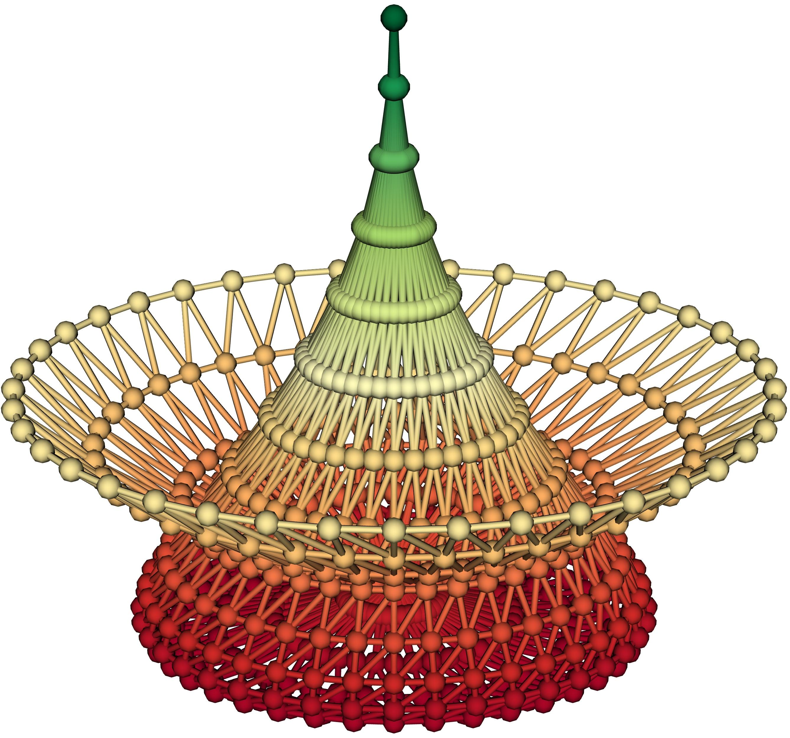
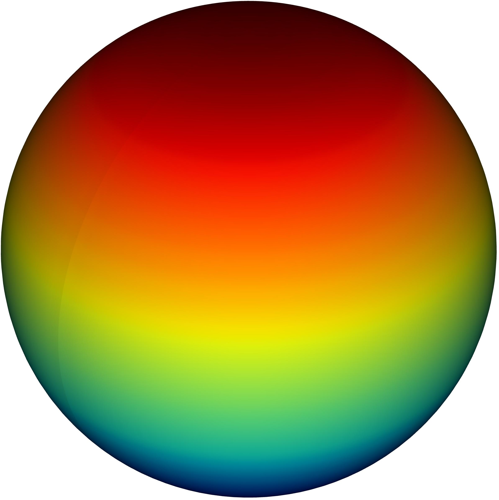
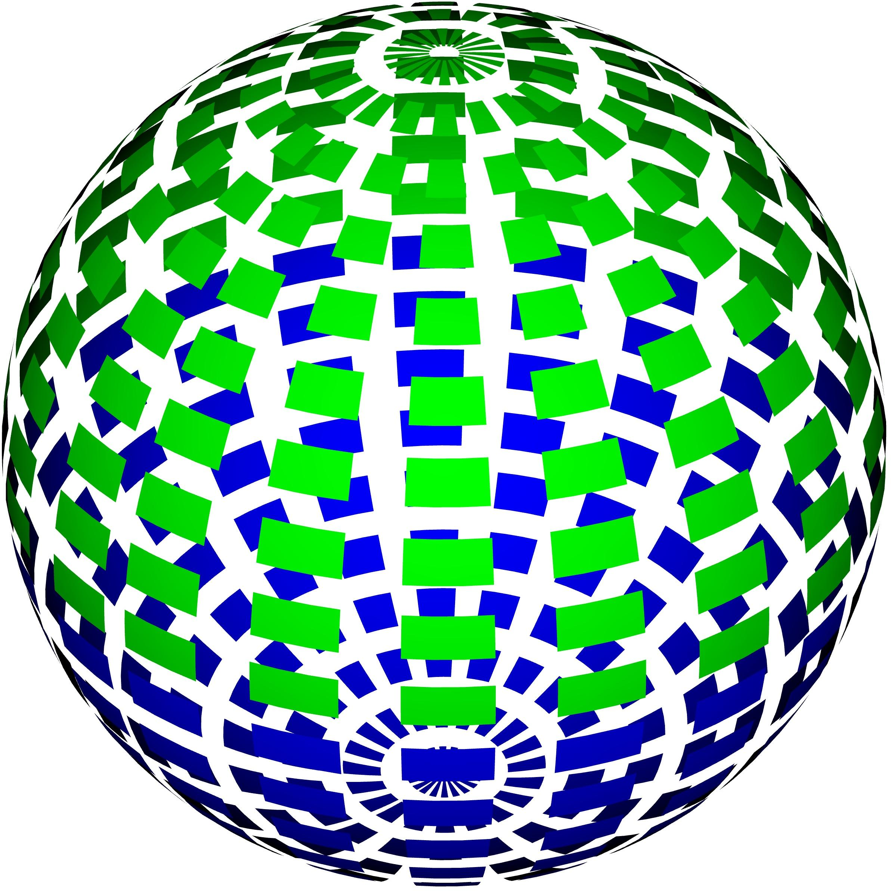
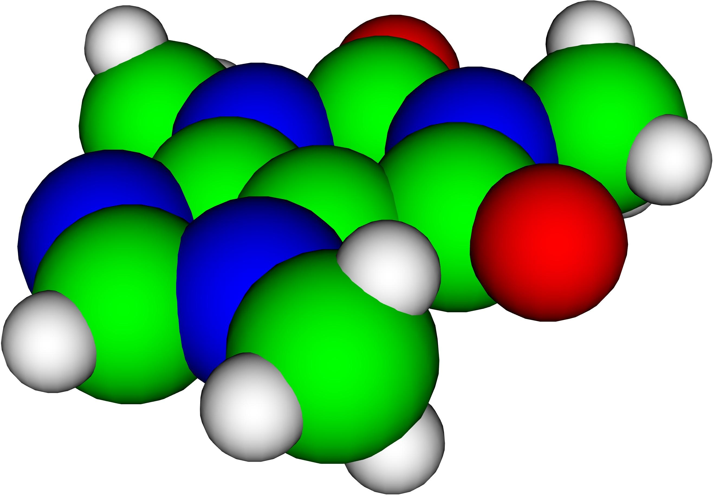
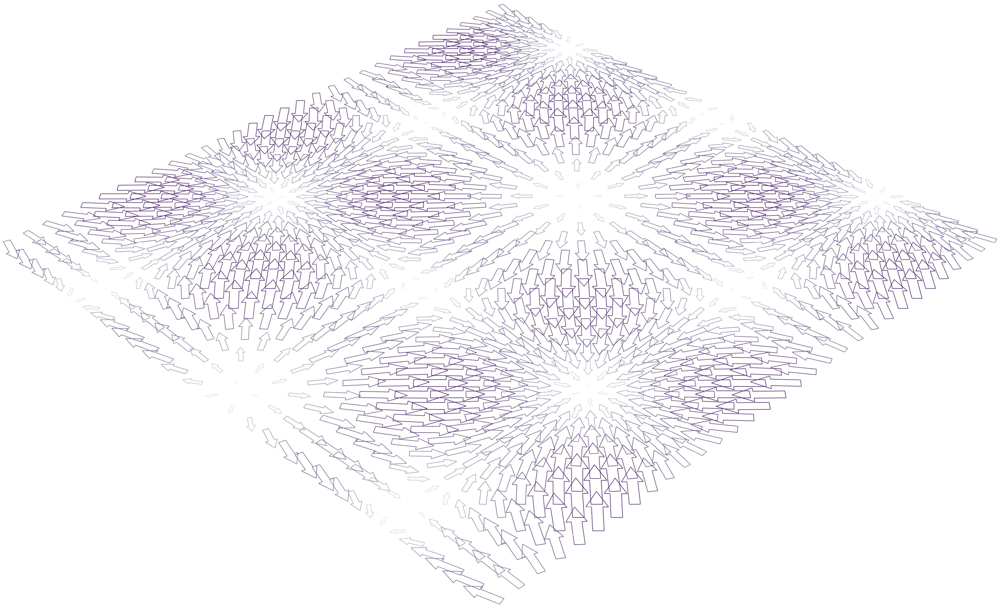
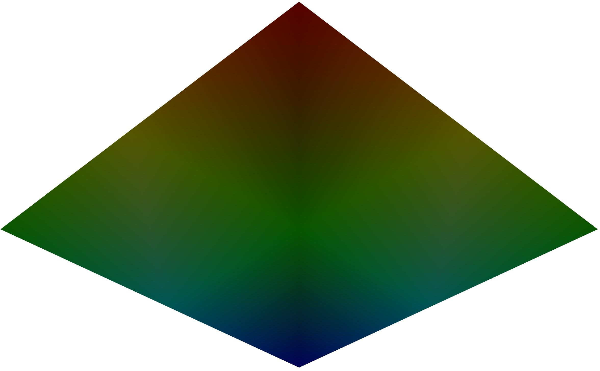

.. currentmodule:: mayavi.mlab

.. note::

    This section is only a reference describing the function, please see
    the chapter on :ref:`simple-scripting-with-mlab` for an introduction to
    mlab and how to interact with and assemble the functions of `mlab`.

    Please see the section on :ref:`running-mlab-scripts` for
    instructions on running the examples.

Plotting functions
==================

barchart
~~~~~~~~

.. function:: barchart(*args, **kwargs)

    
    Plots vertical glyphs (like bars) scaled vertical, to do
    histogram-like plots.
    
    This functions accepts a wide variety of inputs, with positions given
    in 2-D or in 3-D.
    
    **Function signatures**::
    
        barchart(s, ...)
        barchart(x, y, s, ...)
        barchart(x, y, f, ...)
        barchart(x, y, z, s, ...)
        barchart(x, y, z, f, ...)
    
    If only one positional argument is passed, it can be a 1-D, 2-D, or 3-D
    array giving the length of the vectors. The positions of the data
    points are deducted from the indices of array, and an
    uniformly-spaced data set is created.
    
    If 3 positional arguments (x, y, s) are passed the last one must be
    an array s, or a callable, f, that returns an array. x and y give the
    2D coordinates of positions corresponding to the s values.
    
    If 4 positional arguments (x, y, z, s) are passed, the 3 first are
    arrays giving the 3D coordinates of the data points, and the last one
    is an array s, or a callable, f, that returns an array giving the
    data value.
    
    
    **Keyword arguments:**
    
        :auto_scale: whether to compute automatically the lateral scaling of
                     the glyphs. This might be computationally expensive. Must
                     be a boolean. Default: True
    
        :color: the color of the vtk object. Overides the colormap,
                if any, when specified. This is specified as a
                triplet of float ranging from 0 to 1, eg (1, 1,
                1) for white.
    
        :colormap: type of colormap to use.
    
        :extent: [xmin, xmax, ymin, ymax, zmin, zmax]
                 Default is the x, y, z arrays extent. Use
                 this to change the extent of the object
                 created.
    
        :figure: Figure to populate.
    
        :lateral_scale: The lateral scale of the glyph, in units of the
                        distance between nearest points Must be a float.
                        Default: 0.9
    
        :line_width:  The width of the lines, if any used. Must be a float.
                     Default: 2.0
    
        :mask_points: If supplied, only one out of 'mask_points' data point is
                      displayed. This option is useful to reduce the number of
                      points displayed on large datasets Must be an integer or
                      None.
    
        :mode: The glyph used to represent the bars. Must be '2dcircle' or
               '2dcross' or '2ddiamond' or '2dsquare' or '2dthick_cross' or
               '2dtriangle' or '2dvertex' or 'cube'. Default: cube
    
        :name: the name of the vtk object created.
    
        :opacity: The overall opacity of the vtk object. Must be a float.
                  Default: 1.0
    
        :reset_zoom: Reset the zoom to accomodate the data newly
                     added to the scene. Defaults to True.
    
        :resolution: The resolution of the glyph created. For spheres, for
                     instance, this is the number of divisions along theta and
                     phi. Must be an integer. Default: 8
    
        :scale_factor: the scaling applied to the glyphs. The
                       size of the glyph is by default in drawing
                       units. Must be a float. Default: 1.0
    
        :scale_mode: the scaling mode for the glyphs
                     ('vector', 'scalar', or 'none').
    
        :transparent: make the opacity of the actor depend on
                      the scalar.
    
        :vmax: vmax is used to scale the colormap.
               If None, the max of the data will be used
    
        :vmin: vmin is used to scale the colormap.
               If None, the min of the data will be used
    

    

.. image:: ../generated_images/mayavi_mlab_barchart.jpg

**Example** (run in ``ipython --gui=qt``, or in the mayavi2 interactive shell,
see :ref:`running-mlab-scripts` for more info)::

    
    import numpy
    from mayavi.mlab import *
    
    def test_barchart():
        """ Demo the bar chart plot with a 2D array.
        """
        s = np.abs(np.random.random((3, 3)))
        return barchart(s)
    
                

contour3d
~~~~~~~~~

.. function:: contour3d(*args, **kwargs)

    
    Plots iso-surfaces for a 3D volume of data supplied as arguments.
    
    **Function signatures**::
    
        contour3d(scalars, ...)
        contour3d(x, y, z, scalars, ...)
    
    scalars is a 3D numpy arrays giving the data on a grid.
    
    If 4 arrays, (x, y, z, scalars) are passed, the 3 first arrays give the
    position, and the last the scalar value. The x, y and z arrays are then
    supposed to have been generated by `numpy.mgrid`, in other words, they are
    3D arrays, with positions lying on a 3D orthogonal and regularly spaced
    grid with nearest neighbor in space matching nearest neighbor in the array.
    The function builds a scalar field assuming  the points are regularly
    spaced.
    
    **Keyword arguments:**
    
        :color: the color of the vtk object. Overides the colormap,
                if any, when specified. This is specified as a
                triplet of float ranging from 0 to 1, eg (1, 1,
                1) for white.
    
        :colormap: type of colormap to use.
    
        :contours: Integer/list specifying number/list of
                   contours. Specifying a list of values will only
                   give the requested contours asked for.
    
        :extent: [xmin, xmax, ymin, ymax, zmin, zmax]
                 Default is the x, y, z arrays extent. Use
                 this to change the extent of the object
                 created.
    
        :figure: Figure to populate.
    
        :line_width:  The width of the lines, if any used. Must be a float.
                     Default: 2.0
    
        :name: the name of the vtk object created.
    
        :opacity: The overall opacity of the vtk object. Must be a float.
                  Default: 1.0
    
        :reset_zoom: Reset the zoom to accomodate the data newly
                     added to the scene. Defaults to True.
    
        :transparent: make the opacity of the actor depend on
                      the scalar.
    
        :vmax: vmax is used to scale the colormap.
               If None, the max of the data will be used
    
        :vmin: vmin is used to scale the colormap.
               If None, the min of the data will be used
    

    

.. image:: ../generated_images/mayavi_mlab_contour3d.jpg

**Example** (run in ``ipython --gui=qt``, or in the mayavi2 interactive shell,
see :ref:`running-mlab-scripts` for more info)::

    
    import numpy
    from mayavi.mlab import *
    
    def test_contour3d():
        x, y, z = np.ogrid[-5:5:64j, -5:5:64j, -5:5:64j]
    
        scalars = x * x * 0.5 + y * y + z * z * 2.0
    
        obj = contour3d(scalars, contours=4, transparent=True)
        return obj
    
                

contour_surf
~~~~~~~~~~~~

.. function:: contour_surf(*args, **kwargs)

    
    Plots a the contours of a surface using grid-spaced data for
    elevation supplied as a 2D array.
    
    **Function signatures**::
    
        contour_surf(s, ...)
        contour_surf(x, y, s, ...)
        contour_surf(x, y, f, ...)
    
    s is the elevation matrix, a 2D array. The contour lines plotted
    are lines of equal s value.
    
    x and y can be 1D or 2D arrays (such as returned by numpy.ogrid or
    numpy.mgrid), but the points should be located on an orthogonal grid
    (possibly non-uniform). In other words, all the points sharing a same
    index in the s array need to have the same x or y value. For
    arbitrary-shaped position arrays (non-orthogonal grids), see the mesh
    function.
    
    If only 1 array s is passed, the x and y arrays are assumed to be
    made from the indices of arrays, and an uniformly-spaced data set is
    created.
    
    If 3 positional arguments are passed the last one must be an array s,
    or a callable, f, that returns an array. x and y give the
    coordinates of positions corresponding to the s values.
    
    **Keyword arguments:**
    
        :color: the color of the vtk object. Overides the colormap,
                if any, when specified. This is specified as a
                triplet of float ranging from 0 to 1, eg (1, 1,
                1) for white.
    
        :colormap: type of colormap to use.
    
        :contours: Integer/list specifying number/list of
                   contours. Specifying a list of values will only
                   give the requested contours asked for.
    
        :extent: [xmin, xmax, ymin, ymax, zmin, zmax]
                 Default is the x, y, z arrays extent. Use
                 this to change the extent of the object
                 created.
    
        :figure: Figure to populate.
    
        :line_width:  The width of the lines, if any used. Must be a float.
                     Default: 2.0
    
        :name: the name of the vtk object created.
    
        :opacity: The overall opacity of the vtk object. Must be a float.
                  Default: 1.0
    
        :reset_zoom: Reset the zoom to accomodate the data newly
                     added to the scene. Defaults to True.
    
        :transparent: make the opacity of the actor depend on
                      the scalar.
    
        :vmax: vmax is used to scale the colormap.
               If None, the max of the data will be used
    
        :vmin: vmin is used to scale the colormap.
               If None, the min of the data will be used
    
        :warp_scale: scale of the warp scalar
    

    

.. image:: ../generated_images/mayavi_mlab_contour_surf.jpg

**Example** (run in ``ipython --gui=qt``, or in the mayavi2 interactive shell,
see :ref:`running-mlab-scripts` for more info)::

    
    import numpy
    from mayavi.mlab import *
    
    def test_contour_surf():
        """Test contour_surf on regularly spaced co-ordinates like MayaVi."""
        def f(x, y):
            sin, cos = np.sin, np.cos
            return sin(x + y) + sin(2 * x - y) + cos(3 * x + 4 * y)
    
        x, y = np.mgrid[-7.:7.05:0.1, -5.:5.05:0.05]
        s = contour_surf(x, y, f)
        return s
    
                

flow
~~~~

.. function:: flow(*args, **kwargs)

    
    Creates a trajectory of particles following the flow of a vector field.
    
    **Function signatures**::
    
        flow(u, v, w, ...)
        flow(x, y, z, u, v, w, ...)
        flow(x, y, z, f, ...)
    
    u, v, w are numpy arrays giving the components of the vectors.
    
    If only 3 arrays, u, v, and w are passed, they must be 3D arrays, and
    the positions of the arrows are assumed to be the indices of the
    corresponding points in the (u, v, w) arrays.
    
    If 6 arrays, (x, y, z, u, v, w) are passed, the 3 first arrays give
    the position of the arrows, and the 3 last the components. The x, y
    and z arrays are then supposed to have been generated by
    `numpy.mgrid`, in other words, they are 3D arrays, with positions
    lying on a 3D orthogonal and regularly spaced grid with nearest
    neighbor in space matching nearest neighbor in the array. The
    function builds a vector field assuming  the points are regularly
    spaced.
    
    If 4 positional arguments, (x, y, z, f) are passed, the last one must be
    a callable, f, that returns vectors components (u, v, w) given the
    positions (x, y, z).
    
    **Keyword arguments:**
    
        :color: the color of the vtk object. Overides the colormap,
                if any, when specified. This is specified as a
                triplet of float ranging from 0 to 1, eg (1, 1,
                1) for white.
    
        :colormap: type of colormap to use.
    
        :extent: [xmin, xmax, ymin, ymax, zmin, zmax]
                 Default is the x, y, z arrays extent. Use
                 this to change the extent of the object
                 created.
    
        :figure: Figure to populate.
    
        :integration_direction: The direction of the integration. Must be
                                'forward' or 'backward' or 'both'. Default:
                                forward
    
        :line_width:  The width of the lines, if any used. Must be a float.
                     Default: 2.0
    
        :linetype: the type of line-like object used to display the
                   streamline. Must be 'line' or 'ribbon' or 'tube'. Default:
                   line
    
        :name: the name of the vtk object created.
    
        :opacity: The overall opacity of the vtk object. Must be a float.
                  Default: 1.0
    
        :reset_zoom: Reset the zoom to accomodate the data newly
                     added to the scene. Defaults to True.
    
        :scalars: optional scalar data.
    
        :seed_resolution: The resolution of the seed. Determines the number of
                          seed points Must be an integer or None.
    
        :seed_scale: Scales the seed around its default center Must be a
                     float. Default: 1.0
    
        :seed_visible: Control the visibility of the seed. Must be a boolean.
                       Default: True
    
        :seedtype: the widget used as a seed for the streamlines. Must be
                   'line' or 'plane' or 'point' or 'sphere'. Default: sphere
    
        :transparent: make the opacity of the actor depend on
                      the scalar.
    
        :vmax: vmax is used to scale the colormap.
               If None, the max of the data will be used
    
        :vmin: vmin is used to scale the colormap.
               If None, the min of the data will be used
    

    

.. image:: ../generated_images/mayavi_mlab_flow.jpg

**Example** (run in ``ipython --gui=qt``, or in the mayavi2 interactive shell,
see :ref:`running-mlab-scripts` for more info)::

    
    import numpy
    from mayavi.mlab import *
    
    def test_flow():
        x, y, z = np.mgrid[-4:4:40j, -4:4:40j, 0:4:20j]
        r = np.sqrt(x ** 2 + y ** 2 + z ** 2 + 0.1)
        u = y * np.sin(r) / r
        v = -x * np.sin(r) / r
        w = np.ones_like(z)*0.05
        obj = flow(u, v, w)
        return obj
    
                

imshow
~~~~~~

.. function:: imshow(*args, **kwargs)

    
    View a 2D array as an image.
    
    **Function signatures**::
    
        imshow(s, ...)
    
    s is a 2 dimension array. The values of s are mapped to a color using
    the colormap.
    
    **Keyword arguments:**
    
        :color: the color of the vtk object. Overides the colormap,
                if any, when specified. This is specified as a
                triplet of float ranging from 0 to 1, eg (1, 1,
                1) for white.
    
        :colormap: type of colormap to use.
    
        :extent: [xmin, xmax, ymin, ymax, zmin, zmax]
                 Default is the x, y, z arrays extent. Use
                 this to change the extent of the object
                 created.
    
        :figure: Figure to populate.
    
        :interpolate: if the pixels in the image are to be
                      interpolated or not. Must be a boolean. Default: True
    
        :line_width:  The width of the lines, if any used. Must be a float.
                     Default: 2.0
    
        :name: the name of the vtk object created.
    
        :opacity: the opacity of the image. Must be a legal value. Default:
                  1.0
    
        :reset_zoom: Reset the zoom to accomodate the data newly
                     added to the scene. Defaults to True.
    
        :transparent: make the opacity of the actor depend on
                      the scalar.
    
        :vmax: vmax is used to scale the colormap.
               If None, the max of the data will be used
    
        :vmin: vmin is used to scale the colormap.
               If None, the min of the data will be used
    

    

.. image:: ../generated_images/mayavi_mlab_imshow.jpg

**Example** (run in ``ipython --gui=qt``, or in the mayavi2 interactive shell,
see :ref:`running-mlab-scripts` for more info)::

    
    import numpy
    from mayavi.mlab import *
    
    def test_imshow():
        """ Use imshow to visualize a 2D 10x10 random array.
        """
        s = np.random.random((10, 10))
        return imshow(s, colormap='gist_earth')
    
                

mesh
~~~~

.. function:: mesh(*args, **kwargs)

    
    Plots a surface using grid-spaced data supplied as 2D arrays.
    
    **Function signatures**::
    
        mesh(x, y, z, ...)
    
    x, y, z are 2D arrays, all of the same shape, giving the positions of
    the vertices of the surface. The connectivity between these points is
    implied by the connectivity on the arrays.
    
    For simple structures (such as orthogonal grids) prefer the `surf`
    function, as it will create more efficient data structures. For mesh
    defined by triangles rather than regular implicit connectivity, see the
    `triangular_mesh` function.
    
    
    **Keyword arguments:**
    
        :color: the color of the vtk object. Overides the colormap,
                if any, when specified. This is specified as a
                triplet of float ranging from 0 to 1, eg (1, 1,
                1) for white.
    
        :colormap: type of colormap to use.
    
        :extent: [xmin, xmax, ymin, ymax, zmin, zmax]
                 Default is the x, y, z arrays extent. Use
                 this to change the extent of the object
                 created.
    
        :figure: Figure to populate.
    
        :line_width:  The width of the lines, if any used. Must be a float.
                     Default: 2.0
    
        :mask: boolean mask array to suppress some data points.
               Note: this works based on colormapping of scalars and will
               not work if you specify a solid color using the
               `color` keyword.
    
        :mask_points: If supplied, only one out of 'mask_points' data point is
                      displayed. This option is useful to reduce the number of
                      points displayed on large datasets Must be an integer or
                      None.
    
        :mode: the mode of the glyphs. Must be '2darrow' or '2dcircle' or
               '2dcross' or '2ddash' or '2ddiamond' or '2dhooked_arrow' or
               '2dsquare' or '2dthick_arrow' or '2dthick_cross' or
               '2dtriangle' or '2dvertex' or 'arrow' or 'axes' or 'cone' or
               'cube' or 'cylinder' or 'point' or 'sphere'. Default: sphere
    
        :name: the name of the vtk object created.
    
        :opacity: The overall opacity of the vtk object. Must be a float.
                  Default: 1.0
    
        :representation: the representation type used for the surface. Must be
                         'surface' or 'wireframe' or 'points' or 'mesh' or
                         'fancymesh'. Default: surface
    
        :reset_zoom: Reset the zoom to accomodate the data newly
                     added to the scene. Defaults to True.
    
        :resolution: The resolution of the glyph created. For spheres, for
                     instance, this is the number of divisions along theta and
                     phi. Must be an integer. Default: 8
    
        :scalars: optional scalar data.
    
        :scale_factor: scale factor of the glyphs used to represent
                       the vertices, in fancy_mesh mode. Must be a float.
                       Default: 0.05
    
        :scale_mode: the scaling mode for the glyphs
                     ('vector', 'scalar', or 'none').
    
        :transparent: make the opacity of the actor depend on
                      the scalar.
    
        :tube_radius: radius of the tubes used to represent the
                      lines, in mesh mode. If None, simple lines are used.
    
        :tube_sides: number of sides of the tubes used to
                     represent the lines. Must be an integer. Default: 6
    
        :vmax: vmax is used to scale the colormap.
               If None, the max of the data will be used
    
        :vmin: vmin is used to scale the colormap.
               If None, the min of the data will be used
    

    

.. image:: ../generated_images/mayavi_mlab_mesh.jpg

**Example** (run in ``ipython --gui=qt``, or in the mayavi2 interactive shell,
see :ref:`running-mlab-scripts` for more info)::

    
    import numpy
    from mayavi.mlab import *
    
    def test_mesh():
        """A very pretty picture of spherical harmonics translated from
        the octaviz example."""
        pi = np.pi
        cos = np.cos
        sin = np.sin
        dphi, dtheta = pi / 250.0, pi / 250.0
        [phi, theta] = np.mgrid[0:pi + dphi * 1.5:dphi,
                                0:2 * pi + dtheta * 1.5:dtheta]
        m0 = 4
        m1 = 3
        m2 = 2
        m3 = 3
        m4 = 6
        m5 = 2
        m6 = 6
        m7 = 4
        r = sin(m0 * phi) ** m1 + cos(m2 * phi) ** m3 + \
            sin(m4 * theta) ** m5 + cos(m6 * theta) ** m7
        x = r * sin(phi) * cos(theta)
        y = r * cos(phi)
        z = r * sin(phi) * sin(theta)
    
        return mesh(x, y, z, colormap="bone")
    
                

**Fancy mesh**

Create a fancy looking mesh using mesh (example taken from octaviz).

::

    def test_fancy_mesh():
        """Create a fancy looking mesh using mesh (example taken from octaviz)."""
        pi = np.pi
        cos = np.cos
        du, dv = pi / 20.0, pi / 20.0
        u, v = np.mgrid[0.01:pi + du * 1.5:du, 0:2 * pi + dv * 1.5:dv]
        x = (1 - cos(u)) * cos(u + 2 * pi / 3) * cos(v + 2 * pi / 3.0) * 0.5
        y = (1 - cos(u)) * cos(u + 2 * pi / 3) * cos(v - 2 * pi / 3.0) * 0.5
        z = -cos(u - 2 * pi / 3.)
    
        m = mesh(x, y, z, representation='fancymesh',
                       tube_radius=0.0075, colormap="RdYlGn")
        return m
    

**Mesh sphere**

Create a simple sphere.

::

    def test_mesh_sphere(r=1.0, npts=(100, 100), colormap='jet'):
        """Create a simple sphere."""
        pi = np.pi
        cos = np.cos
        sin = np.sin
        np_phi = npts[0] * 1j
        np_theta = npts[1] * 1j
        phi, theta = np.mgrid[0:pi:np_phi, 0:2 * pi:np_theta]
        x = r * sin(phi) * cos(theta)
        y = r * sin(phi) * sin(theta)
        z = r * cos(phi)
        return mesh(x, y, z, colormap=colormap)
    

**Mesh mask custom colors**

Create a sphere with masking and using a custom colormap.

Note that masking works only when scalars are set.  The custom colormap
illustrates how one can completely customize the colors with numpy arrays.
In this case we use a simple 2 color colormap.

::

    def test_mesh_mask_custom_colors(r=1.0, npts=(100, 100)):
        """Create a sphere with masking and using a custom colormap.
    
        Note that masking works only when scalars are set.  The custom colormap
        illustrates how one can completely customize the colors with numpy arrays.
        In this case we use a simple 2 color colormap.
        """
        # Create the data like for test_mesh_sphere.
        pi = np.pi
        cos = np.cos
        sin = np.sin
        np_phi = npts[0] * 1j
        np_theta = npts[1] * 1j
        phi, theta = np.mgrid[0:pi:np_phi, 0:2 * pi:np_theta]
        x = r * sin(phi) * cos(theta)
        y = r * sin(phi) * sin(theta)
        z = r * cos(phi)
    
        # Setup the mask array.
        mask = np.zeros_like(x).astype(bool)
        mask[::5] = True
        mask[:,::5] = True
    
        # Create the mesh with the default colormapping.
        m = mesh(x, y, z, scalars=z, mask=mask)
    
        # Setup the colormap. This is an array of (R, G, B, A) values (each in
        # range 0-255), there should be at least 2 colors in the array.  If you
        # want a constant color set the two colors to the same value.
        colors = np.zeros((2, 4), dtype='uint8')
        colors[0,2] = 255
        colors[1,1] = 255
        # Set the alpha value to fully visible.
        colors[:,3] = 255
    
        # Now setup the lookup table to use these colors.
        m.module_manager.scalar_lut_manager.lut.table = colors
        return m
    

plot3d
~~~~~~

.. function:: plot3d(*args, **kwargs)

    
    Draws lines between points.
    
    **Function signatures**::
    
        plot3d(x, y, z, ...)
        plot3d(x, y, z, s, ...)
    
    x, y, z and s are numpy arrays or lists of the same shape. x, y and z
    give the positions of the successive points of the line. s is an
    optional scalar value associated with each point.
    
    **Keyword arguments:**
    
        :color: the color of the vtk object. Overides the colormap,
                if any, when specified. This is specified as a
                triplet of float ranging from 0 to 1, eg (1, 1,
                1) for white.
    
        :colormap: type of colormap to use.
    
        :extent: [xmin, xmax, ymin, ymax, zmin, zmax]
                 Default is the x, y, z arrays extent. Use
                 this to change the extent of the object
                 created.
    
        :figure: Figure to populate.
    
        :line_width:  The width of the lines, if any used. Must be a float.
                     Default: 2.0
    
        :name: the name of the vtk object created.
    
        :opacity: The overall opacity of the vtk object. Must be a float.
                  Default: 1.0
    
        :representation: the representation type used for the surface. Must be
                         'surface' or 'wireframe' or 'points'. Default:
                         surface
    
        :reset_zoom: Reset the zoom to accomodate the data newly
                     added to the scene. Defaults to True.
    
        :transparent: make the opacity of the actor depend on
                      the scalar.
    
        :tube_radius: radius of the tubes used to represent the
                      lines, If None, simple lines are used.
    
        :tube_sides: number of sides of the tubes used to
                     represent the lines. Must be an integer. Default: 6
    
        :vmax: vmax is used to scale the colormap.
               If None, the max of the data will be used
    
        :vmin: vmin is used to scale the colormap.
               If None, the min of the data will be used
    

    

.. image:: ../generated_images/mayavi_mlab_plot3d.jpg

**Example** (run in ``ipython --gui=qt``, or in the mayavi2 interactive shell,
see :ref:`running-mlab-scripts` for more info)::

    
    import numpy
    from mayavi.mlab import *
    
    def test_plot3d():
        """Generates a pretty set of lines."""
        n_mer, n_long = 6, 11
        dphi = np.pi / 1000.0
        phi = np.arange(0.0, 2 * np.pi + 0.5 * dphi, dphi)
        mu = phi * n_mer
        x = np.cos(mu) * (1 + np.cos(n_long * mu / n_mer) * 0.5)
        y = np.sin(mu) * (1 + np.cos(n_long * mu / n_mer) * 0.5)
        z = np.sin(n_long * mu / n_mer) * 0.5
    
        l = plot3d(x, y, z, np.sin(mu), tube_radius=0.025, colormap='Spectral')
        return l
    
                

points3d
~~~~~~~~

.. function:: points3d(*args, **kwargs)

    
    Plots glyphs (like points) at the position of the supplied data.
    
    **Function signatures**::
    
        points3d(x, y, z...)
        points3d(x, y, z, s, ...)
        points3d(x, y, z, f, ...)
    
    x, y and z are numpy arrays, or lists, all of the same shape, giving
    the positions of the points.
    
    If only 3 arrays x, y, z are given, all the points are drawn with the
    same size and color.
    
    In addition, you can pass a fourth array s of the same
    shape as x, y, and z giving an associated scalar value for each
    point, or a function f(x, y, z) returning the scalar value. This
    scalar value can be used to modulate the color and the size of the
    points.
    
    **Keyword arguments:**
    
        :color: the color of the vtk object. Overides the colormap,
                if any, when specified. This is specified as a
                triplet of float ranging from 0 to 1, eg (1, 1,
                1) for white.
    
        :colormap: type of colormap to use.
    
        :extent: [xmin, xmax, ymin, ymax, zmin, zmax]
                 Default is the x, y, z arrays extent. Use
                 this to change the extent of the object
                 created.
    
        :figure: Figure to populate.
    
        :line_width:  The width of the lines, if any used. Must be a float.
                     Default: 2.0
    
        :mask_points: If supplied, only one out of 'mask_points' data point is
                      displayed. This option is useful to reduce the number of
                      points displayed on large datasets Must be an integer or
                      None.
    
        :mode: the mode of the glyphs. Must be '2darrow' or '2dcircle' or
               '2dcross' or '2ddash' or '2ddiamond' or '2dhooked_arrow' or
               '2dsquare' or '2dthick_arrow' or '2dthick_cross' or
               '2dtriangle' or '2dvertex' or 'arrow' or 'axes' or 'cone' or
               'cube' or 'cylinder' or 'point' or 'sphere'. Default: sphere
    
        :name: the name of the vtk object created.
    
        :opacity: The overall opacity of the vtk object. Must be a float.
                  Default: 1.0
    
        :reset_zoom: Reset the zoom to accomodate the data newly
                     added to the scene. Defaults to True.
    
        :resolution: The resolution of the glyph created. For spheres, for
                     instance, this is the number of divisions along theta and
                     phi. Must be an integer. Default: 8
    
        :scale_factor: The scaling applied to the glyphs. the size of the
                       glyph is by default calculated from the inter-glyph
                       spacing. Specify a float to give the maximum glyph size
                       in drawing units
    
        :scale_mode: the scaling mode for the glyphs
                     ('vector', 'scalar', or 'none').
    
        :transparent: make the opacity of the actor depend on
                      the scalar.
    
        :vmax: vmax is used to scale the colormap.
               If None, the max of the data will be used
    
        :vmin: vmin is used to scale the colormap.
               If None, the min of the data will be used
    

    

.. image:: ../generated_images/mayavi_mlab_points3d.jpg

**Example** (run in ``ipython --gui=qt``, or in the mayavi2 interactive shell,
see :ref:`running-mlab-scripts` for more info)::

    
    import numpy
    from mayavi.mlab import *
    
    def test_points3d():
        t = np.linspace(0, 4 * np.pi, 20)
    
        x = np.sin(2 * t)
        y = np.cos(t)
        z = np.cos(2 * t)
        s = 2 + np.sin(t)
    
        return points3d(x, y, z, s, colormap="copper", scale_factor=.25)
    
                

**Molecule**

Generates and shows a Caffeine molecule.

::

    def test_molecule():
        """Generates and shows a Caffeine molecule."""
        o = [[30, 62, 19], [8, 21, 10]]
        ox, oy, oz = list(map(np.array, zip(*o)))
        n = [[31, 21, 11], [18, 42, 14], [55, 46, 17], [56, 25, 13]]
        nx, ny, nz = list(map(np.array, zip(*n)))
        c = [[5, 49, 15], [30, 50, 16], [42, 42, 15], [43, 29, 13], [18, 28, 12],
             [32, 6, 8], [63, 36, 15], [59, 60, 20]]
        cx, cy, cz = list(map(np.array, zip(*c)))
        h = [[23, 5, 7], [32, 0, 16], [37, 5, 0], [73, 36, 16], [69, 60, 20],
             [54, 62, 28], [57, 66, 12], [6, 59, 16], [1, 44, 22], [0, 49, 6]]
        hx, hy, hz = list(map(np.array, zip(*h)))
    
        oxygen = points3d(ox, oy, oz, scale_factor=16, scale_mode='none',
                                    resolution=20, color=(1, 0, 0), name='Oxygen')
        nitrogen = points3d(nx, ny, nz, scale_factor=20, scale_mode='none',
                                    resolution=20, color=(0, 0, 1),
                                    name='Nitrogen')
        carbon = points3d(cx, cy, cz, scale_factor=20, scale_mode='none',
                                    resolution=20, color=(0, 1, 0), name='Carbon')
        hydrogen = points3d(hx, hy, hz, scale_factor=10, scale_mode='none',
                                    resolution=20, color=(1, 1, 1),
                                    name='Hydrogen')
    
        return oxygen, nitrogen, carbon, hydrogen
    

quiver3d
~~~~~~~~

.. function:: quiver3d(*args, **kwargs)

    
    Plots glyphs (like arrows) indicating the direction of the vectors
    at the positions supplied.
    
    **Function signatures**::
    
        quiver3d(u, v, w, ...)
        quiver3d(x, y, z, u, v, w, ...)
        quiver3d(x, y, z, f, ...)
    
    u, v, w are numpy arrays giving the components of the vectors.
    
    If only 3 arrays, u, v, and w are passed, they must be 3D arrays, and
    the positions of the arrows are assumed to be the indices of the
    corresponding points in the (u, v, w) arrays.
    
    If 6 arrays, (x, y, z, u, v, w) are passed, the 3 first arrays give
    the position of the arrows, and the 3 last the components. They
    can be of any shape.
    
    If 4 positional arguments, (x, y, z, f) are passed, the last one must be
    a callable, f, that returns vectors components (u, v, w) given the
    positions (x, y, z).
    
    **Keyword arguments:**
    
        :color: the color of the vtk object. Overides the colormap,
                if any, when specified. This is specified as a
                triplet of float ranging from 0 to 1, eg (1, 1,
                1) for white.
    
        :colormap: type of colormap to use.
    
        :extent: [xmin, xmax, ymin, ymax, zmin, zmax]
                 Default is the x, y, z arrays extent. Use
                 this to change the extent of the object
                 created.
    
        :figure: Figure to populate.
    
        :line_width:  The width of the lines, if any used. Must be a float.
                     Default: 2.0
    
        :mask_points: If supplied, only one out of 'mask_points' data point is
                      displayed. This option is useful to reduce the number of
                      points displayed on large datasets Must be an integer or
                      None.
    
        :mode: the mode of the glyphs. Must be '2darrow' or '2dcircle' or
               '2dcross' or '2ddash' or '2ddiamond' or '2dhooked_arrow' or
               '2dsquare' or '2dthick_arrow' or '2dthick_cross' or
               '2dtriangle' or '2dvertex' or 'arrow' or 'axes' or 'cone' or
               'cube' or 'cylinder' or 'point' or 'sphere'. Default: 2darrow
    
        :name: the name of the vtk object created.
    
        :opacity: The overall opacity of the vtk object. Must be a float.
                  Default: 1.0
    
        :reset_zoom: Reset the zoom to accomodate the data newly
                     added to the scene. Defaults to True.
    
        :resolution: The resolution of the glyph created. For spheres, for
                     instance, this is the number of divisions along theta and
                     phi. Must be an integer. Default: 8
    
        :scalars: optional scalar data.
    
        :scale_factor: The scaling applied to the glyphs. the size of the
                       glyph is by default calculated from the inter-glyph
                       spacing. Specify a float to give the maximum glyph size
                       in drawing units
    
        :scale_mode: the scaling mode for the glyphs
                     ('vector', 'scalar', or 'none').
    
        :transparent: make the opacity of the actor depend on
                      the scalar.
    
        :vmax: vmax is used to scale the colormap.
               If None, the max of the data will be used
    
        :vmin: vmin is used to scale the colormap.
               If None, the min of the data will be used
    

    

.. image:: ../generated_images/mayavi_mlab_quiver3d.jpg

**Example** (run in ``ipython --gui=qt``, or in the mayavi2 interactive shell,
see :ref:`running-mlab-scripts` for more info)::

    
    import numpy
    from mayavi.mlab import *
    
    def test_quiver3d():
        x, y, z = np.mgrid[-2:3, -2:3, -2:3]
        r = np.sqrt(x ** 2 + y ** 2 + z ** 4)
        u = y * np.sin(r) / (r + 0.001)
        v = -x * np.sin(r) / (r + 0.001)
        w = np.zeros_like(z)
        obj = quiver3d(x, y, z, u, v, w, line_width=3, scale_factor=1)
        return obj
    
                

**Quiver3d 2d data**

::

    def test_quiver3d_2d_data():
        dims = [32, 32]
        xmin, xmax, ymin, ymax = [-5, 5, -5, 5]
        x, y = np.mgrid[xmin:xmax:dims[0] * 1j,
                        ymin:ymax:dims[1] * 1j]
        x = x.astype('f')
        y = y.astype('f')
    
        u = np.cos(x)
        v = np.sin(y)
        w = np.zeros_like(x)
    
        return quiver3d(x, y, w, u, v, w, colormap="Purples",
                                    scale_factor=0.5, mode="2dthick_arrow")
    

set_picker_props
~~~~~~~~~~~~~~~~

.. function:: set_picker_props(figure=None, pick_type='point_picker', tolerance=0.025, text_color=None)

    
    
    

    

surf
~~~~

.. function:: surf(*args, **kwargs)

    
    Plots a surface using regularly-spaced elevation data supplied as a 2D
    array.
    
    **Function signatures**::
    
        surf(s, ...)
        surf(x, y, s, ...)
        surf(x, y, f, ...)
    
    s is the elevation matrix, a 2D array, where indices along the first
    array axis represent x locations, and indices along the second array
    axis represent y locations.
    
    x and y can be 1D or 2D arrays such as returned by numpy.ogrid or
    numpy.mgrid. Arrays returned by numpy.meshgrid require a transpose
    first to obtain correct indexing order.
    The points should be located on an orthogonal grid (possibly
    non-uniform). In other words, all the points sharing a same
    index in the s array need to have the same x or y value. For
    arbitrary-shaped position arrays (non-orthogonal grids), see the mesh
    function.
    
    If only 1 array s is passed, the x and y arrays are assumed to be
    made from the indices of arrays, and an uniformly-spaced data set is
    created.
    
    If 3 positional arguments are passed the last one must be an array s,
    or a callable, f, that returns an array. x and y give the
    coordinates of positions corresponding to the s values.
    
    **Keyword arguments:**
    
        :color: the color of the vtk object. Overides the colormap,
                if any, when specified. This is specified as a
                triplet of float ranging from 0 to 1, eg (1, 1,
                1) for white.
    
        :colormap: type of colormap to use.
    
        :extent: [xmin, xmax, ymin, ymax, zmin, zmax]
                 Default is the x, y, z arrays extent. Use
                 this to change the extent of the object
                 created.
    
        :figure: Figure to populate.
    
        :line_width:  The width of the lines, if any used. Must be a float.
                     Default: 2.0
    
        :mask: boolean mask array to suppress some data points.
               Note: this works based on colormapping of scalars and will
               not work if you specify a solid color using the
               `color` keyword.
    
        :name: the name of the vtk object created.
    
        :opacity: The overall opacity of the vtk object. Must be a float.
                  Default: 1.0
    
        :representation: the representation type used for the surface. Must be
                         'surface' or 'wireframe' or 'points'. Default:
                         surface
    
        :reset_zoom: Reset the zoom to accomodate the data newly
                     added to the scene. Defaults to True.
    
        :transparent: make the opacity of the actor depend on
                      the scalar.
    
        :vmax: vmax is used to scale the colormap.
               If None, the max of the data will be used
    
        :vmin: vmin is used to scale the colormap.
               If None, the min of the data will be used
    
        :warp_scale: scale of the z axis (warped from
                     the value of the scalar). By default this scale
                     is a float value.                          If you specify
                     'auto', the scale is calculated to
                     give a pleasant aspect ratio to the plot,
                     whatever the bounds of the data.
                     If you specify a value for warp_scale in
                     addition to an extent, the warp scale will be
                     determined by the warp_scale, and the plot be
                     positioned along the z axis with the zero of the
                     data centered on the center of the extent. If you
                     are using explicit extents, this is the best way
                     to control the vertical scale of your plots.
                     If you want to control the extent (or range)
                     of the surface object, rather than its scale,
                     see the `extent` keyword argument.
    

    

.. image:: ../generated_images/mayavi_mlab_surf.jpg

**Example** (run in ``ipython --gui=qt``, or in the mayavi2 interactive shell,
see :ref:`running-mlab-scripts` for more info)::

    
    import numpy
    from mayavi.mlab import *
    
    def test_surf():
        """Test surf on regularly spaced co-ordinates like MayaVi."""
        def f(x, y):
            sin, cos = np.sin, np.cos
            return sin(x + y) + sin(2 * x - y) + cos(3 * x + 4 * y)
    
        x, y = np.mgrid[-7.:7.05:0.1, -5.:5.05:0.05]
        s = surf(x, y, f)
        #cs = contour_surf(x, y, f, contour_z=0)
        return s
    
                

**Simple surf**

Test Surf with a simple collection of points.

::

    def test_simple_surf():
        """Test Surf with a simple collection of points."""
        x, y = np.mgrid[0:3:1, 0:3:1]
        # z = x + y, not x: the plane z = x contains the default view direction, so
        # the surface would be edge-on and invisible
        return surf(x, y, np.asarray(x + y, 'd'))
    

triangular_mesh
~~~~~~~~~~~~~~~

.. function:: triangular_mesh(*args, **kwargs)

    
    Plots a surface using a mesh defined by the position of its vertices
    and the triangles connecting them.
    
    **Function signatures**::
    
        triangular_mesh(x, y, z, triangles ...)
    
    x, y, z are arrays giving the positions of the vertices of the surface.
    triangles is a list of triplets (or an array) list the vertices in
    each triangle. Vertices are indexes by their appearance number in the
    position arrays.
    
    For simple structures (such as rectangular grids) prefer the surf or
    mesh functions, as they will create more efficient data structures.
    
    
    **Keyword arguments:**
    
        :color: the color of the vtk object. Overides the colormap,
                if any, when specified. This is specified as a
                triplet of float ranging from 0 to 1, eg (1, 1,
                1) for white.
    
        :colormap: type of colormap to use.
    
        :extent: [xmin, xmax, ymin, ymax, zmin, zmax]
                 Default is the x, y, z arrays extent. Use
                 this to change the extent of the object
                 created.
    
        :figure: Figure to populate.
    
        :line_width:  The width of the lines, if any used. Must be a float.
                     Default: 2.0
    
        :mask: boolean mask array to suppress some data points.
               Note: this works based on colormapping of scalars and will
               not work if you specify a solid color using the
               `color` keyword.
    
        :mask_points: If supplied, only one out of 'mask_points' data point is
                      displayed. This option is useful to reduce the number of
                      points displayed on large datasets Must be an integer or
                      None.
    
        :mode: the mode of the glyphs. Must be '2darrow' or '2dcircle' or
               '2dcross' or '2ddash' or '2ddiamond' or '2dhooked_arrow' or
               '2dsquare' or '2dthick_arrow' or '2dthick_cross' or
               '2dtriangle' or '2dvertex' or 'arrow' or 'axes' or 'cone' or
               'cube' or 'cylinder' or 'point' or 'sphere'. Default: sphere
    
        :name: the name of the vtk object created.
    
        :opacity: The overall opacity of the vtk object. Must be a float.
                  Default: 1.0
    
        :representation: the representation type used for the surface. Must be
                         'surface' or 'wireframe' or 'points' or 'mesh' or
                         'fancymesh'. Default: surface
    
        :reset_zoom: Reset the zoom to accomodate the data newly
                     added to the scene. Defaults to True.
    
        :resolution: The resolution of the glyph created. For spheres, for
                     instance, this is the number of divisions along theta and
                     phi. Must be an integer. Default: 8
    
        :scalars: optional scalar data.
    
        :scale_factor: scale factor of the glyphs used to represent
                       the vertices, in fancy_mesh mode. Must be a float.
                       Default: 0.05
    
        :scale_mode: the scaling mode for the glyphs
                     ('vector', 'scalar', or 'none').
    
        :transparent: make the opacity of the actor depend on
                      the scalar.
    
        :tube_radius: radius of the tubes used to represent the
                      lines, in mesh mode. If None, simple lines are used.
    
        :tube_sides: number of sides of the tubes used to
                     represent the lines. Must be an integer. Default: 6
    
        :vmax: vmax is used to scale the colormap.
               If None, the max of the data will be used
    
        :vmin: vmin is used to scale the colormap.
               If None, the min of the data will be used
    

    

.. image:: ../generated_images/mayavi_mlab_triangular_mesh.jpg

**Example** (run in ``ipython --gui=qt``, or in the mayavi2 interactive shell,
see :ref:`running-mlab-scripts` for more info)::

    
    import numpy
    from mayavi.mlab import *
    
    def test_triangular_mesh():
        """An example of a cone, ie a non-regular mesh defined by its
            triangles.
        """
        n = 8
        t = np.linspace(-np.pi, np.pi, n)
        z = np.exp(1j * t)
        x = z.real.copy()
        y = z.imag.copy()
        z = np.zeros_like(x)
    
        triangles = [(0, i, i + 1) for i in range(1, n)]
        x = np.r_[0, x]
        y = np.r_[0, y]
        z = np.r_[1, z]
        t = np.r_[0, t]
    
        return triangular_mesh(x, y, z, triangles, scalars=t)
    
                

volume_slice
~~~~~~~~~~~~

.. function:: volume_slice(*args, **kwargs)

    
    Plots an interactive image plane sliced through a 3D volume of data
    supplied as argument.
    
    **Function signatures**::
    
        volume_slice(scalars, ...)
        volume_slice(x, y, z, scalars, ...)
    
    scalars is a 3D numpy arrays giving the data on a grid.
    
    If 4 arrays, (x, y, z, scalars) are passed, the 3 first arrays give the
    position, and the last the scalar value. The x, y and z arrays are then
    supposed to have been generated by `numpy.mgrid`, in other words, they are
    3D arrays, with positions lying on a 3D orthogonal and regularly spaced
    grid with nearest neighbor in space matching nearest neighbor in the array.
    The function builds a scalar field assuming  the points are regularly
    spaced.
    
    **Keyword arguments:**
    
        :color: the color of the vtk object. Overides the colormap,
                if any, when specified. This is specified as a
                triplet of float ranging from 0 to 1, eg (1, 1,
                1) for white.
    
        :colormap: type of colormap to use.
    
        :extent: [xmin, xmax, ymin, ymax, zmin, zmax]
                 Default is the x, y, z arrays extent. Use
                 this to change the extent of the object
                 created.
    
        :figure: Figure to populate.
    
        :line_width:  The width of the lines, if any used. Must be a float.
                     Default: 2.0
    
        :name: the name of the vtk object created.
    
        :opacity: The overall opacity of the vtk object. Must be a float.
                  Default: 1.0
    
        :plane_opacity: the opacity of the plane actor. Must be a legal value.
                        Default: 1.0
    
        :plane_orientation: the orientation of the plane Must be a legal
                            value. Default: x_axes
    
        :reset_zoom: Reset the zoom to accomodate the data newly
                     added to the scene. Defaults to True.
    
        :slice_index: The index along with the
                      image is sliced.
    
        :transparent: make the opacity of the actor depend on
                      the scalar.
    
        :vmax: vmax is used to scale the colormap.
               If None, the max of the data will be used
    
        :vmin: vmin is used to scale the colormap.
               If None, the min of the data will be used
    

    

.. image:: ../generated_images/mayavi_mlab_volume_slice.jpg

**Example** (run in ``ipython --gui=qt``, or in the mayavi2 interactive shell,
see :ref:`running-mlab-scripts` for more info)::

    
    import numpy
    from mayavi.mlab import *
    
    def test_volume_slice():
        x, y, z = np.ogrid[-5:5:64j, -5:5:64j, -5:5:64j]
    
        scalars = x * x * 0.5 + y * y + z * z * 2.0
    
        obj = volume_slice(scalars, plane_orientation='x_axes')
        return obj
    
                

