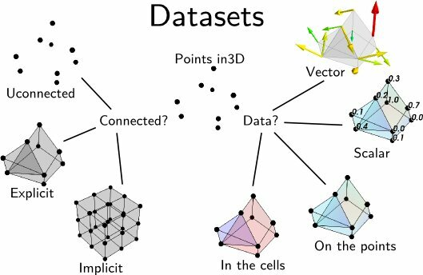

.. _data-structures-used-by-mayavi:

Data structures used by Mayavi
==============================

Describing data in three dimension in the general case is a complex
problem. Mayavi helps you focus on your visualization work and not worry
too much about the underlying data structures, for instance using mlab
(see :ref:`simple-scripting-with-mlab`). We suggest you create sources
for Mayavi using `mlab` or Mayavi sources when possible. However, if you
want to create data with a specific structure for a more efficient
visualization, it helps to understand the VTK data structures that Mayavi
uses.

VTK data structures
--------------------

Mayavi uses the VTK library for all its visualization needs. The data is
exposed internally, by the sources, or at the output of the filters, as
VTK datasets, described below. Understanding these structures is useful
not only to manipulate them, but also to understand what happens when
using filters to transform the data in the pipeline.

Caracteristics of a dataset
.............................

A dataset is defined by many different characteristics:

:Connectivity:

    Connectivity is not only necessary to draw lines between the
    different points, it is also needed to define a volume.

    **Implicit connectivity**: connectivity or positioning is implicit. In
    this case the data is considered as arranged on a lattice-like structure,
    with equal number of layers in each direction, x increasing first along
    the array, then y and finally z.

:Data:

    Dataset are made of points positioned in 3D, with the corresponding
    data. Each dataset can carry several data components.

    **Scalar or Vectors data**: The data can be scalar, in which case VTK
    can perform operations such as taking the gradient and display the
    data with a colormap, or vector, in which case VTK can perform an
    integration to display streamlines, display the vectors, or extract the 
    norm of the vectors, to create a scalar dataset.

    **Cell data and point data**: Each VTK dataset is defined by vertices and
    cells, explicitly or implicitly. The data, scalar or vector, can be
    positioned either on the vertices, in which case it is called point data,
    or associated with a cell, in which case it is called cell data.
    Point data is stored in the `.point_data` attribute of the dataset,
    and the cell data is stored in the `.cell_data` attribute.

    In addition the data arrays have an associated name, which is used in
    Mayavi to specify on which data component module or filter apply (eg
    using the`SetActiveAttribute` filter.

All VTK arrays, whether it be for data or position, are exposed as (n, 3)
numpy arrays for 3D components, and flat (n, ) array for 1D components.
The index vary in the opposite order as numpy: z first, y and then x.
Thus to go from a 3D numpy array to the corresponding flatten VTK array,
the operation is::

    vtk_array = numpy_array.T.ravel()

Description of the different datasets
......................................

The 5 VTK structures used are the following (ordered by the cost of
visualizing them).:

================== ============= =========================== ============================================================
VTK name            Connectivity  Suitable for                Required information
================== ============= =========================== ============================================================
ImageData           Implicit      Volumes and surfaces        3D data array and spacing along each axis
RectilinearGrid     Implicit      Volumes and surfaces        3D data array and 1D array of spacing for each axis
StructuredGrid      Implicit      Volumes and surfaces        3D data array and 3D position arrays for each axis
PolyData            Explicit      Points, lines and surfaces  x, y, z, positions of vertices and arrays of surface Cells
UnstructuredGrid    Explicit      Volumes and surfaces        x, y, z positions of vertices and arrays of volume Cells
================== ============= =========================== ============================================================

.. _image_data: ImageData 

:ImageData:
  This dataset is made of data points positioned on an orthogonal grid,
  with constant spacing along each axis. The position of the data points
  are inferred from their position on the data array (implicit
  positioning), an origin and a spacing between 2 slices along each axis.
  In 2D, this can be understood as a raster image. This is the data
  structure created by the `ArraySource` mayavi source, from a 3D numpy
  array, as well as the `mlab.pipeline.scalar_field` and 
  `mlab.pipeline.vector_field` factory functions, if the `x`, `y` and 
  `z` arrays are not explicitely specified.

  .. image:: image_data.jpg

  Creating a `tvtk.ImageData` object from numpy arrays::
  
    from enthought.tvtk.api import tvtk
    from numpy import random
    data = random.random((3, 3, 3))
    i = tvtk.ImageData(spacing=(1, 1, 1), origin=(0, 0, 0))
    i.point_data.scalars = data.ravel()
    i.point_data.scalars.name = 'scalars'
    i.dimensions = data.shape

.. _rectilinear_grid: RectilinearGrid

:RectilinearGrid:
  This dataset is made of data points positioned on an orthogonal grid, 
  with arbitrary spacing along the various axis. The position of the data
  points are inferred from their position on the data array, an
  origin and the list of spacings of each axis.

  .. image:: rectilinear_grid.jpg

  Creating a `tvtk.RectilinearGrid` object from numpy arrays::

    from enthought.tvtk.api import tvtk
    from numpy import random, array
    data = random.random((3, 3, 3))
    r = tvtk.RectilinearGrid()
    r.point_data.scalars = data.ravel()
    r.point_data.scalars.name = 'scalars'
    r.dimensions = data.shape
    r.x_coordinates = array((0, 0.7, 1.4))
    r.y_coordinates = array((0, 1, 3))
    r.z_coordinates = array((0, .5, 2))

.. _structured_grid: StructuredGrid

:StructuredGrid:
  This dataset is made of data points positioned on arbitrary grid: each
  point is connected to its nearest neighbors on the data array. The
  position of the data points are fully described by 1 coordinate
  arrays, specifying x, y and z for each point. This is the dataset
  created by the `mlab.pipeline.scalar_field` and 
  `mlab.pipeline.vector_field` factory functions, if the `x`, `y` and 
  `z` arrays are explicitely specified.
 

  .. image:: structured_grid.jpg

  Creating a `tvtk.StructuredGrid` object from numpy arrays::

    from numpy import pi, cos, sin, empty, linspace, random
    from enthought.tvtk.api import tvtk

    def generate_annulus(r, theta, z):
        """ Generate points for structured grid for a cylindrical annular
            volume.  This method is useful for generating a unstructured
            cylindrical mesh for VTK.
        """
        # Find the x values and y values for each plane.
        x_plane = (cos(theta)*r[:,None]).ravel()
        y_plane = (sin(theta)*r[:,None]).ravel()
        
        # Allocate an array for all the points.  We'll have len(x_plane)
        # points on each plane, and we have a plane for each z value, so
        # we need len(x_plane)*len(z) points.
        points = empty([len(x_plane)*len(z),3])
        
        # Loop through the points for each plane and fill them with the
        # correct x,y,z values.
        start = 0
        for z_plane in z:
            end = start+len(x_plane)
            # slice out a plane of the output points and fill it
            # with the x,y, and z values for this plane.  The x,y
            # values are the same for every plane.  The z value
            # is set to the current z 
            plane_points = points[start:end]    
            plane_points[:,0] = x_plane
            plane_points[:,1] = y_plane 
            plane_points[:,2] = z_plane
            start = end
            
        return points

    dims = (3, 4, 3)
    r = linspace(5, 15, dims[0])
    theta = linspace(0, 0.5*pi, dims[1])
    z = linspace(0, 10, dims[2])
    pts = generate_annulus(r, theta, z)
    sgrid = tvtk.StructuredGrid(dimensions=(dims[1], dims[0], dims[2]))
    sgrid.points = pts
    s = random.random((dims[0]*dims[1]*dims[2]))
    sgrid.point_data.scalars = ravel(s.copy())
    sgrid.point_data.scalars.name = 'scalars'

.. _poly_data: 

:PolyData:
  This dataset is made of arbitrarily positioned data points that can
  be connected to form lines, or grouped in polygons to from surfaces
  (the polygons are broken up in triangles). Unlike the other datasets, 
  this one cannot be used to describe volumetric data. The is the dataset
  created by the `mlab.pipeline.scalar_scatter` and
  `mlab.pipeline.vector_scatter` functions.

  .. image:: poly_data.jpg

  Creating a `tvtk.PolyData` object from numpy arrays::

    from numpy import array, random
    from enthought.tvtk.api import tvtk

    # The numpy array data.
    points = array([[0,-0.5,0], [1.5,0,0], [0,1,0], [0,0,0.5],
                    [-1,-1.5,0.1], [0,-1, 0.5], [-1, -0.5, 0],
                    [1,0.8,0]], 'f')
    triangles = array([[0,1,3], [1,2,3], [1,0,5], 
                       [2,3,4], [3,0,4], [0,5,4], [2, 4, 6],
                        [2, 1, 7]])
    scalars = random.random(points.shape) 

    # The TVTK dataset.
    mesh = tvtk.PolyData(points=points, polys=triangles)
    mesh.point_data.scalars = scalars
    mesh.point_data.scalars.name = 'scalars'

.. _unstructured_grid: UnstructuredGrid

:UnstructuredGrid:
  This dataset is the most general dataset of all. It is made of data 
  points positioned arbitrarily. The connectivity between data points 
  can be arbitrary (any number of neighbors). It is described by
  specifying connectivity, defining volumetric cells made of adjacent 
  data points.

  .. image:: unstructured_grid.jpg

  Creating a `tvtk.UnstructuredGrid` object from numpy arrays::

    from numpy import array, random
    from enthought.tvtk.api import tvtk

    points = array([[0,1.2,0.6], [1,0,0], [0,1,0], [1,1,1], # tetra
                    [1,0,-0.5], [2,0,0], [2,1.5,0], [0,1,0],
                    [1,0,0], [1.5,-0.2,1], [1.6,1,1.5], [1,1,1], # Hex
                    ], 'f')
    # The cells
    cells = array([4, 0, 1, 2, 3, # tetra
                   8, 4, 5, 6, 7, 8, 9, 10, 11 # hex
                   ])
    # The offsets for the cells, i.e. the indices where the cells
    # start.
    offset = array([0, 5])
    tetra_type = tvtk.Tetra().cell_type # VTK_TETRA == 10
    hex_type = tvtk.Hexahedron().cell_type # VTK_HEXAHEDRON == 12
    cell_types = array([tetra_type, hex_type])
    # Create the array of cells unambiguously.
    cell_array = tvtk.CellArray()
    cell_array.set_cells(2, cells)
    # Now create the UG.
    ug = tvtk.UnstructuredGrid(points=points)
    # Now just set the cell types and reuse the ug locations and cells.
    ug.set_cells(cell_types, offset, cell_array)
    scalars = random.random(points.shape[0]) 
    ug.point_data.scalars = scalars
    ug.point_data.scalars.name = 'scalars'

External references
--------------------

This section of the user guide will be improved later.  For now, the
following two presentations best describe how one can create data
objects or data files for Mayavi and TVTK.

 * Presentation on TVTK and Mayavi2 for course at IIT Bombay

   https://svn.enthought.com/enthought/attachment/wiki/MayaVi/tvtk_mayavi2.pdf

   This presentation provides information on graphics in general, 3D
   data representation, creating VTK data files, creating datasets
   from numpy in Python, and also about mayavi.

 * Presentation on making TVTK datasets using numpy arrays made for SciPy07.

   https://svn.enthought.com/enthought/attachment/wiki/MayaVi/tvtk_datasets.pdf

   This presentation focuses on creating TVTK datasets using numpy
   arrays.

Datasets creation examples
---------------------------

There are several examples in the mayavi sources that highlight the
creation of the most important datasets from numpy arrays. Specifically
they are:

   * :ref:`example_datasets`: Generate a simple example for each type of 
     VTK dataset.

   * :ref:`example_polydata`:  Demonstrates how to create Polydata datasets
     from numpy arrays and visualize them in mayavi.

   * :ref:`example_structured_points2d`: Demonstrates how to create a 2D
     structured points (an ImageData) dataset from numpy arrays and
     visualize them in mayavi.  This is basically a square of
     equispaced points.

   * :ref:`example_structured_points3d`: Demonstrates how to create a 3D
     structured points (an ImageData) dataset from numpy arrays and
     visualize them in Mayavi.  This is a cube of points that are
     regularly spaced.

   * :ref:`example_structured_grid`: Demonstrates the creation and
     visualization of a 3D structured grid.

   * :ref:`example_unstructured_grid`: Demonstrates the creation and
     visualization of an unstructured grid.

These scripts may be run like so::

  $ mayavi2 -x structured_grid.py

or better yet, all in one go like so::

  $ mayavi2 -x polydata.py -x structured_points2d.py \
  > -x structured_points3d.py -x structured_grid.py -x unstructured_grid.py
 

.. Creating datasets from numpy arrays
   -----------------------------------
   
   Add content here from the presentations.

.. VTK Data files
   --------------

   Add content here from the presentations.

Inserting TVTK datasets in the Mayavi pipeline.
-----------------------------------------------

TVTK datasets can be created using directly TVTK, as illustrated in the
examples above. A VTK data source can be inserted in the Mayavi pipeline
using the VTKDataSource. For instance we can create an `ImageData`
dataset::

    from enthought.tvtk.api import tvtk
    import numpy as np
    a = np.random.random((10, 10, 10))
    i = tvtk.ImageData(spacing=(1, 1, 1), origin=(0, 0, 0))
    i.point_data.scalars = a.ravel()
    i.point_data.scalars.name = 'scalars'
    i.dimensions = a.shape

Inserting this dataset on the pipeline with `VTKDataSource` is done as
such::

    from enthought.mayavi.sources.api import VTKDataSource
    src = VTKDataSource(data=i)
    from enthought.mayavi.api import Engine
    e = Engine()
    e.start()
    s = e.new_scene()
    e.add_source(src)

In addition, if you are scripting using `mlab`, the `mlab.pipeline`
factory functions creating filters and modules accept VTK datasets, in
which case they are automatically inserted on the pipeline. A surface
module could have been used to visualize the `ImageData` dataset as
such::

    from enthgouth.mayavi import mlab
    mlab.pipeline.surface(i)

Of course, unless you want specific control on the attributes of the VTK
dataset, or you are using Mayavi in the context of existing code
manipulating TVTK objects, creating an `ImageData` TVTK object is not
advised. The `ArraySource` Mayavi will actually create an `ImageData`,
but make sure you don't get the shape wrong, which can lead to a
segmentation fault. An even easier way to create a data source for an
`ImageData` is to use the `mlab.pipeline.scalar_field` function.

..
   Local Variables:
   mode: rst
   indent-tabs-mode: nil
   sentence-end-double-space: t
   fill-column: 70
   End:

