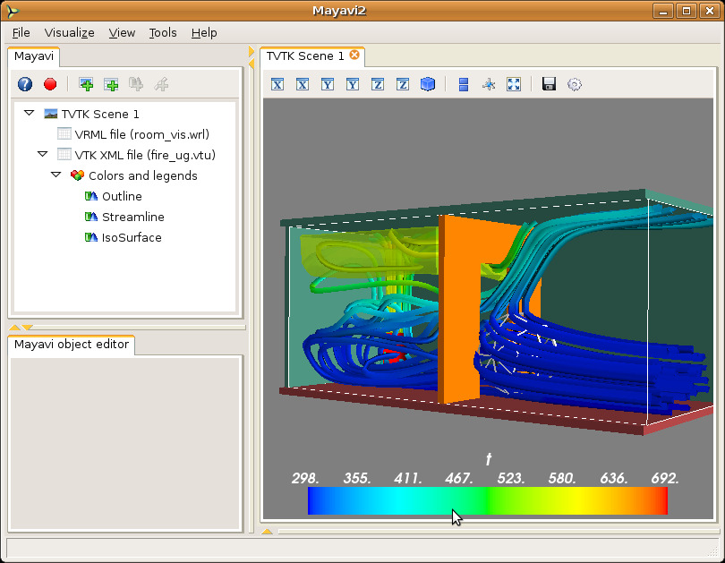

Visualizing rich datasets: the ``fire_ug.vtu`` example
-------------------------------------------------------

Like ``heart.vtk``, the ``fire_ug.vtu`` example dataset is available
in the ``examples/data`` directory.  This dataset is an unstructured
grid stored in a VTK XML file.  It represents a room with a fire in
one corner.  A simulation of the fluid flow generated by this fire was
performed and the resulting data at a particular instant of time is
stored in the file.  The dataset was provided by Dr. Philip Rubini,
who at the time was at Cranfield University.  A VRML file
(``room_vis.wrl``) is also provided to show the context of the room in
which the fire is taking place.

  1. With mayavi2 started, select `File->Load data->Open file` to load the
     data.  Again, you will see a node on the tree view on the left but
     nothing on the TVTK scene.  This dataset contains different scalars
     and vectors in the same data file.  If you select the `VTK XML file
     ...` node on the left the reader may be configured in the object
     editor pane of the UI.  On this,  you will see a drop list of all
     the scalars, vectors etc. in this data file.  Select any that you
     wish to view.

  2. Create an outline of the data as described earlier using an
     `Outline` module.  View an iso-surface of the data by creating an
     `IsoSurface` module.  Also experiment with the `ScalarCutPlane`
     module.

  3. Show the scalar bar that represents the color mapping (via a Look
     up table that maps scalar values to colors) by clicking on the
     `Colors and legends` node and enabling the `Show scalar bar`.  
     Experiment with the different color maps provided by default.

  4. Now click on the `VTK XML file ...` and select different scalar
     values to see how the data has changed.  Your legend should
     automatically update when the scalar value is changed.
  
  5. This data also features vectors.  The scalar data has `u`, `v`
     and `w` but not the magnitude of the velocity.  Let's say we'd
     like to be able to view iso-contours of the magnitude of the
     velocity.  To do this let's use the `ExtractVectorNorm` filter.
     This is created by choosing the `Visualize->Filters->Extract
     Vector Norm` menu.

  6. If you now create a `ScalarCutPlane`, you will see a new
     `Colors and legends` node under the `ExtractVectorNorm` node.  This scalar
     cut plane is displaying colors for the velocity magnitude that
     the filter has created.  You can drag the iso-surface module from
     the other `Colors and legends` node and drop it on this 
     `Colors and legends` node so that the IsoSurface generated is for 
     the velocity magnitude and not for the scalars chosen in the data.

     Note that the view on the left represents a pipeline of the flow
     of the data from `source -> filter -> modules`. Essentially the
     data flows from the parent node down to the children nodes below
     it.

     Now if you want to visualize something on a different "branch" of
     the pipeline, let's say you want to view iso-surfaces of the
     temperature data you must first click on the modules or the
     source object (the `VTK XML File ...` node) itself and then
     select the menu item.  When you select an item on the tree, it
     makes that item the *current object* and menu selections made
     after that will in general create new modules/filters below the
     current object.

  7. You can filter "filtered data".  So select the
     `ExtractVectorNorm` node to make it the active object.  Now
     create a Threshold filter by selecting
     `Visualize->Filters->Threshold`.  Now set the upper and lower
     thresholds on the object editor for the Threshold to something
     like 0.5 and 3.0.  If you create a `VectorCutPlane` module at
     this point and move the cut plane you should see arrows but only
     arrows that are between the threshold values you have selected.
     Thus, you can create pretty complicated visualization pipelines
     using this approach.

  8. There are several vector modules.  `VectorCutPlane`, `Vectors`,
     `WarpVectorCutPlane` and `Streamlines`.  If you view streamlines
     then mayavi will generate streamlines of vector data in your
     dataset.  To view streamlines of the original dataset you can
     click on the original `Outline` module (or the source) and then
     choose the `Streamline` menu item.  The streamline lets you move
     different type of seeds on screen using 3D widgets.  Seed points
     originating from these positions are used to trace out the
     streamlines.  Sphere, line and plane sources may be used here to
     initialize the streamline seeds.

  9. You can view the room in which the fire is taking place by
     opening the VRML file by the `File->Open->VRML2 file` menu item
     and selecting the ``room_vis.wrl`` file included with the data.

  10. Once you setup a complex visualization pipeline and want to save
      it for later experimentation you may save the entire
      visualization via the `File->Save Visualization` menu.  A saved
      file can be loaded later using the `File->Load Visualization`
      menu item.  This option is not 100% robust and is still
      experimental.  Future versions will improve this feature.
      However, it does work and can be used for the time being.

Once again, the visualization in this case was created by using the
user interface.  It is possible to script this entirely using Python
scripts.  A simple script demonstrating several of the above modules
is available in ``examples/streamline.py``.  This file may be studied.
It can be run either likes so::

 $ cd examples
 $ python streamline.py

or so::

 $ mayavi2 -x streamline.py

As can be seen from the example, it is quite easy to script mayavi to
visualize data.  An image of a resulting visualization generated from
this script is shown below.

