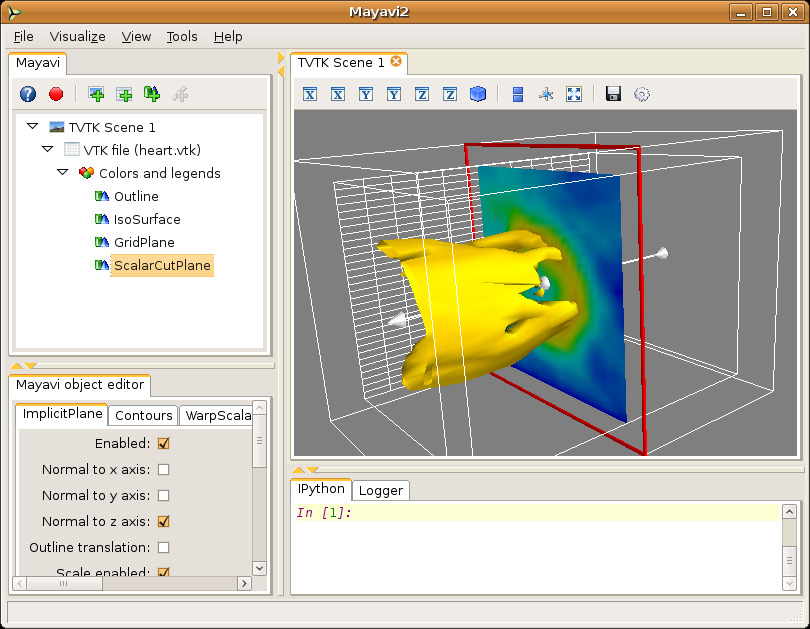

Loading scalar data: the ``heart.vtk`` example
-----------------------------------------------

This section describes a simple example with the ``heart.vtk`` file.
This is a simple volume of 3D data (32 x 32 x 12 points) with scalars
at each point (the points are equally spaced).  The data is a
structured dataset (an `ImageData` in fact), we'll read more about
these later but you can think of it as a cube of points regularly
spaced with some scalar data associated with each point.  The data
apparently represents a CT scan of a heart.  I have no idea whose
heart!  The file is a readable text file, look at it in a text editor
if you'd like to.

  1. With ``mayavi2`` started, we start by opening the data file.  Go
     to the `File->Load data->Open file` menu item and then in the file
     dialog, navigate to the directory that contains the sample data.
     There select the ``heart.vtk`` file.

     Once you choose the data, you will see a new node on the Mayavi
     tree view on the left that says `VTK file (heart.vtk)`.  Note
     that you **will not** see anything visualized on the TVTK scene
     yet.

  2. To see an outline (a box) of the data, navigate to the
     `Visualize->Modules` menu item and select the `Outline` module.
     You will immediately see a white box on the TVTK scene.  You
     should also see two new nodes on the tree view, one called
     `Colors and legends` and one underneath that called `Outline`.  

  3. You can change properties of the outline displayed by clicking on
     the `Outline` node on the left.  This will create an object editor
     window on left bottom of the window (the object editor tab) below
     the tree view.  Play with the settings here and look at the
     results.  If you double-click a node on the tree view it will pop
     up an editor dialog rather than show it in the embedded object
     editor.

     Note that in general, the editor window for a `Module` will have
     a section for the `Actor`, one for the `Mapper` and one for
     `Property`.  These refer to TVTK/VTK terminology.  You may think
     of Properties as those related to the color, representation
     (surface, wireframe, etc.), line size etc.  Things grouped under
     `Actor` are related to the object that is rendered on screen and
     typically the editor will let you toggle its visibility.  In VTK
     parlance, the word `Mapper` refers to an object that converts the
     data to graphics primitives.  Properties related to it will be
     grouped under the `Mapper` head.

  4. To interact with the TVTK scene window, look at the section on
     :ref:`interaction-with-the-scene` for more details.  Experiment with
     these options till you are comfortable.

  5. Now, with the Outline node selected, create an iso-surface by selecting the
     `Visualize->Modules->IsoSurface` menu item.  You will see a new
     `IsoSurface` node on the left and an iso-contour of the scalar
     data on the scene.  The iso-surface is colored as per the
     particular iso-value chosen.  Experiment with the settings of
     this module.

  6. To produce meaningful visualizations you need to know what each
     color represents.  To display this legend on the scene, click on the
     `Colors and legends` node on the tree view and on the object editor 
     activate the `Show scalar bar` check-box.  This will show you a legend 
     on the TVTK scene.  The legend can be moved around on the scene by
     clicking on it and dragging on it.  It can also be resized by
     clicking and dragging on its edges.  You can change the nature of
     the color-mapping by choosing various options on the object
     editor.

  7. Create a simple "grid plane" to obtain an idea of the actual
     points on the grid.  This can be done using the `GridPlane`
     module, and created via the `Visualize->Modules->GridPlane` menu
     item.

  8. You can delete a particular module by right clicking on it and
     choosing delete.  Try this on the `GridPlane` module.  Try the
     other right click menu options as well.

  9. Experiment with the `ContourGridPlane` module and also the
     `ScalarCutPlane` module a little.  

     The `ScalarCutPlane` module features a very powerful feature
     called *3D widgets*.  On the TVTK scene window you will see a cut
     plane that slices through your data showing you colors
     representing your data.  This cut plane will have a red outline
     and an arrow sticking out of it.  You can click directly on the
     cut plane and move it by dragging it.  Click on the arrow head to
     rotate the plane.  You can also reset its position by using the
     editor window for the scalar cut plane.

  10. You can save the visualization to an image produced by clicking
      on the little save icon on the TVTK scene or via any of the
      options on the `File->Save Scene As` menu.

You should have a visualization that looks something like the one
shown below.

The nice thing about mayavi is that although in this case all of the
above was done using the user interface, all of it can be done using
pure Python scripts as well.  More details on this are available in
the :ref:`simple-scripting-with-mlab` section (see also 
:ref:`advanced-scripting-with-mayavi` for a more in-depth coverage).

Opening data files and starting up modules can also be done from the
command line.  For example we could simply have done::

 $ mayavi2 -d /path/to/heart.vtk -m Outline -m IsoSurface \
 > -m GridPlane -m ScalarCutPlane

More details are available in the :ref:`command-line-arguments` section.

