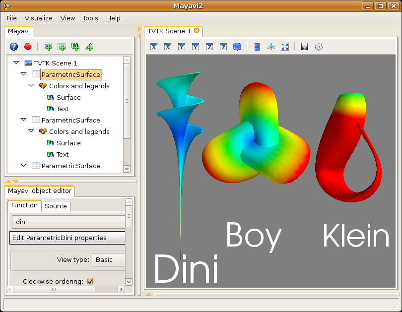

.. _parametric_surfaces_example:

Parametric surfaces: a simple introduction to visualization
------------------------------------------------------------

Parametric surfaces are particularly handy if you are unable to find
any data to play with right away.  Parametric surfaces are surfaces
parametrized typically by 2 variables, u and v.  VTK has a bunch of
classes that let users explore Parametric surfaces.  This
functionality is also available in Mayavi.  The data is a 2D
surface embedded in 3D. Scalar data is also available on the surface.
More details on parametric surfaces in VTK may be obtained from Andrew
Maclean's `Parametric Surfaces`_ document.

  1. After starting mayavi2, create a simple Parametric surface source
     by selecting `File->Load data->Create Parametric Surface source`.
     Once you create the data, you will see a new node on the Mayavi
     tree view on the left that says `ParametricSurface`.  Note that
     you **will not** see anything visualized on the TVTK scene yet.

     You can modify the nature of the parametric surface by clicking
     on the node for the `ParametricSurface` source object.

  2. To see an outline (a box) of the data, navigate to the
     `Visualize->Modules` menu item and select the `Outline` module.
     You can also right-click on the `ParametricSurface` node to bring up
     a context menu and select `Add Module->Surface`.
     You will immediately see a wireframe cube on the TVTK scene. 
     You should also see two new nodes on the tree view, one called
     `Colors and legends` and one underneath that called `Outline`.

  3. You can change properties of the outline displayed by clicking on
     the `Outline` node on the left.  This will create an object editor
     window on left bottom of the window (the object editor tab) below
     the tree view.  Play with the settings here and look at the
     results.  For example, to change the color of the outline box
     modify the value in the color field.  If you double-click a node on
     the left it will pop up an editor dialog rather than show it in the
     embedded object editor.  

  4. To navigate the scene look at the section on 
     :ref:`interaction-with-the-scene` section for more details.  Experiment 
     with these.

  5. To view the actual surface create a `Surface` module by selecting
     `Visualize->Modules->Surface`.  You can show contours of the
     scalar data on this surface by clicking on the `Surface` node on
     the left and switching on the `Enable contours` check-box.

  6. To view the color legend (used to map scalar values to colors),
     click on the `Modules` node on the tree view. Then, on the 'Scalar LUT'
     tab, activate the `Show scalar bar` check-box.  This will show
     you a legend on the TVTK scene.  The legend can be moved around on
     the scene by clicking on it and dragging it.  It can also be
     resized by clicking and dragging on its edges.  You can change the
     nature of the color-mapping by choosing among different lookup
     tables on the object editor.

  7. You can add as many modules as you like.  Not all modules make
     sense for all data.  Mayavi does not yet grey out (or disable) menu
     items and options if they are invalid for the particular data
     chosen.  This will be implemented in the future.  However making a
     mistake should not in general be disastrous, so go ahead and
     experiment.

  8. You may add as many data sources as you like.  It is possible to
     view two different parametric surfaces on the same scene by selecting
     the scene node and then loading another parametric surface source.
     Whether this makes sense or not is up to the user.  You may also
     create as many scenes you want to and view anything in those.
     You can cut/paste/copy sources and modules between any nodes on
     the tree view using the right click options.

  9. To delete the `Outline` module say, right click on the `Outline`
     node and select the Delete option.  You may also want to
     experiment with the other options.

  10. You can save the rendered visualization to a variety of file
      formats using the `File->Save Scene As` menu.

  11. The visualization may itself be saved out to a file via the
      `File->Save Visualization` menu and reloaded using the `Load
      visualization` menu.

Shown below is example visualization made using the parametric
source.  Note that the positioning of the different surfaces were effected by moving the actors on screen using the actor mode of the
scene via the 'a' key.  For more details on this see the section on
:ref:`interaction-with-the-scene`.

.. _Parametric Surfaces: http://www.vtk.org/pdf/ParametricSurfaces.pdf

