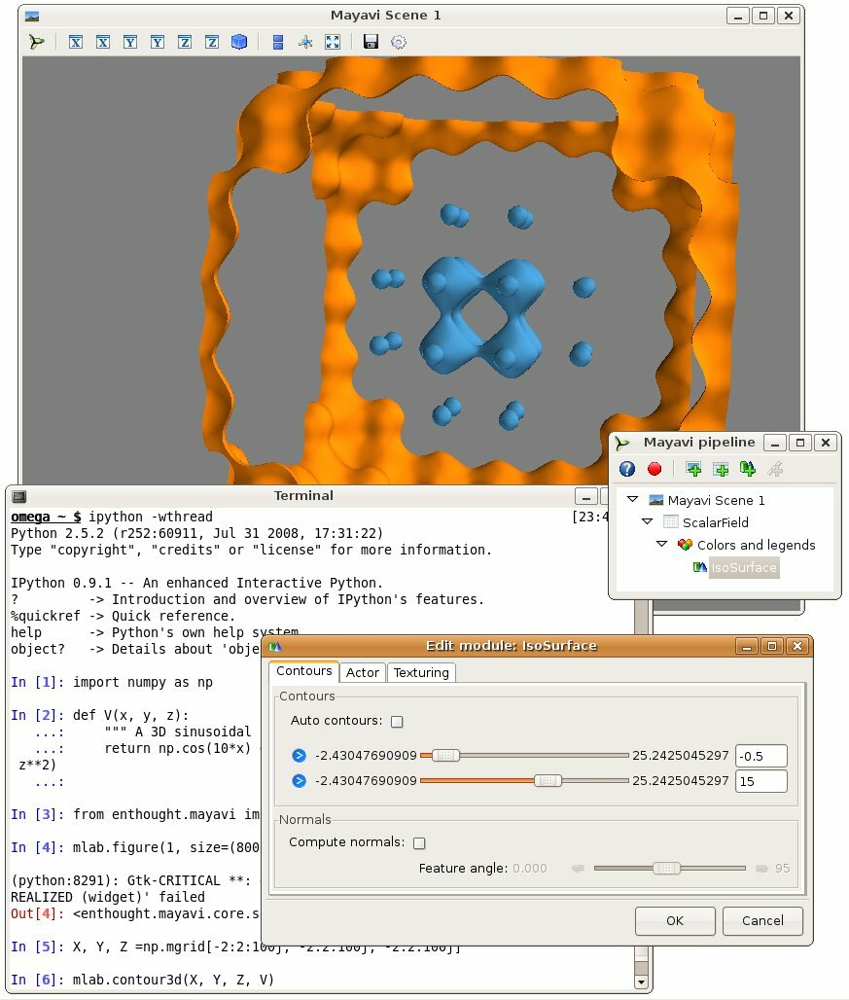
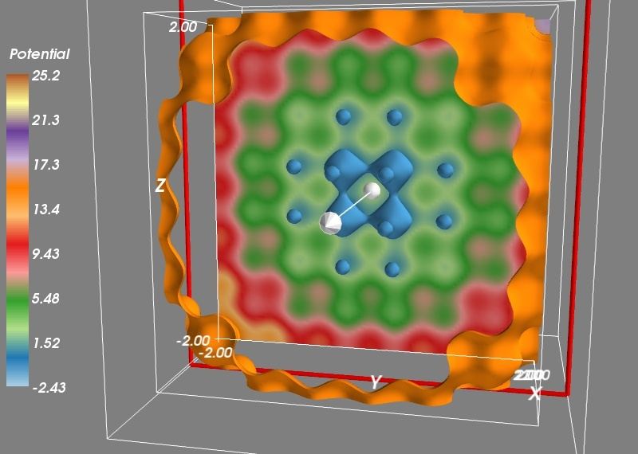
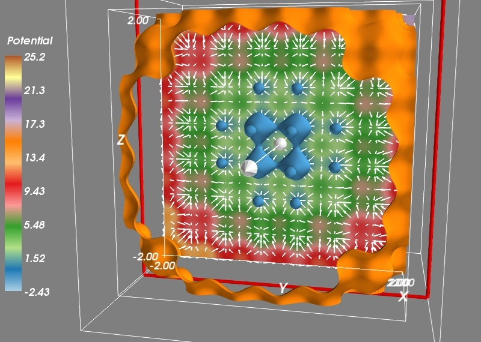
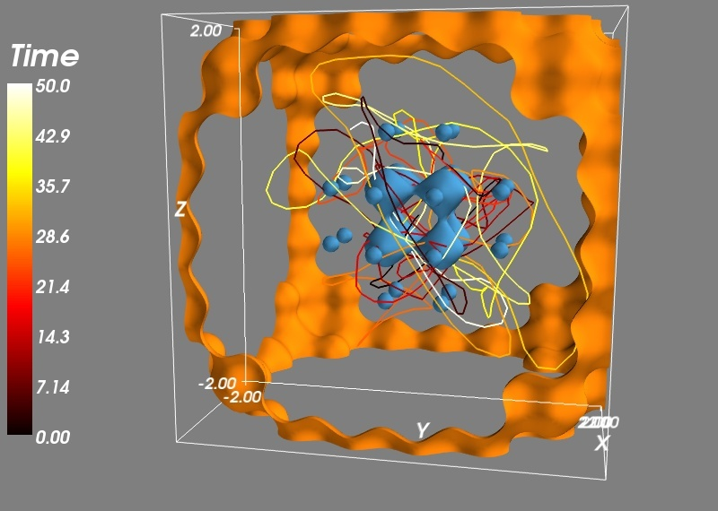

Using Mayavi with scipy
-------------------------

This tutorial example shows you how you can use Mayavi interactively
to visualize `numpy`_ arrays while doing numerical work with `scipy`_. It
assumes that you are familiar with numerical Python tools, and shows you
how to use Mayavi in combination with these tools.

Let us study the trajectories of a particle in a potential. This is a
very common problem in physics and engineering, and visualization of the
potential and the trajectories is key to developing an understanding of
the problem.

The potential we are interested is a periodic lattice, immersed in a
parabolic confinement. We will shake this potential and see how the
particle jumps from a hole of the lattice to another. The parabolic
confinement is there to limit the excursions of the particle::

    import numpy as np

    def V(x, y, z):
        """ A 3D sinusoidal lattice with a parabolic confinement. """
        return np.cos(10*x) + np.cos(10*y) + np.cos(10*z) + 2*(x**2 + y**2 + z**2)

Now that we have defined the potential, we would like to see what it
looks like in 3D. To do this we can create a 3D grid of points, and
sample it on these points::

    X, Y, Z = np.mgrid[-2:2:100j, -2:2:100j, -2:2:100j]
    V(X, Y, Z)

We are going to use the `mlab` module (see :ref:`simple-scripting-with-mlab`)
to interactively visualize this volumetric data. For this it is best to type
the commands in an interactive Python shell, either using the built-in shell
of the Mayavi2 application, on in `ipython --gui=qt`. Let us visualize the 3D
isosurfaces of the potential::

    from mayavi import mlab
    mlab.contour3d(X, Y, Z, V)

We can interact with the visualization created by the above command by
rotating the view, but to get a good understanding of the structure of
the potential, it is useful to vary the iso-surfaces. We can do this by
double-clicking on the `IsoSurface` in the Mayavi pipeline tree (if you
are running from `ipython`, you need to click on the Mayavi icon on the
scene to pop up the pipeline). This opens a dialog which lets us select
the values of the contours used. A good view of the potential can be
achieved by turning off auto contours and choosing -0.5 as a first
contour value (eg by entering it in the text box on the right, and
pressing `tab`). A second contour can be added by clicking on the blue
arrow and selecting "Add after". Using a value of 15 gives a nice result.

.. warning::
    Note that the "Add after" UI formerly crashed on Linux with the
    wxPython backend for versions of Mayavi up to 3.2.0 (see
    :ref:`known_bugs` for all know bugs).

We can now click on the `Colors and legends` on the pipeline and change
the colors used, by selecting a different LUT (Look Up Table). Let us
select 'Paired' as it separates well levels.

To get a better view of the potential, we would like to display more
contours, but the problem with this approach is that closed contours hide
their interior. On solution is to use a cut plane. Right-click on the
`IsoSurface` node and add a `ScalarCutPlane` through the "Add module" sub
menu. You can move the cut plane by clicking on it and dragging.

To make the link between our numpy arrays and the visualization, we can
use the same menu to add an Axes and an Outline. Finally, let us add a
colorbar. We can do this by typing::

    mlab.colorbar(title='Potential', orientation='vertical')

Or using the options in the LUT dialog visited earlier.

We want to study the motion of a particle in this potential. For this we
need to derive the corresponding force, given by the gradient of the
potential. We create a gradient function::

    def gradient(f, x, y, z, d=0.01):
        """ Return the gradient of f in (x, y, z). """
        fx  = f(x+d, y, z)
        fx_ = f(x-d, y, z)
        fy  = f(x, y+d, z)
        fy_ = f(x, y-d, z)
        fz  = f(x, y, z+d)
        fz_ = f(x, y, z-d)
        return (fx-fx_)/(2*d), (fy-fy_)/(2*d), (fz-fz_)/(2*d)

To check that our gradient function works well, let us visualize the
vector field it creates. To avoid displaying too many vectors, we will
evaluate the gradient only along a cut for X=50, and every three points
on our grid::

    Vx, Vy, Vz = gradient(V, X[50, ::3, ::3], Y[50, ::3, ::3], Z[50, ::3, ::3])
    mlab.quiver3d(X[50, ::3, ::3], Y[50, ::3, ::3], Z[50, ::3, ::3],
                         Vx, Vy, Vz, scale_factor=-0.2, color=(1, 1, 1))

Now we can use `scipy` to integrate the trajectories. We first have to
define a dynamical flow, the function that returns the derivative of the
different parameters as a function of these parameters and of time. The
flow is used by every ODE_ (ordinary differential equation) solver, it
give the dynamic of the system. The dynamics we are interested in is made
of the force deriving from the potential, which we shake with time in the
three directions, as well as a damping force. The damping coefficient and
the amount and frequency of shaking have been tuned to give an
interesting dynamic. ::

    def flow(r, t):
        """ The dynamical flow of the system """
        x, y, z, vx, vy, vz = r
        fx, fy, fz = gradient(V, x-.2*np.sin(6*t), y-.2*np.sin(6*t+1), z-.2*np.sin(6*t+2))
        return np.array((vx, vy, vz, -fx - 0.3*vx, -fy - 0.3*vy, -fz - 0.3*vz))

Now we can integrate the trajectory::

    from scipy.integrate import odeint

    # Initial conditions
    R0 = (0, 0, 0, 0, 0, 0)
    # Times at which we want the integrator to return the positions:
    t = np.linspace(0, 50, 500)
    R = odeint(flow, R0, t)

And we can now plot the trajectories, after removing the cut plane and
the vector field by right-clicking on the corresponding pipeline node and
selecting delete. We also turn the first color bar off in the
corresponding `Colors and legends` node. We plot the trajectories with
extra scalar information attached to it, to display the time via the
colormap::

    x, y, z, vx, vy, vz = R.T
    trajectory = mlab.plot3d(x, y, z, t, colormap='hot',
                        tube_radius=None)
    mlab.colorbar(trajectory, title='Time', orientation='vertical')

.. _`numpy`: http://www.scipy.org
.. _`scipy`: http://www.scipy.org
.. _ODE: http://en.wikipedia.org/wiki/Ordinary_differential_equation
