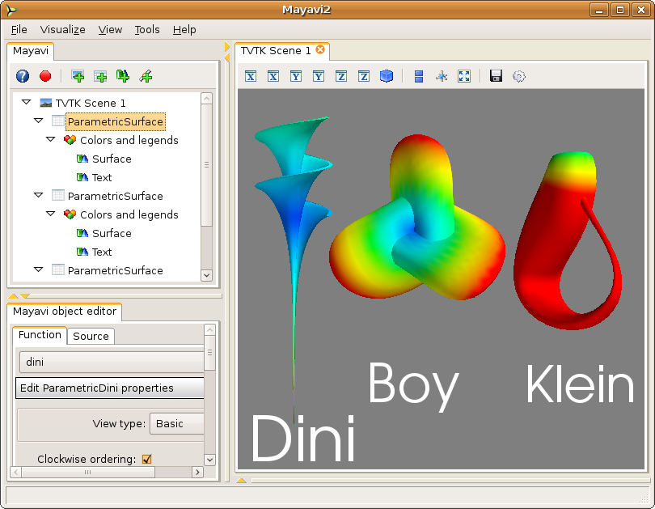
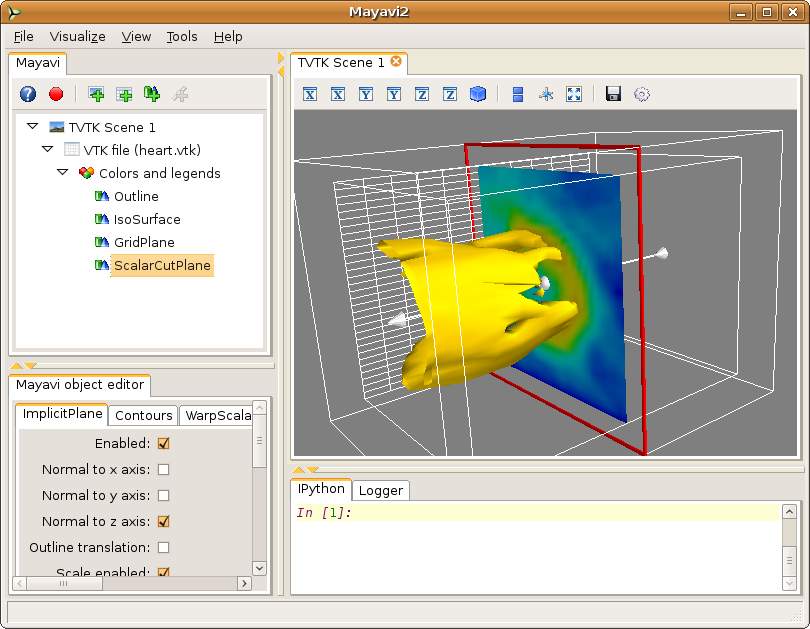
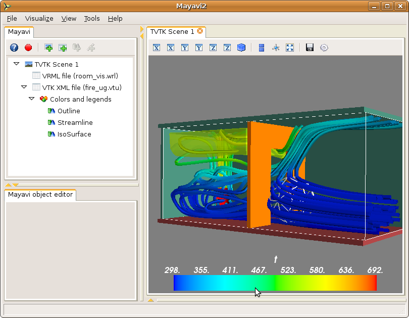

.. _learning-mayavi-by-example:

Learning Mayavi by example
==========================

To get acquainted with mayavi you may start up ``mayavi2`` like so::

  $ mayavi2

On Windows you can double click on the installed ``mayavi2.exe``
executable (usually in the ``Python2X\Scripts`` directory).

Once mayavi starts, you may resize the various panes of the user
interface to get a comfortable layout.  These settings will become the
default "perspective" of the mayavi application.  More details on the
UI are available in the :ref:`general-layout-of-ui` section.

Before proceeding on the quick tour, it is important to locate some data
to experiment with.  The mayavi sources ship with several useful data
files for  the examples and testing.  These may be found in the
``examples/data`` directory inside the root of the mayavi source tree.
If these are not installed, the sources may be downloaded from here:
http://code.enthought.com/enstaller/eggs/source/

If for some reason the sample data files are not available or there is
no Internet access to download them, one can always create some
interesting looking surfaces using the `File->Load data->Create Parametric
surface source` menu item.  This will let us create very pretty
looking surfaces without reference to any external data.  This is
described in the `Parametric surfaces example`_ section below.

Parametric surfaces example
---------------------------

Parametric surfaces are particularly handy if you are unable to find
any data to play with right away.  Parametric surfaces are surfaces
parametrized typically by 2 variables, u and v.  VTK has a bunch of
classes that let users explore Parametric surfaces.  This
functionality is also available in Mayavi.  The data basically is a 2D
surface embedded in 3D.  Scalar data is also available on the surface.
More details on parametric surfaces in VTK may be obtained from Andrew
Maclean's `Parametric Surfaces`_ document.

  1. After starting mayavi2, create a simple Parametric surface source
     by selecting `File->Load data->Create Parametric Surface source`.
     Once you create the data, you will see a new node on the Mayavi
     tree view on the left that says `ParametricSurface`.  Note that
     you **will not** see anything visualized on the TVTK scene yet.

     You can modify the nature of the parametric surface by clicking
     on the node for the `ParametricSurface` source object.

  2. To see an outline (a box) of the data, navigate to the
     `Visualize->Modules` menu item and select the `Outline` module.
     You will immediately see a white box on the TVTK scene.  You
     should also see two new nodes on the tree view, one called
     `Modules` and one underneath that called `Outline`.  

  3. You can change properties of the outline displayed by clicking on
     the `Outline` node on the left.  This will create an object editor
     window on left bottom of the window (the object editor tab) below
     the tree view.  Play with the settings here and look at the
     results.  If you double-click a node on the left it will pop up an
     editor dialog rather than show it in the embedded object editor.

  4. To navigate the scene look at the section on 
     :ref:`interaction-with-the-scene` section for more details.  Experiment 
     with these.

  5. To view the actual surface create a `Surface` module by selecting
     `Visualize->Modules->Surface`.  You can show contours of the
     scalar data on this surface by clicking on the `Surface` node on
     the left and switching on the `Enable contours` check-box.

  6. To view the color legend (used to map scalar values to colors),
     click on the `Modules` node on the tree view and on the object
     editor activate the `Show scalar bar` check-box.  This will show
     you a legend on the TVTK scene.  The legend can be moved around on
     the scene by clicking on it and dragging it.  It can also be
     resized by clicking and dragging on its edges.  You can change the
     nature of the color-mapping by choosing among different lookup
     tables on the object editor.

  7. You can add as many modules as you like.  Not all modules make
     sense for all data.  Mayavi does not yet grey out (or disable) menu
     items and options if they are invalid for the particular data
     chosen.  This will be implemented in the future.  However making a
     mistake should not in general be disastrous, so go ahead and
     experiment.

  8. You may add as many data sources as you like.  It is possible to
     view two different parametric surfaces on the same scene.
     Whether this makes sense or not is up to the user.  You may also
     create as many scenes you want to and view anything in those.
     You can cut/paste/copy sources and modules between any nodes on
     the tree view using the right click options.

  9. To delete the `Outline` module say, right click on the `Outline`
     node and select the Delete option.  You may also want to
     experiment with the other options.

  10. You can save the rendered visualization to a variety of file
      formats using the `File->Save Scene As` menu.

  11. The visualization may itself be saved out to a file via the
      `File->Save Visualization` menu and reloaded using the `Load
      visualization` menu.

Shown below is an example visualization made using the parametric
source.  Note that the positioning of the different surfaces was
effected by moving the actors on screen using the actor mode of the
scene via the 'a' key.  For more details on this see the section on
:ref:`interaction-with-the-scene`.

The examples detailed above should provide a good general idea of how
to visualize data with Mayavi2 and also an idea of its features and
capabilities.

.. _Parametric Surfaces: http://www.vtk.org/pdf/ParametricSurfaces.pdf

``heart.vtk`` example
---------------------

This section describes a simple example with the ``heart.vtk`` file.
This is a simple volume of 3D data (32 x 32 x 12 points) with scalars
at each point (the points are equally spaced).  The data is a
structured dataset (an `ImageData` in fact), we'll read more about
these later but you can think of it as a cube of points regularly
spaced with some scalar data associated with each point.  The data
apparently represents a CT scan of a heart.  I have no idea whose
heart!  The file is a readable text file, look at it in a text editor
if you'd like to.

  1. With ``mayavi2`` started, we start by opening the data file.  Go
     to the `File->Load data->Open file` menu item and then in the file
     dialog, navigate to the directory that contains the sample data.
     There select the ``heart.vtk`` file.

     Once you choose the data, you will see a new node on the Mayavi
     tree view on the left that says `VTK file (heart.vtk)`.  Note
     that you **will not** see anything visualized on the TVTK scene
     yet.

  2. To see an outline (a box) of the data, navigate to the
     `Visualize->Modules` menu item and select the `Outline` module.
     You will immediately see a white box on the TVTK scene.  You
     should also see two new nodes on the tree view, one called
     `Modules` and one underneath that called `Outline`.  

  3. You can change properties of the outline displayed by clicking on
     the `Outline` node on the left.  This will create an object editor
     window on left bottom of the window (the object editor tab) below
     the tree view.  Play with the settings here and look at the
     results.  If you double-click a node on the tree view it will pop
     up an editor dialog rather than show it in the embedded object
     editor.

     Note that in general, the editor window for a `Module` will have
     a section for the `Actor`, one for the `Mapper` and one for
     `Property`.  These refer to TVTK/VTK terminology.  You may think
     of Properties as those related to the color, representation
     (surface, wireframe, etc.), line size etc.  Things grouped under
     `Actor` are related to the object that is rendered on screen and
     typically the editor will let you toggle its visibility.  In VTK
     parlance, the word `Mapper` refers to an object that converts the
     data to graphics primitives.  Properties related to it will be
     grouped under the `Mapper` head.

  4. To interact with the TVTK scene window, look at the section on
     :ref:`interaction-with-the-scene` for more details.  Experiment with
     these options till you are comfortable.

  5. Now, with the Outline node selected, create an iso-surface by selecting the
     `Visualize->Modules->IsoSurface` menu item.  You will see a new
     `IsoSurface` node on the left and an iso-contour of the scalar
     data on the scene.  The iso-surface is colored as per the
     particular iso-value chosen.  Experiment with the settings of
     this module.

  6. To produce meaningful visualizations you need to know what each
     color represents.  To display this legend on the scene, click on the
     `Modules` node on the tree view and on the object editor activate
     the `Show scalar bar` check-box.  This will show you a legend on
     the TVTK scene.  The legend can be moved around on the scene by
     clicking on it and dragging on it.  It can also be resized by
     clicking and dragging on its edges.  You can change the nature of
     the color-mapping by choosing various options on the object
     editor.

  7. Create a simple "grid plane" to obtain an idea of the actual
     points on the grid.  This can be done using the `GridPlane`
     module, and created via the `Visualize->Modules->GridPlane` menu
     item.

  8. You can delete a particular module by right clicking on it and
     choosing delete.  Try this on the `GridPlane` module.  Try the
     other right click menu options as well.

  9. Experiment with the `ContourGridPlane` module and also the
     `ScalarCutPlane` module a little.  

     The `ScalarCutPlane` module features a very powerful feature
     called *3D widgets*.  On the TVTK scene window you will see a cut
     plane that slices through your data showing you colors
     representing your data.  This cut plane will have a red outline
     and an arrow sticking out of it.  You can click directly on the
     cut plane and move it by dragging it.  Click on the arrow head to
     rotate the plane.  You can also reset its position by using the
     editor window for the scalar cut plane.

  10. You can save the visualization to an image produced by clicking
      on the little save icon on the TVTK scene or via any of the
      options on the `File->Save Scene As` menu.

You should have a visualization that looks something like the one
shown below.

The nice thing about mayavi is that although in this case all of the
above was done using the user interface, all of it can be done using
pure Python scripts as well.  More details on this are available in
the :ref:`advanced-scripting-with-mayavi` section.  

Opening data files and starting up modules can also be done from the
command line.  For example we could simply have done::

 $ mayavi2 -d /path/to/heart.vtk -m Outline -m IsoSurface \
 > -m GridPlane -m ScalarCutPlane

More details are available in the :ref:`command-line-arguments` section.

``fire_ug.vtu`` example
-----------------------

Like ``heart.vtk``, the ``fire_ug.vtu`` example dataset is available
in the ``examples/data`` directory.  This dataset is an unstructured
grid stored in a VTK XML file.  It represents a room with a fire in
one corner.  A simulation of the fluid flow generated by this fire was
performed and the resulting data at a particular instant of time is
stored in the file.  The dataset was provided by Dr. Philip Rubini,
who at the time was at Cranfield University.  A VRML file
(``room_vis.wrl``) is also provided to show the context of the room in
which the fire is taking place.

  1. With mayavi2 started, select `File->Load data->Open file` to load the
     data.  Again, you will see a node on the tree view on the left but
     nothing on the TVTK scene.  This dataset contains different scalars
     and vectors in the same data file.  If you select the `VTK XML file
     ...` node on the left the reader may be configured in the object
     editor pane of the UI.  On this,  you will see a drop list of all
     the scalars, vectors etc. in this data file.  Select any that you
     wish to view.

  2. Create an outline of the data as described earlier using an
     `Outline` module.  View an iso-surface of the data by creating an
     `IsoSurface` module.  Also experiment with the `ScalarCutPlane`
     module.

  3. Show the scalar bar that represents the color mapping (via a Look
     up table that maps scalar values to colors) by clicking on the
     `Modules` and enabling the `Show scalar bar`.  Experiment with
     the different color maps provided by default.

  4. Now click on the `VTK XML file ...` and select different scalar
     values to see how the data has changed.  Your legend should
     automatically update when the scalar value is changed.
  
  5. This data also features vectors.  The scalar data has `u`, `v`
     and `w` but not the magnitude of the velocity.  Lets say we'd
     like to be able to view iso-contours of the magnitude of the
     velocity.  To do this lets use the `ExtractVectorNorm` filter.
     This is created by choosing the `Visualize->Filters->Extract
     Vector Norm` menu.

  6. If you now create a `ScalarCutPlane`, you will see a new
     `Modules` node under the `ExtractVectorNorm` node.  This scalar
     cut plane is displaying colors for the velocity magnitude that
     the filter has created.  You can drag the iso-surface module from
     the other `Modules` node and drop it on this `Modules` node so
     that the IsoSurface generated is for the velocity magnitude and
     not for the scalars chosen in the data.

     Note that the view on the left represents a pipeline of the flow
     of the data from `source -> filter -> modules`. Essentially the
     data flows from the parent node down to the children nodes below
     it.

     Now if you want to visualize something on a different "branch" of
     the pipeline, lets say you want to view iso-surfaces of the
     temperature data you must first click on the modules or the
     source object (the `VTK XML File ...` node) itself and then
     select the menu item.  When you select an item on the tree, it
     makes that item the *current object* and menu selections made
     after that will in general create new modules/filters below the
     current object.

  7. You can filter "filtered data".  So select the
     `ExtractVectorNorm` node to make it the active object.  Now
     create a Threshold filter by selecting
     `Visualize->Filters->Threshold`.  Now set the upper and lower
     thresholds on the object editor for the Threshold to something
     like 0.5 and 3.0.  If you create a `VectorCutPlane` module at
     this point and move the cut plane you should see arrows but only
     arrows that are between the threshold values you have selected.
     Thus, you can create pretty complicated visualization pipelines
     using this approach.

  8. There are several vector modules.  `VectorCutPlane`, `Vectors`,
     `WarpVectorCutPlane` and `Streamlines`.  If you view streamlines
     then mayavi will generate streamlines of vector data in your
     dataset.  To view streamlines of the original dataset you can
     click on the original `Outline` module (or the source) and then
     choose the `Streamline` menu item.  The streamline lets you move
     different type of seeds on screen using 3D widgets.  Seed points
     originating from these positions are used to trace out the
     streamlines.  Sphere, line and plane sources may be used here to
     initialize the streamline seeds.

  9. You can view the room in which the fire is taking place by
     opening the VRML file by the `File->Open->VRML2 file` menu item
     and selecting the ``room_vis.wrl`` file included with the data.

  10. Once you setup a complex visualization pipeline and want to save
      it for later experimentation you may save the entire
      visualization via the `File->Save Visualization` menu.  A saved
      file can be loaded later using the `File->Load Visualization`
      menu item.  This option is not 100% robust and is still
      experimental.  Future versions will improve this feature.
      However, it does work and can be used for the time being.

Once again, the visualization in this case was created by using the
user interface.  It is possible to script this entirely using Python
scripts.  A simple script demonstrating several of the above modules
is available in ``examples/streamline.py``.  This file may be studied.
It can be run either like so::

 $ cd examples
 $ python streamline.py

or so::

 $ mayavi2 -x streamline.py

As can be seen from the example, it is quite easy to script mayavi to
visualize data.  An image of a resulting visualization generated from
this script is shown below.

