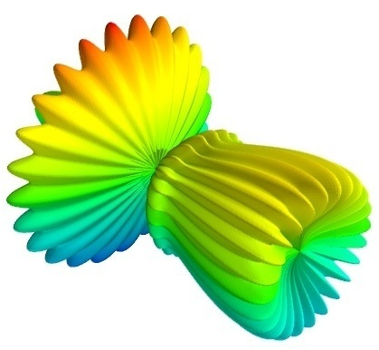
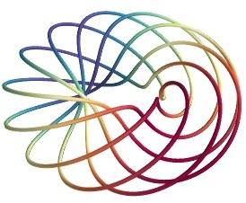
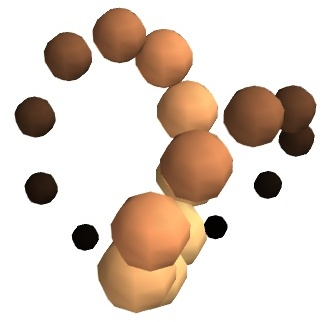
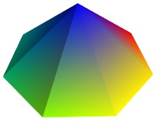
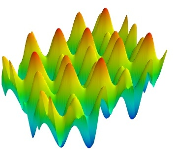
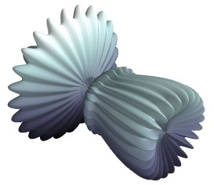
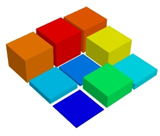
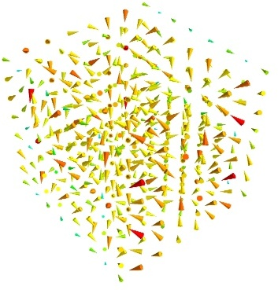
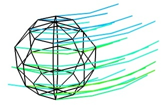
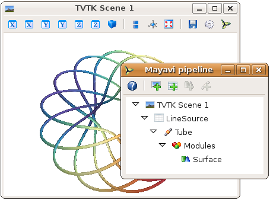

.. _simple-scripting-with-mlab:

Simple Scripting with ``mlab``
===============================

.. currentmodule:: enthought.mayavi.mlab

The :mod:`enthought.mayavi.mlab` module, that we call mlab, provides an easy
way to visualize data in a script or from an interactive prompt with 
one-liners as done in the matplotlib_ ``pylab`` interface but with an
emphasis on 3D visualization using Mayavi2. This allows users to perform
quick 3D visualization while being able to use Mayavi's powerful
features.

Mayavi's mlab is designed to be used in a manner well suited to
scripting and does not present a fully object-oriented API.
It is can be used interactively with IPython_.

.. note:: 

    IPython must be invoked with the ``-wthread`` command line option like so::

         $ ipython -wthread

    If you are using the `Enthought Python Distribution
    <www.enthought.com/products/epd.php>`_, or the latest 
    `Python(x,y) <http://www.pythonxy>`_ distribution, the Pylab menu
    entry will start ipython with the right switch. In older release of
    Python(x,y) you need to start "Interactive Console (wxPython)".

    For more details on using mlab and running scripts, read the section
    `running Mlab scripts`_

.. _matplotlib: http://matplotlib.sf.net

.. _IPython: http://ipython.scipy.org

A demo
-------

Once started, here is a pretty example showing a spherical harmonic::

 from numpy import *
 from enthought.mayavi import mlab

 # Create the data.
 dphi, dtheta = pi/250.0, pi/250.0
 [phi,theta] = mgrid[0:pi+dphi*1.5:dphi,0:2*pi+dtheta*1.5:dtheta]
 m0 = 4; m1 = 3; m2 = 2; m3 = 3; m4 = 6; m5 = 2; m6 = 6; m7 = 4;
 r = sin(m0*phi)**m1 + cos(m2*phi)**m3 + sin(m4*theta)**m5 + cos(m6*theta)**m7
 x = r*sin(phi)*cos(theta)
 y = r*cos(phi)
 z = r*sin(phi)*sin(theta)

 # View it.
 s = mlab.mesh(x, y, z)

 mlab.show()

Bulk of the code in the above example is to create the data.  One line
suffices to visualize it.  This produces the following visualization:

The visualization is created by the single command ``mesh`` in the above.

Several examples of this kind are provided with mlab (see
`test_contour3d`, `test_points3d`, `test_plot3d_anim` etc.).  The above
demo is available as `test_mesh`.  Under IPython these may be found by
tab completing on `mlab.test`.  You can also inspect the source in
IPython via the handy `mlab.test_contour3d??`.

Plotting functions
-------------------

Visualization can be created in mlab by a set of functions operating on
numpy arrays. 

.. note:: 

    In this section, we only list the different functions. Each function
    is described in details in the :ref:`mlab-reference`, the next 
    section of the user guide, with figures and examples. Please follow
    the links.

The mlab plotting functions take numpy arrays as input, describing the
``x``, ``y``, and ``z`` coordinates of the data. They build full-blown
visualizations: they create the data source, filters if necessary, and
add the visualization modules. Their behavior, and thus the visualization
created, can be fine-tuned through keyword arguments, similarly to pylab.
In addition, they all return the visualization module created, thus
visualization can also be modified by changing the attributes of this
module.

0D and 1D data
~~~~~~~~~~~~~~~

+----------------+----------------------+
| |plot3d.jpg|   | |points3d.jpg|       |
+----------------+----------------------+
| :func:`plot3d` | :func:`points3d`     |
+----------------+----------------------+

    The :func:`plot3d` and :func:`points3d` functions are respectively used 
    to draw lines, and sets of points, specifying the ``x``, ``y`` and 
    ``z`` coordinates as numpy arrays.

2D data
~~~~~~~~

+----------------+------------------+-----------------------------+
| |imshow.jpg|   | |surf.jpg|       |  |contour_surf.jpg|         |
+----------------+------------------+-----------------------------+
| :func:`imshow` | :func:`surf`     | :func:`contour_surf`        |
+----------------+------------------+-----------------------------+
| |mesh.jpg|     | |barchart.jpg|   | |triangular_mesh.jpg|       |
+----------------+------------------+-----------------------------+
| :func:`mesh`   | :func:`barchart` | :func:`triangular_mesh.`    |
+----------------+------------------+-----------------------------+

    A 2D array can be shown as a image using :func:`imshow`, or as a surface 
    with the elevation given by its values using :func:`surf`. The contours 
    (lines) of same values can be plotted using :func:`contour_surf`.

    Bar charts can be created with the :func:`barchart` function. This
    function is very versatile and will accept 2D or 3D arrays, but also
    clouds of points, to position the bars.

    The :func:`mesh` function also creates surfaces, however, unlike 
    :func:`surf`, the surface is defined by its ``x``, ``y`` and ``z`` 
    coordinates, and more complex surfaces can be created, as in the 
    above example.

    Finally, the :func:`triangular_mesh` function creates a mesh with 
    arbitrary topology, given position of the vertices and the triangles.

.. |imshow.jpg| image:: images/enthought_mayavi_mlab_imshow.jpg
     :scale: 50

.. |contour_surf.jpg| image:: images/enthought_mayavi_mlab_contour_surf.jpg
     :scale: 50

3D data
~~~~~~~~

+-------------------+------------------+---------------------+
| |contour3d.jpg|   | |quiver3d.jpg|   |  |flow.jpg|         |
+-------------------+------------------+---------------------+
| :func:`contour3d` | :func:`quiver3d` | :func:`flow`        |
+-------------------+------------------+---------------------+

    To plot isosurfaces of a 3D scalar field use :func:`contour3d`. A
    vector field can be represented using :func:`quiver3d`, and the
    trajectories of particles along this field can plotted using :func:`flow`. 

.. |contour3d.jpg| image:: images/enthought_mayavi_mlab_contour3d.jpg
     :scale: 50

Handling figures
-----------------

All mlab functions operate on the current scene, that we also call
:func:`figure`, for compatibility with matlab and pylab. The different
figures are indexed by key that can be an integer or a string. A call to
the :func:`figure` function giving a key will either return the corresponding
figure, if it exists, or create a new one. The current figure can be
retrieved with the :func:`gcf` function. It can be refreshed using the
:func:`draw` function, saved to a picture file using :func:`savefig` and 
cleared using :func:`clf`.

Figure decorations
-------------------

Axes can be added around a visualization object with the :func:`axes`
function, and the labels can be set using the :func:`xlabel`, :func:`ylabel`
and :func:`zlabel` functions. Similarly, :func:`outline` creates an 
outline around an object. :func:`title` adds a title to the figure.

Color bars can be used to reflect the color maps used to display values
(LUT, or lookup tables, in VTK parlance). :func:`colorbar` creates a color 
bar for the last object created, trying to guess whether to use the vector
data or the scalar data color maps. The :func:`scalarbar` and 
:func:`vectorbar` function scan be used to create color bars specifically 
for scalar or vector data. 

A small *xyz* triad can be added to the figure using 
:func:`orientationaxes`. 

Moving the camera
-------------------

The position and direction of the camera can be set using the :func:`view`
function. They are described in terms of Euler angles and distance to a
focal point. The :func:`view` function tries to guess the right roll angle 
of the camera for a pleasing view, but it sometimes fails. The :func:`roll`
explicitly sets the roll angle of the camera.

Interacting graphically with the visualization
-----------------------------------------------

Mayavi, and thus mlab, allow you to interactively modify your
visualization.

The Mayavi pipeline tree can be displayed by clicking on the mayavi icon
in the figure's toolbar, or by using :func:`show_pipeline` mlab command.
One can now change the visualization using this dialog by double-clicking
on each object to edit its properties, as described in other parts of
this manual, or add new modules or filters by using this icons on the
pipeline, or through the right-click menus on the objects in the
pipeline.

In addition, for every object returned by a mlab function,
``this_object.edit_traits()`` brings up a dialog that can be used to
interactively edit the object's properties. If the dialog doesn't show up
when you enter this command, please see the next paragraph.

.. _running-mlab-scripts:

Running mlab scripts
---------------------

Mlab, like the rest of Mayavi, is an interactive application. If you are
not already in an interactive environment (see next paragraph), to
interact with the figures or the rest of the drawing elements, you need
to use the :func:`show` function. For instance, if you are writing a
script, you need to call :func:`show` each time you want to display one
or more figures and allow the user to interact with them.

Using mlab interactively
~~~~~~~~~~~~~~~~~~~~~~~~~

Using `IPython`_ mlab instructions can be run interactively, or in
scripts using `IPython`_'s ``%run`` command, as soon as they are
executed, alleviating the need to use the :func:`show` function. For this
you need to start `Ipython`_ with the `-wthread` option (when installed
with `EPD`_, the `pylab` start-menu link does this for you).

.. _EPD: http://www.enthought.com/products/epd.php

Mlab can also be used interactively in the Python shell of the mayavi2
application, or in any interactive Python shell of wxPython-based
application (such as other Envisage-based applications, or SPE, Stani's
Python Editor).

In scripts
~~~~~~~~~~~~~~~~~

Mlab commands can be written to a file, to form a script. This script
can be loaded in the Mayavi application using the *File->Open file* menu
entry, and executed using the *File->Refresh code* menu entry or by
pressing ``Control-r``.  It can also be executed during the start of the
Mayavi application using the ``-x`` command line switch.

As mentioned above, when running outside of an interactive environment,
for instance with `python myscript.py`, you need to call the
:func:`show` function (as shown in the demo_ above) to pause your script
and have the user interact with the figure.

.. _demo:
    `A demo`_

You can also use :func:`show` to decorate a function, and have it run in
the event-loop, which gives you more flexibility::

 from enthought.mayavi import mlab
 from numpy import random
 
 @mlab.show
 def image():
    mlab.imshow(random.random((10, 10)))

With this decorator, each time the `image` function is called, `mlab`
makes sure an interactive environment is running before executing the
`image` function. If an interactive environment is not running, `mlab`
will start one and the image function will not return until it is closed.

Animating the data
------------------

Often it isn't sufficient to just plot the data.  You may also want to
change the data of the plot and update the plot without having to
recreate the entire visualization, for instance to do animations, or in
an interactive application. Indeed, recreating the entire visualization
is very inefficient and leads to very jerky looking
animations. To do this, mlab provides a very convenient way to change
the data of an existing mlab visualization.  Consider a very simple
example.  The `mlab.test_simple_surf_anim` function has this code::

    x, y = numpy.mgrid[0:3:1,0:3:1]
    s = mlab.surf(x, y, numpy.asarray(x*0.1, 'd'))

    for i in range(10):
        s.mlab_source.scalars = numpy.asarray(x*0.1*(i+1), 'd')

The first two lines define a simple plane and view that.  The next three
lines animate that data by changing the scalars producing a plane that
rotates about the origin.  The key here is that the `s` object above has
a special attribute called `mlab_source`.  This sub-object allows us to
manipulate the points and scalars.  If we wanted to change the `x` values
we could set that too by::

    s.mlab_source.x = new_x

The only thing to keep in mind here is that the shape of `x` should not
be changed. 

If multiple values have to be changed, you can use the `set` method of
the `mlab_source` to set them as shown in the more complicated example
below::

    # Produce some nice data.
    n_mer, n_long = 6, 11
    pi = numpy.pi
    dphi = pi/1000.0
    phi = numpy.arange(0.0, 2*pi + 0.5*dphi, dphi, 'd')
    mu = phi*n_mer
    x = numpy.cos(mu)*(1+numpy.cos(n_long*mu/n_mer)*0.5)
    y = numpy.sin(mu)*(1+numpy.cos(n_long*mu/n_mer)*0.5)
    z = numpy.sin(n_long*mu/n_mer)*0.5

    # View it.
    l = plot3d(x, y, z, numpy.sin(mu), tube_radius=0.025, colormap='Spectral')

    # Now animate the data.
    ms = l.mlab_source
    for i in range(10):
        x = numpy.cos(mu)*(1+numpy.cos(n_long*mu/n_mer +
                                          numpy.pi*(i+1)/5.)*0.5)
        scalars = numpy.sin(mu + numpy.pi*(i+1)/5)
        ms.set(x=x, scalars=scalars)

Notice the use of the `set` method above. With this method, the
visualization is recomputed only once.  In this case, the shape of the
new arrays has not changed, only their values have.  If the shape of the
array changes then one should use the `reset` method as shown below::

    x, y = numpy.mgrid[0:3:1,0:3:1]
    s = mlab.surf(x, y, numpy.asarray(x*0.1, 'd'),
                  representation='wireframe')
    # Animate the data.
    fig = mlab.gcf()
    ms = s.mlab_source
    for i in range(5):
        x, y = numpy.mgrid[0:3:1.0/(i+2),0:3:1.0/(i+2)]
        sc = numpy.asarray(x*x*0.05*(i+1), 'd')
        ms.reset(x=x, y=y, scalars=sc)
        fig.scene.reset_zoom()

Many standard examples for animating data are provided with mlab.  Try
the examples with the name `mlab.test_<name>_anim`, i.e. where the name
ends with an `_anim` to see how these work and run.   

.. note:: 

    It is important to remember distinction between `set` and `reset`.
    Use `set` or directly set the attributes (`x`, `y`, `scalars` etc.)
    when you are not changing the shape of the data but only the values.
    Use `reset` when the arrays are changing shape and size.  Reset
    usually regenerates all the data and can be inefficient when
    compared to `set` or directly setting the traits.

..
   Local Variables:
   mode: rst
   indent-tabs-mode: nil
   sentence-end-double-space: t
   fill-column: 70
   End:

