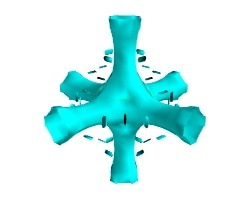
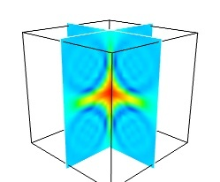

.. _simple-scripting-with-mlab:

Simple Scripting with ``mlab``
===============================

.. topic:: Section summary

    This section describes the `mab` API, for use of Mayavi as a simple
    plotting in scripts or interactive sessions. This is the main entry
    point for people interested in doing 3D plotting à la Matlab or IDL
    in Python.

.. currentmodule:: enthought.mayavi.mlab

The :mod:`enthought.mayavi.mlab` module, that we call mlab, provides an easy
way to visualize data in a script or from an interactive prompt with 
one-liners as done in the matplotlib_ ``pylab`` interface but with an
emphasis on 3D visualization using Mayavi2. This allows users to perform
quick 3D visualization while being able to use Mayavi's powerful
features.

Mayavi's mlab is designed to be used in a manner well suited to
scripting and does not present a fully object-oriented API.
It is can be used interactively with IPython_.

.. warning:: 

    IPython must be invoked with the ``-wthread`` command line option like so::

         $ ipython -wthread

    If you are using the `Enthought Python Distribution
    <www.enthought.com/products/epd.php>`_, or the latest 
    `Python(x,y) <http://www.pythonxy>`_ distribution, the Pylab menu
    entry will start ipython with the right switch. In older release of
    Python(x,y) you need to start "Interactive Console (wxPython)".

    For more details on using mlab and running scripts, read the section
    `running Mlab scripts`_

.. _matplotlib: http://matplotlib.sf.net

.. _IPython: http://ipython.scipy.org

A demo
-------

Once started, here is a pretty example showing a spherical harmonic::

 from numpy import *
 from enthought.mayavi import mlab

 # Create the data.
 dphi, dtheta = pi/250.0, pi/250.0
 [phi,theta] = mgrid[0:pi+dphi*1.5:dphi,0:2*pi+dtheta*1.5:dtheta]
 m0 = 4; m1 = 3; m2 = 2; m3 = 3; m4 = 6; m5 = 2; m6 = 6; m7 = 4;
 r = sin(m0*phi)**m1 + cos(m2*phi)**m3 + sin(m4*theta)**m5 + cos(m6*theta)**m7
 x = r*sin(phi)*cos(theta)
 y = r*cos(phi)
 z = r*sin(phi)*sin(theta)

 # View it.
 s = mlab.mesh(x, y, z)

 mlab.show()

Bulk of the code in the above example is to create the data.  One line
suffices to visualize it.  This produces the following visualization:

The visualization is created by the single command ``mesh`` in the above.

Several examples of this kind are provided with mlab (see
`test_contour3d`, `test_points3d`, `test_plot3d_anim` etc.).  The above
demo is available as `test_mesh`.  Under IPython these may be found by
tab completing on `mlab.test`.  You can also inspect the source in
IPython via the handy `mlab.test_contour3d??`.

.. _mlab_plotting_functions:

Plotting functions
-------------------

Visualization can be created in mlab by a set of functions operating on
numpy arrays. 

.. note:: 

    In this section, we only list the different functions. Each function
    is described in details in the :ref:`mlab-reference`, at the end of
    the user guide, with figures and examples. Please follow the links.

The mlab plotting functions take numpy arrays as input, describing the
``x``, ``y``, and ``z`` coordinates of the data. They build full-blown
visualizations: they create the data source, filters if necessary, and
add the visualization modules. Their behavior, and thus the visualization
created, can be fine-tuned through keyword arguments, similarly to pylab.
In addition, they all return the visualization module created, thus
visualization can also be modified by changing the attributes of this
module.

0D and 1D data
~~~~~~~~~~~~~~~

+----------------+----------------------+
| |plot3d.jpg|   | |points3d.jpg|       |
+----------------+----------------------+
| :func:`plot3d` | :func:`points3d`     |
+----------------+----------------------+

    The :func:`plot3d` and :func:`points3d` functions are respectively used 
    to draw lines, and sets of points, specifying the ``x``, ``y`` and 
    ``z`` coordinates as numpy arrays.

.. |plot3d.jpg| image:: images/enthought_mayavi_mlab_plot3d.jpg
     :scale: 50

.. |points3d.jpg| image:: images/enthought_mayavi_mlab_points3d.jpg
     :scale: 50

2D data
~~~~~~~~

+----------------+------------------+-----------------------------+
| |imshow.jpg|   | |surf.jpg|       |  |contour_surf.jpg|         |
+----------------+------------------+-----------------------------+
| :func:`imshow` | :func:`surf`     | :func:`contour_surf`        |
+----------------+------------------+-----------------------------+
| |mesh.jpg|     | |barchart.jpg|   | |triangular_mesh.jpg|       |
+----------------+------------------+-----------------------------+
| :func:`mesh`   | :func:`barchart` | :func:`triangular_mesh`     |
+----------------+------------------+-----------------------------+

    A 2D array can be shown as a image using :func:`imshow`, or as a surface 
    with the elevation given by its values using :func:`surf`. The contours 
    (lines) of same values can be plotted using :func:`contour_surf`.

    Bar charts can be created with the :func:`barchart` function. This
    function is very versatile and will accept 2D or 3D arrays, but also
    clouds of points, to position the bars.

    The :func:`mesh` function also creates surfaces, however, unlike 
    :func:`surf`, the surface is defined by its ``x``, ``y`` and ``z`` 
    coordinates, and more complex surfaces can be created, as in the 
    above example.

    Finally, the :func:`triangular_mesh` function creates a mesh with 
    arbitrary topology, given position of the vertices and the triangles.

    .. note::
    
        :func:`surf`, :func:`contour_surf` can be used as 3D
        representation of 2D data. By default the z-axis is supposed to
        be in the same units as the x and y axis, but it can be 
        auto-scaled to give a 2/3 aspect ratio. This behavior can be 
        controlled by specifying the "warp_scale='auto'".

.. |imshow.jpg| image:: images/enthought_mayavi_mlab_imshow.jpg
     :scale: 50

.. |contour_surf.jpg| image:: images/enthought_mayavi_mlab_contour_surf.jpg
     :scale: 50

.. |triangular_mesh.jpg| image:: images/enthought_mayavi_mlab_triangular_mesh.jpg
     :scale: 50

.. |surf.jpg| image:: images/enthought_mayavi_mlab_surf.jpg
     :scale: 50

.. |mesh.jpg| image:: images/enthought_mayavi_mlab_mesh.jpg
     :scale: 50

.. |barchart.jpg| image:: images/enthought_mayavi_mlab_barchart.jpg
     :scale: 50

3D data
~~~~~~~~

+-------------------+------------------+---------------------+
| |contour3d.jpg|   | |quiver3d.jpg|   |  |flow.jpg|         |
+-------------------+------------------+---------------------+
| :func:`contour3d` | :func:`quiver3d` | :func:`flow`        |
+-------------------+------------------+---------------------+

    To plot isosurfaces of a 3D scalar field use :func:`contour3d`. A
    vector field can be represented using :func:`quiver3d`, and the
    trajectories of particles along this field can plotted using :func:`flow`. 

    .. note:: 
       
        :func:`contour3d` and :func:`flow` require ordered data (to
        be able to interpolate between the points), whereas :func:`quiver3d`
        works with any set of points. The required structure is detailed
        in the functions' documentation.

.. |contour3d.jpg| image:: images/enthought_mayavi_mlab_contour3d.jpg
     :scale: 50

.. |quiver3d.jpg| image:: images/enthought_mayavi_mlab_quiver3d.jpg
     :scale: 50

.. |flow.jpg| image:: images/enthought_mayavi_mlab_flow.jpg
     :scale: 50

Changing the looks of the visual objects created
-------------------------------------------------

Adding color or size variations
~~~~~~~~~~~~~~~~~~~~~~~~~~~~~~~~

* **The color** of the objects created by a plotting function can be specified
  explicitly using the 'color' keyword argument of the function. This color
  is than applied uniformly to all the objects created. 

  If you want to vary the color across your visualization, you need to
  specify scalar information for each data point. Some functions try to
  guess this information: these scalars default to the norm of the vectors,
  for functions with vectors, or to the z elevation for functions where is
  meaningful, such as :func:`surf` or :func:`barchart`.

  This scalar information is converted into colors using the colormap, or
  also called LUT, for Look Up Table. The list of possible colormaps is::

      accent       flag          hot      pubu     set2
      autumn       gist_earth    hsv      pubugn   set3
      black-white  gist_gray     jet      puor     spectral
      blue-red     gist_heat     oranges  purd     spring
      blues        gist_ncar     orrd     purples  summer
      bone         gist_rainbow  paired   rdbu     winter
      brbg         gist_stern    pastel1  rdgy     ylgnbu
      bugn         gist_yarg     pastel2  rdpu     ylgn
      bupu         gnbu          pink     rdylbu   ylorbr
      cool         gray          piyg     rdylgn   ylorrd
      copper       greens        prgn     reds
      dark2        greys         prism    set1

  The easiest way to choose the colormap most adapted to your visualization
  is to use the GUI (as described in the 
  `Interacting graphically with the visualization`_ paragraph). The dialog
  to set the colormap can be found by double-clicking on the `Modules`
  node.

* The scalar information can also be displayed in many different ways.
  For instance it can be used to adjust the **size** of glyphs positioned at 
  the data points, or it can be 'warped' into a displacement, e.g. using a
  `WarpScalar` filter.

  **A caveat: Clamping: relative or absolute scaling**
  Given six points positionned on a line with interpoint spacing 1::

    x = [1, 2, 3, 4, 5, 6]
    y = [0, 0, 0, 0, 0, 0]
    z = y

  If we represent a scalar varying from 0.5 to 1 on this dataset::

    s = [.5, .6, .7, .8, .9, 1]

  We represent the dataset as spheres, using :func:`points3d`, and the 
  scalar is mapped to diameter of the spheres::

    from enthought.mayavi import mlab
    pts = mlab.points3d(x, y, z, s)

  By default the diameter of the spheres is not 'clamped', in other
  words, the smallest value of the scalar data is represented as a null
  diameter, and the largest is proportional to inter-point distance. 
  The scaling is only relative, as can be seen on the resulting
  figure:

  .. image:: clamping_on.jpg

  This behavior gives visible points for all datasets, but may not be
  desired if the scalar represents the size of the glyphs in the same
  unit as the positions specified.

  In this case, you shoud turn auto-scaling off by specifying the desired
  scale factor::

    pts = mlab.points3d(x, y, z, s, scale_factor=1)

  .. image:: clamping_off.jpg

  .. warning:: 
    
    In earlier versions of Mayavi (up to 3.1.0 included), the glyphs are
    not auto-scaled, and as a result the visualization can seem empty
    due to the glyphs being very small. In addition the minimum diameter of 
    the glyphs is clamped to zero, and thus the glyph are not scaled
    absolutely, unless you specifie::

        pts.glyph.glyph.clamping = False

Changing the scale and position of objects
~~~~~~~~~~~~~~~~~~~~~~~~~~~~~~~~~~~~~~~~~~~

Each mlab function takes an `extent` keyword argument, that allows to set
its (x, y, z) extents. This give both control on the scaling in the
different directions and the displacement of the center. Beware that when
you are using this functionality, it can be useful to pass the same
extents to other modules visualizing the same data. If you don't, they
will not share the same displacement and scale.

Handling figures
-----------------

All mlab functions operate on the current scene, that we also call
:func:`figure`, for compatibility with matlab and pylab. The different
figures are indexed by key that can be an integer or a string. A call to
the :func:`figure` function giving a key will either return the corresponding
figure, if it exists, or create a new one. The current figure can be
retrieved with the :func:`gcf` function. It can be refreshed using the
:func:`draw` function, saved to a picture file using :func:`savefig` and 
cleared using :func:`clf`.

Figure decorations
-------------------

Axes can be added around a visualization object with the :func:`axes`
function, and the labels can be set using the :func:`xlabel`, :func:`ylabel`
and :func:`zlabel` functions. Similarly, :func:`outline` creates an 
outline around an object. :func:`title` adds a title to the figure.

Color bars can be used to reflect the color maps used to display values
(LUT, or lookup tables, in VTK parlance). :func:`colorbar` creates a color 
bar for the last object created, trying to guess whether to use the vector
data or the scalar data color maps. The :func:`scalarbar` and 
:func:`vectorbar` function scan be used to create color bars specifically 
for scalar or vector data. 

A small *xyz* triad can be added to the figure using 
:func:`orientationaxes`. 

Moving the camera
-------------------

The position and direction of the camera can be set using the :func:`view`
function. They are described in terms of Euler angles and distance to a
focal point. The :func:`view` function tries to guess the right roll angle 
of the camera for a pleasing view, but it sometimes fails. The :func:`roll`
explicitly sets the roll angle of the camera.

Interacting graphically with the visualization
-----------------------------------------------

Mayavi, and thus mlab, allows you to interactively modify your
visualization.

The Mayavi pipeline tree can be displayed by clicking on the mayavi icon
in the figure's toolbar, or by using :func:`show_pipeline` mlab command.
One can now change the visualization using this dialog by double-clicking
on each object to edit its properties, as described in other parts of
this manual, or add new modules or filters by using this icons on the
pipeline, or through the right-click menus on the objects in the
pipeline.

.. image:: images/pipeline_and_scene.png

In addition, for every object returned by a mlab function,
``this_object.edit_traits()`` brings up a dialog that can be used to
interactively edit the object's properties. If the dialog doesn't show up
when you enter this command, please see the next paragraph.

.. _running-mlab-scripts:

Running mlab scripts
---------------------

Mlab, like the rest of Mayavi, is an interactive application. If you are
not already in an interactive environment (see next paragraph), to
interact with the figures or the rest of the drawing elements, you need
to use the :func:`show` function. For instance, if you are writing a
script, you need to call :func:`show` each time you want to display one
or more figures and allow the user to interact with them.

Using mlab interactively
~~~~~~~~~~~~~~~~~~~~~~~~~

Using `IPython`_ mlab instructions can be run interactively, or in
scripts using `IPython`_'s ``%run`` command, as soon as they are
executed, alleviating the need to use the :func:`show` function. For this
you need to start `Ipython`_ with the `-wthread` option (when installed
with `EPD`_, the `pylab` start-menu link does this for you).

.. _EPD: http://www.enthought.com/products/epd.php

Mlab can also be used interactively in the Python shell of the mayavi2
application, or in any interactive Python shell of wxPython-based
application (such as other Envisage-based applications, or SPE, Stani's
Python Editor).

Using together with Matplotlib's pylab
~~~~~~~~~~~~~~~~~~~~~~~~~~~~~~~~~~~~~~~

If you want to use Matplotlib's pylab with Mayavi's mlab in IPython you
should:

    * if your IPython version is greater than 0.8.4: start IPython with
      the following options::

        $ ipython -pylab -wthread

    * elsewhere, start IPython with the `-wthread` option::

        $ ipython -wthread

      and **before** importing pylab, enter the following Python
      commands::

        >>> import matplotlib
        >>> matplotlib.use('WxAgg')
        >>> matplotlib.interactive(True)

In scripts
~~~~~~~~~~~~~~~~~

Mlab commands can be written to a file, to form a script. This script
can be loaded in the Mayavi application using the *File->Open file* menu
entry, and executed using the *File->Refresh code* menu entry or by
pressing ``Control-r``.  It can also be executed during the start of the
Mayavi application using the ``-x`` command line switch.

As mentioned above, when running outside of an interactive environment,
for instance with `python myscript.py`, you need to call the
:func:`show` function (as shown in the demo_ above) to pause your script
and have the user interact with the figure.

.. _demo:
    `A demo`_

You can also use :func:`show` to decorate a function, and have it run in
the event-loop, which gives you more flexibility::

 from enthought.mayavi import mlab
 from numpy import random
 
 @mlab.show
 def image():
    mlab.imshow(random.random((10, 10)))

With this decorator, each time the `image` function is called, `mlab`
makes sure an interactive environment is running before executing the
`image` function. If an interactive environment is not running, `mlab`
will start one and the image function will not return until it is closed.

Animating the data
------------------

Often it isn't sufficient to just plot the data.  You may also want to
change the data of the plot and update the plot without having to
recreate the entire visualization, for instance to do animations, or in
an interactive application. Indeed, recreating the entire visualization
is very inefficient and leads to very jerky looking
animations. To do this, mlab provides a very convenient way to change
the data of an existing mlab visualization.  Consider a very simple
example.  The `mlab.test_simple_surf_anim` function has this code::

    x, y = numpy.mgrid[0:3:1,0:3:1]
    s = mlab.surf(x, y, numpy.asarray(x*0.1, 'd'))

    for i in range(10):
        s.mlab_source.scalars = numpy.asarray(x*0.1*(i+1), 'd')

The first two lines define a simple plane and view that.  The next three
lines animate that data by changing the scalars producing a plane that
rotates about the origin.  The key here is that the `s` object above has
a special attribute called `mlab_source`.  This sub-object allows us to
manipulate the points and scalars.  If we wanted to change the `x` values
we could set that too by::

    s.mlab_source.x = new_x

The only thing to keep in mind here is that the shape of `x` should not
be changed. 

If multiple values have to be changed, you can use the `set` method of
the `mlab_source` to set them as shown in the more complicated example
below::

    # Produce some nice data.
    n_mer, n_long = 6, 11
    pi = numpy.pi
    dphi = pi/1000.0
    phi = numpy.arange(0.0, 2*pi + 0.5*dphi, dphi, 'd')
    mu = phi*n_mer
    x = numpy.cos(mu)*(1+numpy.cos(n_long*mu/n_mer)*0.5)
    y = numpy.sin(mu)*(1+numpy.cos(n_long*mu/n_mer)*0.5)
    z = numpy.sin(n_long*mu/n_mer)*0.5

    # View it.
    l = plot3d(x, y, z, numpy.sin(mu), tube_radius=0.025, colormap='Spectral')

    # Now animate the data.
    ms = l.mlab_source
    for i in range(10):
        x = numpy.cos(mu)*(1+numpy.cos(n_long*mu/n_mer +
                                          numpy.pi*(i+1)/5.)*0.5)
        scalars = numpy.sin(mu + numpy.pi*(i+1)/5)
        ms.set(x=x, scalars=scalars)

Notice the use of the `set` method above. With this method, the
visualization is recomputed only once.  In this case, the shape of the
new arrays has not changed, only their values have.  If the shape of the
array changes then one should use the `reset` method as shown below::

    x, y = numpy.mgrid[0:3:1,0:3:1]
    s = mlab.surf(x, y, numpy.asarray(x*0.1, 'd'),
                  representation='wireframe')
    # Animate the data.
    fig = mlab.gcf()
    ms = s.mlab_source
    for i in range(5):
        x, y = numpy.mgrid[0:3:1.0/(i+2),0:3:1.0/(i+2)]
        sc = numpy.asarray(x*x*0.05*(i+1), 'd')
        ms.reset(x=x, y=y, scalars=sc)
        fig.scene.reset_zoom()

Many standard examples for animating data are provided with mlab.  Try
the examples with the name `mlab.test_<name>_anim`, i.e. where the name
ends with an `_anim` to see how these work and run.   

.. note:: 

    It is important to remember distinction between `set` and `reset`.
    Use `set` or directly set the attributes (`x`, `y`, `scalars` etc.)
    when you are not changing the shape of the data but only the values.
    Use `reset` when the arrays are changing shape and size.  Reset
    usually regenerates all the data and can be inefficient when
    compared to `set` or directly setting the traits.

..  _controlling-the-pipeline-with-mlab-scripts:

Controlling the pipeline with `mlab` scripts
---------------------------------------------

.. currentmodule:: enthought.mayavi.tools.pipeline

The plotting functions reviewed above explore only a small fraction of
the visualization possibilities of Mayavi. The full power of Mayavi can
only be unleashed through the control of the pipeline itself. As
described in the :ref:`an-overview-of-mayavi` section, a visualization in
Mayavi is created by loading the data in Mayavi with `data source`
object, optionally transforming the data through :ref:`filters`, and
visualizing it with :ref:`modules`. The mlab functions build complex
pipelines for you in one function, making the right choice of sources,
filters, and modules, but they cannot explore all the possible
combinations.

Mlab provides a submodule `pipeline` which contains functions to populate
the pipeline easily from scripts. This module is accessible in `mlab`:
`mlab.pipeline`, or can be imported from
`enthought.mayavi.tools.pipeline`.

When using an `mlab` plotting function, a pipeline is created: first a
source is created from `numpy` arrays, then modules, and possibly
filters, are added. The resulting pipeline can be seen for instance with
the `mlab.show_pipeline` command. This information can be used to create
the very same pipeline using directly the `pipeline` scripting module, as
the names of the functions required to create each step of the pipeline
are directly linked to the default names of the objects created by `mlab`
on the pipeline. As an example, let us create a visualization using
`surf`::

    import numpy as np
    a = np.random.random((4, 4))
    from enthought.mayavi import mlab
    mlab.surf(a)
    mlab.show_pipeline()

The following pipeline is created::

    Array2DSource
        \__ WarpScalar
                \__ PolyDataNormals
                        \__ Colors and legends
                                \__ Surface

The same pipeline can be created using the following code::

    src = mlab.pipeline.array2d_source(a)
    warp = mlab.pipeline.warp_scalar(src)
    normals = mlab.pipeline.poly_data_normals(warp)
    surf = mlab.pipeline.surface(normals)

.. _mlab_data_source:

Data sources
~~~~~~~~~~~~~

The `pipeline` module contains functions for creating various data
sources from arrays. They are fully documented in details in the
:ref:`mlab-pipeline-reference`. We give a small summary of the
possibilities here. 

`mlab` distinguishes sources with scalar data, and sources with vector
data, but more important, it has different functions to create sets of
unconnected points, with data attached to them, or connected data
points describing continuously varying quantities that can be
interpolated between data points, often called `fields` in physics or
engineering.

:Unconnected sources:
    :func:`scalar_scatter`, :func:`vector_scatter`

:Implicitely-connected sources:
    :func:`scalar_field`, :func:`vector_field`, :func:`array2d_source`

:Explicitly-connected sources:
    :func:`line_source`, :func:`triangular_mesh_source`

All the `mab` source factories are functions that take numpy arrays and
return the Mayavi source object that was added to the pipeline. However,
the implicitely-connected sources require well-shaped arrays as
arguments: the data is supposed to lie on a regular, orthogonal, grid of
the same shape as the shape of the input array, in other words, the array
describes an image, possibly 3 dimensional.

Modules and filters
~~~~~~~~~~~~~~~~~~~~

For each Mayavi module or filter, there is a corresponding
`mlab.pipeline` function. The name of this function is created by
replacing the alternating capitals in the module or filter name by
underscores. Thus `ScalarCutPlane` corresponds to `scalar_cut_plane`.

In general, the `mlab.pipeline` module and filter factory functions
simply create and connect the corresponding object. However they can also
contain addition logic, exposed as keyword arguments. For instance they
allow to set up easily a colormap, or to specify the color of the module,
when relevant. In accordance with the goal of the `mlab` interface to
make frequent operations simple, they use the keyword arguments to choose 
the properties of the create object to best suit the requirements. It can
be thus easier to use the keyword arguments, when available, than to set
the attributes of the objects created. For more information, please check
out the docstrings.

Case studies of some visualizations
-------------------------------------

Visualizing volumetric scalar data
~~~~~~~~~~~~~~~~~~~~~~~~~~~~~~~~~~~~

There are three main ways of visualizing a 3D scalar field. Given the
following field::

    import numpy as np
    x, y, z = np.ogrid[-10:10:20j, -10:10:20j, -10:10:20j]
    s = np.sin(x*y*z)/(x*y*z)

:IsoSurfaces:
    To display iso surfaces of the field, the simplest solution is
    simply to use the `mlab` :func:`contour3d` function:: 

        mlab.contour3d(s)

    |volumetric_contour3d|

    The problem with this method that outer iso-surfaces tend to hide inner 
    ones. As a result, quite often only one iso-surface can be visible.

:Volume rendering:
    Volume rendering is an advanced technique in which each voxel is
    given a partly transparent color. This can be achieved with
    `mlab.pipeline` using the :func:`scalar_field` source, and the 
    `volume` module::

        mlab.pipeline.volume(mlab.pipeline.scalar_field(s))

    |volumetric_volume|

    It is useful to open the module's dialog (eg through the pipeline
    interface, or using it's `edit_traits()` method) and tweak the color
    transfert function to render transparent the low-intensities regions
    of the image. **For this module, the LUT as defined in the `Colors and
    legends` node are not used**

    |volumetric_volume_tweaked|

    The limitations of volume rendering is that, while it is often very
    pretty, it can be difficult to analysis the details of the field with
    it.

:Cut planes:
    While less impressive, cut planes are a very informative way of
    visualising the details of a scalar field::

        mlab.pipeline.image_plane_widget(mlab.pipeline.scalar_field(s),
                                    plane_orientation='x_axes',
                                    slice_index=10,
                                )
        mlab.pipeline.image_plane_widget(mlab.pipeline.scalar_field(s),
                                    plane_orientation='y_axes',
                                    slice_index=10,
                                )
        mlab.outline()

    |volumetric_cut_plane|

    The image plane widget can only be used on regular-spaced data, as
    created by `mlab.pipeline.scalar_field`, but it is very fast. It
    should thus be prefered to the scalar cut plane, when possible.

    Clicking and dragging the cut plane is an excellent way of exploring
    the field.

:A combination of techniques:
    Finally, it can be interesting to combine cut planes with
    iso-surfaces and thresholding to give a view of the peak areas using
    the iso-surfaces, visualize the details of the field with the cut
    plane, and the global mass with a large iso-surface::

        src = mlab.pipeline.scalar_field(s)
        mlab.pipeline.iso_surface(src, contours=[s.min()+0.1*s.ptp(), ], opacity=0.1)
        mlab.pipeline.iso_surface(src, contours=[s.max()-0.1*s.ptp(), ],)
        mlab.pipeline.image_plane_widget(src,
                                    plane_orientation='z_axes',
                                    slice_index=10,
                                )
        

    |volumetric_combination|

    In some cases, thought not in our example, it might be usable to
    insert a threshold filter before the cut plane, eg to remove area
    with values below 's.min()+0.1*s.ptp()'. In this case, the cut plane
    needs to be implemented with `mlab.pipeline.scalar_cut_plane` as the data
    looses its structure after thresholding.

.. |volumetric_volume_tweaked| image:: volumetric_volume_tweaked.jpg

.. |volumetric_combination| image:: volumetric_combination.jpg

Visualizing a vector field
~~~~~~~~~~~~~~~~~~~~~~~~~~~~

.. Parameters used for the images:
    mlab.figure(1, fgcolor=(0., 0., 0.), bgcolor=(1, 1, 1), size=(349, 349))
    mlab.view(60, 90, 45.8, (9.5, 11.1, 10.4))

A vector field, ie vectors continuously defined in a volume, can be
difficult to visualize, as it contains a lot of information. Let us
explore different visualizations for the velocity field of a multi-axis
convection cell [1]_, in hydrodynamics, as defined by its components
sampled on a grid, `u`, `v`, `w`::

    import numpy as np
    x, y, z = np.mgrid[0:1:20j, 0:1:20j, 0:1:20j]

    u =    np.sin(np.pi*x) * np.cos(np.pi*z)
    v = -2*np.sin(np.pi*y) * np.cos(2*np.pi*z)
    w = np.cos(np.pi*x)*np.sin(np.pi*z) + np.cos(np.pi*y)*np.sin(2*np.pi*z)

:Quiver:
    The simplest visualization of a set of vectors, is using the `mlab`
    function `quiver3d`::

        mlab.quiver3d(u, v, w)
        mlab.outline()

    .. image:: vector_field_quiver.jpg

    The main limitation of this visualization is that it positions an
    arrow for each sampling point on the grid. As a result the
    visualization is very busy.

:Masking vectors:
    We can use the fact that we are visualizing a vector field, and not
    just a bunch of vectors, to reduce the amount of arrows displayed. For
    this we need to build a `vector_field` source, and apply to it the
    `vectors` module, with some masking parameters (here we keep only one
    point out of 20)::

        src = mlab.pipeline.vector_field(u, v, w)
        mlab.pipeline.vectors(src, mask_points=20, scale_factor=3.)

    .. image:: vector_field_vectors.jpg

:A cut plane:
    If we are interested in displaying the vectors along a cut, we can
    use a cut plane. In particular, we can inspect interactively the
    vector field by moving the cut plane along: clicking on it and
    dragging it can give a very clear understanding of the vector field::

        mlab.pipeline.vector_cut_plane(src, mask_points=2, scale_factor=3)

    .. image:: vector_field_cut_plane.jpg

:IsoSurfaces of the magnitude:
    An important parameter of the vector field is its magnitude. It can
    be interesting to display iso-surfaces of the norm of the vectors.
    For this we can create a scalar field from the vector field using the 
    ExtractVectorNorm filter, and use the IsoSurface module on it. When
    working interactively, a good understanding of the magnitude of the
    field can be gained by changing the values of the contours in the
    object's property dialog. ::

        magnitude = mlab.pipeline.extract_vector_norm(src)
        mlab.pipeline.iso_surface(magnitude, contours=[1.9, 0.5])

    .. image:: vector_field_isosurface.jpg

:The Flow, or the field lines:
    For certain vector fields, the line of flow of along the field can
    have an interesting meaning. For instance the can be interpreted as
    trajectories in hydrodynamics, or field lines in electro-magnetism.
    We can display the flow lines originating for a certain seed surface
    using the `streamline` module, or the mlab `flow` function, which
    calls it::

        flow = mlab.flow(u, v, w, seed_scale=1,
                                  seed_resolution=5,
                                  integration_direction='both')

    .. image:: vector_field_flow.jpg

:A combination of techniques:

    Giving a meaningful visualization of a vector field is a hard task,
    and one must use all the tools at hand to illustrate his purposes. It
    is important to choose the message conveyed. No one visualization
    will tell all about a vector field. Here is an example of a
    visualization made by combining the different tools above::

        mlab.figure(fgcolor=(0., 0., 0.), bgcolor=(1, 1, 1))
        src = mlab.pipeline.vector_field(u, v, w)
        magnitude = mlab.pipeline.extract_vector_norm(src)

        # We apply the following modules on the magnitude object, in order to
        # be able to display the norm of the vectors, eg as the color.
        iso = mlab.pipeline.iso_surface(magnitude, contours=[1.9, ], opacity=0.3)

        vec = mlab.pipeline.vectors(magnitude, mask_points=40,
                                            line_width=1,
                                            color=(.8, .8, .8),
                                            scale_factor=4.)

        flow = mlab.pipeline.streamline(magnitude, seedtype='plane',
                                                seed_visible=False,
                                                seed_scale=0.5,
                                                seed_resolution=1,
                                                linetype='ribbon',)

        vcp = mlab.pipeline.vector_cut_plane(magnitude, mask_points=2,
                                                scale_factor=4,
                                                colormap='jet',
                                                plane_orientation='x_axes')

    .. image:: vector_field_combination.jpg

.. note::

    Although most of this section has been centered on snippets of code
    to create visualization objects, it is important to remember that
    Mayavi is an interactive program, and that the properties of these
    objects can be modified interactively, as described in 
    `Interacting graphically with the visualization`_. It is often
    impossible to choose the best parameters for a visualization before
    hand. Colors, contour values, colormap, view angle, etc... should be
    chosen interactively. If reproducibility is required, the chosen
    values can be added in the original script.

    Moreover, the `mlab` functions expose only a small fraction of the
    possibilities of the visualization objects. The dialogs expose more
    of these functionalities, that are entirely controlled by the
    attributes of the objects returned by the mlab functions. These
    objects are very rich, as they are built from VTK objects. It can be
    hard to find the right attribute to modify when exploring them, or in
    the VTK documentation. The following chapter shows how to go from a
    modification made interactively in a dialog, to the corresponding lines 
    of code.

____

.. [1] Toussaint, V.; Carriere, P. & Raynal, F. A numerical Eulerian
   approach to mixing by chaotic advection Phys. Fluids, 1995, 7, 2587

..
   Local Variables:
   mode: rst
   indent-tabs-mode: nil
   sentence-end-double-space: t
   fill-column: 70
   End:

