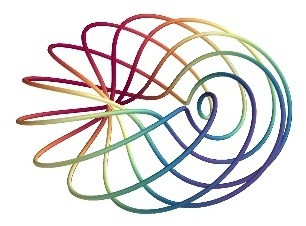
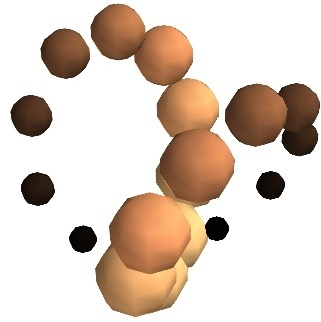
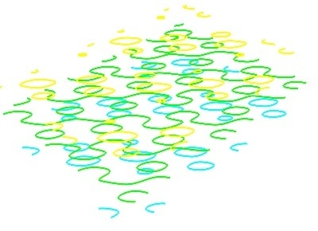
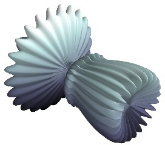
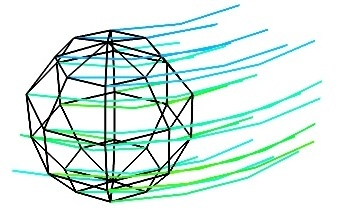
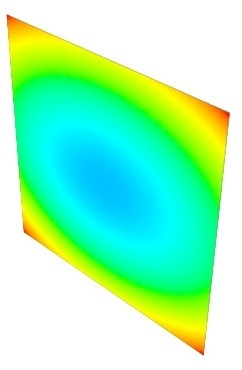

.. _mlab_plotting_functions:

3D Plotting functions for numpy arrays
---------------------------------------

Visualization can be created in `mlab` by a set of functions operating on
numpy arrays. 

The mlab plotting functions take numpy arrays as input, describing the
``x``, ``y``, and ``z`` coordinates of the data. They build full-blown
visualizations: they create the data source, filters if necessary, and
add the visualization modules. Their behavior, and thus the visualization
created, can be fine-tuned through keyword arguments, similarly to pylab.
In addition, they all return the visualization module created, thus
visualization can also be modified by changing the attributes of this
module.

.. note:: 

    In this section, we only list the different functions. Each function
    is described in detail in the :ref:`mlab-reference`, at the end of
    the user guide, with figures and examples. Please follow the links.

0D and 1D data
~~~~~~~~~~~~~~~

.. A temporary hack to avoid a sphinx bug
.. |hack| raw:: html

    

================= =========================================================
================= =========================================================
|points3d|        :func:`points3d`
                  |hack|
                  Plots glyphs (like points) at the position of the
                  supplied data, described by ``x``, ``y``, ``z`` 
                  numpy arrays of the same shape.

|plot3d|          :func:`plot3d`
                  |hack|
                  Plots line between the supplied data, described by ``x``, 
                  ``y``, ``z`` 1D numpy arrays of the same length.

================= =========================================================

2D data
~~~~~~~~

================= =========================================================
================= =========================================================
|imshow|          :func:`imshow`
                  |hack|
                  View a 2D array as an image.

|surf|            :func:`surf`
                  |hack|
                  View a 2D array as a carpet plot, with the z axis
                  representation through elevation the value of the
                  array points.

|contour_surf|    :func:`contour_surf`
                  |hack|
                  View a 2D array as line contours, elevated
                  according to the value of the array points.

|mesh|            :func:`mesh`
                  |hack|
                  Plot a surface described by three 2D arrays, ``x``, 
                  ``y``, ``z`` giving the coordinates of the data points 
                  as a grid.
                  |hack|
                  Unlike :func:`surf`, the surface is defined by its 
                  ``x``, ``y`` and ``z`` coordinates with no privileged
                  direction. More complex surfaces can be created.

|barchart|        :func:`barchart`
                  |hack|
                  Plot an array ``s``, or a set of points with
                  explicit coordinates arrays, ``x``, ``y`` and ``z``,
                  as a bar chart, eg for histograms.
                  |hack|
                  This function is very versatile and will accept 2D or 
                  3D arrays, but also clouds of points, to position the 
                  bars.

|triangular_mesh| :func:`triangular_mesh`
                  |hack|
                  Plot a triangular mesh, fully specified by
                  ``x``, ``y`` and ``z`` coordinates of its
                  vertices, and the (n, 3) array of the indices of
                  the triangles.

================= =========================================================

.. topic:: Vertical scale of  :func:`surf` and :func:`contour_surf`

    :func:`surf` and :func:`contour_surf` can be used as 3D
    representation of 2D data. By default the z-axis is supposed to
    be in the same units as the x and y axis, but it can be 
    auto-scaled to give a 2/3 aspect ratio. This behavior can be 
    controlled by specifying the "warp_scale='auto'".

.. topic:: From data points to surfaces.

    Knowing the positions of data points is not enough to define a
    surface, connectivity information is also required. With the 
    functions :func:`surf` and :func:`mesh`, this connectivity
    information is implicitly extracted from the shape of the input
    arrays: neighboring data points in the 2D input arrays are
    connected, and the data lies on a grid. With the function 
    :func:`triangular_mesh`, connectivity is explicitly specified.
    Quite often, the connectivity is not regular, but is not known in
    advance either. The data points lie on a surface, and we want to
    plot the surface implicitly defined. The `delaunay2d` filter does
    the required nearest-neighbor matching, and interpolation, as
    shown in the (:ref:`example_surface_from_irregular_data`).

.. |imshow| image:: generated_images/enthought_mayavi_mlab_imshow.jpg
     :scale: 50

.. |triangular_mesh| image:: generated_images/enthought_mayavi_mlab_triangular_mesh.jpg
     :scale: 50

.. |surf| image:: generated_images/enthought_mayavi_mlab_surf.jpg
     :scale: 50

.. |barchart| image:: generated_images/enthought_mayavi_mlab_barchart.jpg
     :scale: 50

3D data
~~~~~~~~

================= =========================================================
================= =========================================================
|contour3d|       :func:`contour3d`
                  |hack|
                  Plot iso-surfaces of volumetric data defined as a 3D
                  array.

|quiver3d|        :func:`quiver3d`
                  |hack|
                  Plot arrows to represent vectors at data points.
                  The ``x``, ``y``, ``z`` position are specified by
                  numpy arrays, as well as the ``u``, ``v``, ``w``
                  components of the vectors.

|flow|            :func:`flow`
                  |hack|
                  Plot a trajectory of particles along a vector field 
                  described by three 3D arrays giving the ``u``,
                  ``v``, ``w`` components on a grid.

|slice|           :func:`volume_slice`
                  |hack|
                  Plots an interactive image plane sliced through
                  volumetric data.

================= =========================================================

.. topic:: Structured or unstructured data
    
    :func:`contour3d`, :func:`volume_slice` and :func:`flow` require
    ordered data (to be able to interpolate between the points), whereas
    :func:`quiver3d` works with any set of points. The required structure
    is detailed in the functions' documentation.

.. |quiver3d| image:: generated_images/enthought_mayavi_mlab_quiver3d.jpg
     :scale: 50

.. note::

    Many richer visualizations can be created by assembling data sources
    filters and modules. See the
    :ref:`controlling-the-pipeline-with-mlab-scripts` and the 
    :ref:`mlab-case-studies` sections.

..
   Local Variables:
   mode: rst
   indent-tabs-mode: nil
   sentence-end-double-space: t
   fill-column: 70
   End:

