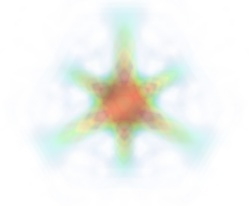
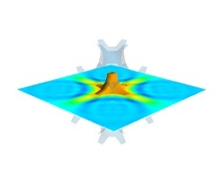

.. _mlab-case-studies:

Case studies of some visualizations
-------------------------------------

Visualizing volumetric scalar data
~~~~~~~~~~~~~~~~~~~~~~~~~~~~~~~~~~~~

.. currentmodule:: mayavi.mlab

There are three main ways of visualizing a 3D scalar field. Given the
following field::

    import numpy as np
    x, y, z = np.ogrid[-10:10:20j, -10:10:20j, -10:10:20j]
    s = np.sin(x*y*z)/(x*y*z)

:Iso-Surfaces:
    To display iso surfaces of the field, the simplest solution is
    simply to use the ``mlab`` :func:`contour3d` function:: 

        mlab.contour3d(s)

    |volumetric_contour3d|

    The problem with this method is that the outer iso-surfaces tend to hide inner 
    ones. As a result, quite often only one iso-surface can be visible.

    .. currentmodule:: mayavi.tools.pipeline

:Volume rendering:
    Volume rendering is an advanced technique in which each voxel is
    given a partly transparent color. This can be achieved with
    `mlab.pipeline` using the :func:`scalar_field` source, and the 
    `volume` module::

        mlab.pipeline.volume(mlab.pipeline.scalar_field(s))

    |volumetric_volume|

    For such a visualization, tweaking the opacity transfer function is
    critical to achieve a good effect. Typically, it can be useful to
    limit the lower and upper values to the 20 and 80 percentiles of the
    data, in order to have a reasonable fraction of the volume
    transparent::

	mlab.pipeline.volume(mlab.pipeline.scalar_field(s), vmin=0, vmax=0.8)

    |volumetric_volume_tweaked|

    It is useful to open the module's dialog (eg through the pipeline
    interface, or using it's `edit_traits()` method) and tweak the color
    transfer function to render the transparent low-intensity regions
    of the image. **For this module, the LUT as defined in the** `Colors and
    legends` **node are not used.**

    The limitations of volume rendering is that, while it is often very
    pretty, it can be difficult to analyze the details of the field with
    it.

.. currentmodule:: mayavi.mlab

:Cut planes:
    While less impressive, cut planes are a very informative way of
    visualizing the details of a scalar field::

        mlab.pipeline.image_plane_widget(mlab.pipeline.scalar_field(s),
                                    plane_orientation='x_axes',
                                    slice_index=10,
                                )
        mlab.pipeline.image_plane_widget(mlab.pipeline.scalar_field(s),
                                    plane_orientation='y_axes',
                                    slice_index=10,
                                )
        mlab.outline()

    Image plane widgets can also being created from NumPy arrays using
    the ``mlab`` :func:`volume_slice` function::

        mlab.volume_slice(s, plane_orientation='x_axes', slice_index=10)

    |volumetric_cut_plane|

    The image plane widget can only be used on regular-spaced data, as
    created by `mlab.pipeline.scalar_field`, but it is very fast. It
    should thus be prefered to the scalar cut plane, when possible.

    Clicking and dragging the cut plane is an excellent way of exploring
    the field.

:A combination of techniques:
    Finally, it can be interesting to combine cut planes with
    iso-surfaces and thresholding to give a view of the peak areas using
    the iso-surfaces, visualize the details of the field with the cut
    plane, and the global mass with a large iso-surface::

        src = mlab.pipeline.scalar_field(s)
        mlab.pipeline.iso_surface(src, contours=[s.min()+0.1*s.ptp(), ], opacity=0.1)
        mlab.pipeline.iso_surface(src, contours=[s.max()-0.1*s.ptp(), ],)
        mlab.pipeline.image_plane_widget(src,
                                    plane_orientation='z_axes',
                                    slice_index=10,
                                )
        

    |volumetric_combination|

    In the above example, we have used the pipeline syntax of mayavi
    instead of using :func:`contour3d` and :func:`volume_slice`
    in order to use a single scalar field as data source.

    In some cases, though not in our example, it might be usable to
    insert a threshold filter before the cut plane, eg:to remove area
    with values below 's.min()+0.1*s.ptp()'. In this case, the cut plane
    needs to be implemented with `mlab.pipeline.scalar_cut_plane` as the data
    looses its structure after thresholding.

.. |volumetric_contour3d| image:: volumetric_contour3d.jpg

.. |volumetric_volume| image:: volumetric_volume.jpg

.. |volumetric_cut_plane| image:: volumetric_cut_plane.jpg

Visualizing a vector field
~~~~~~~~~~~~~~~~~~~~~~~~~~~~

.. Parameters used for the images:
    mlab.figure(1, fgcolor=(0., 0., 0.), bgcolor=(1, 1, 1), size=(349, 349))
    mlab.view(60, 90, 45.8, (9.5, 11.1, 10.4))

.. currentmodule:: mayavi.mlab

A vector field, i.e., vectors continuously defined in a volume, can be
difficult to visualize, as it contains a lot of information. Let us
explore different visualizations for the velocity field of a multi-axis
convection cell [1]_, in hydrodynamics, as defined by its components
sampled on a grid, `u`, `v`, `w`::

    import numpy as np
    x, y, z = np.mgrid[0:1:20j, 0:1:20j, 0:1:20j]

    u =    np.sin(np.pi*x) * np.cos(np.pi*z)
    v = -2*np.sin(np.pi*y) * np.cos(2*np.pi*z)
    w = np.cos(np.pi*x)*np.sin(np.pi*z) + np.cos(np.pi*y)*np.sin(2*np.pi*z)

:Quiver:
    The simplest visualization of a set of vectors, is using the `mlab`
    function `quiver3d`::

        mlab.quiver3d(u, v, w)
        mlab.outline()

    .. image:: vector_field_quiver.jpg

    The main limitation of this visualization is that it positions an
    arrow for each sampling point on the grid. As a result the
    visualization is very busy.

:Masking vectors:
    We can use the fact that we are visualizing a vector field, and not
    just a bunch of vectors, to reduce the amount of arrows displayed. For
    this we need to build a `vector_field` source, and apply to it the
    `vectors` module, with some masking parameters (here we keep only one
    point out of 20)::

        src = mlab.pipeline.vector_field(u, v, w)
        mlab.pipeline.vectors(src, mask_points=20, scale_factor=3.)

    .. image:: vector_field_vectors.jpg

:A cut plane:
    If we are interested in displaying the vectors along a cut, we can
    use a cut plane. In particular, we can inspect interactively the
    vector field by moving the cut plane along: clicking on it and
    dragging it can give a very clear understanding of the vector field::

        mlab.pipeline.vector_cut_plane(src, mask_points=2, scale_factor=3)

    .. image:: vector_field_cut_plane.jpg

:Iso-Surfaces of the magnitude:
    An important parameter of the vector field is its magnitude. It can
    be interesting to display iso-surfaces of the normal of the vectors.
    For this we can create a scalar field from the vector field using the 
    ExtractVectorNorm filter, and use the Iso-Surface module on it. When
    working interactively, a good understanding of the magnitude of the
    field can be gained by changing the values of the contours in the
    object's property dialog. ::

        magnitude = mlab.pipeline.extract_vector_norm(src)
        mlab.pipeline.iso_surface(magnitude, contours=[1.9, 0.5])

    .. image:: vector_field_isosurface.jpg

:The Flow, or the field lines:
    For certain vector fields, the line of flow along the field can
    have an interesting meaning. For instance this can be interpreted as a
    trajectory in hydrodynamics, or field lines in electro-magnetism.
    We can display the flow lines originating for a certain seed surface
    using the `streamline` module, or the mlab :func:`flow` function, 
    which relies on `streamline` internally::

        flow = mlab.flow(u, v, w, seed_scale=1,
                                  seed_resolution=5,
                                  integration_direction='both')

    .. image:: vector_field_flow.jpg

:A combination of techniques:

    Giving a meaningful visualization of a vector field is a hard task,
    and one must use all the tools at hand to illustrate his purposes. It
    is important to choose the message conveyed. No one visualization
    will tell all about a vector field. Here is an example of a
    visualization made by combining the different tools above::

        mlab.figure(fgcolor=(0., 0., 0.), bgcolor=(1, 1, 1))
        src = mlab.pipeline.vector_field(u, v, w)
        magnitude = mlab.pipeline.extract_vector_norm(src)

        # We apply the following modules on the magnitude object, in order to
        # be able to display the norm of the vectors, eg as the color.
        iso = mlab.pipeline.iso_surface(magnitude, contours=[1.9, ], opacity=0.3)

        vec = mlab.pipeline.vectors(magnitude, mask_points=40,
                                            line_width=1,
                                            color=(.8, .8, .8),
                                            scale_factor=4.)

        flow = mlab.pipeline.streamline(magnitude, seedtype='plane',
                                                seed_visible=False,
                                                seed_scale=0.5,
                                                seed_resolution=1,
                                                linetype='ribbon',)

        vcp = mlab.pipeline.vector_cut_plane(magnitude, mask_points=2,
                                                scale_factor=4,
                                                colormap='jet',
                                                plane_orientation='x_axes')

    .. image:: vector_field_combination.jpg

.. note::

    Although most of this section has been centered on snippets of code
    to create visualization objects, it is important to remember that
    Mayavi is an interactive program, and that the properties of these
    objects can be modified interactively, as described in 
    :ref:`mlab-changing-objects-interactively`. It is often
    impossible to choose the best parameters for a visualization before
    hand. Colors, contour values, colormap, view angle, etc... should be
    chosen interactively. If reproducibiles are required, the chosen
    values can be added in the original script.

    Moreover, the `mlab` functions expose only a small fraction of the
    possibilities of the visualization objects. The dialogs expose more
    of these functionalities, that are entirely controlled by the
    attributes of the objects returned by the mlab functions. These
    objects are very rich, as they are built from VTK objects. It can be
    hard to find the right attribute to modify when exploring them, or in
    the VTK documentation, thus the easiest way is to modify them 
    interactively using the pipeline view dialog and use 
    the :ref:`record feature <record_feature>` to find out the
    corresponding lines of code. See
    :ref:`organisation_mayavi_visualisations` to understand better the
    link between the lines of code generated by the record feature and
    `mlab`.
    .

____

.. [1] Toussaint, V.; Carriere, P. & Raynal, F. A numerical Eulerian
   approach to mixing by chaotic advection Phys. Fluids, 1995, 7, 2587

..
   Local Variables:
   mode: rst
   indent-tabs-mode: nil
   sentence-end-double-space: t
   fill-column: 70
   End:

