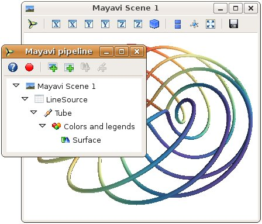

Changing the looks of the visual objects created
-------------------------------------------------

Adding color or size variations
~~~~~~~~~~~~~~~~~~~~~~~~~~~~~~~~

:Color:
  The color of the objects created by a plotting function can be specified
  explicitly using the 'color' keyword argument of the function. This color
  is then applied uniformly to all the objects created. 

  If you want to vary the color across your visualization, you need to
  specify scalar information for each data point. Some functions try to
  guess this information: these scalars default to the norm of the vectors,
  for functions with vectors, or to the z elevation for functions where it is
  meaningful, such as :func:`surf` or :func:`barchart`.

  This scalar information is converted into colors using the colormap, or
  also called LUT, for Look Up Table. The list of possible colormaps is::

      accent       flag          hot      pubu     set2
      autumn       gist_earth    hsv      pubugn   set3
      black-white  gist_gray     jet      puor     spectral
      blue-red     gist_heat     oranges  purd     spring
      blues        gist_ncar     orrd     purples  summer
      bone         gist_rainbow  paired   rdbu     winter
      brbg         gist_stern    pastel1  rdgy     ylgnbu
      bugn         gist_yarg     pastel2  rdpu     ylgn
      bupu         gnbu          pink     rdylbu   ylorbr
      cool         gray          piyg     rdylgn   ylorrd
      copper       greens        prgn     reds
      dark2        greys         prism    set1

  The easiest way to choose the colormap, most adapted to your visualization
  is to use the GUI (as described in the next paragraph). The dialog
  to set the colormap can be found in the `Colors and legends` node.

  To use a custom-defined colormap, for the time being, you need to write
  specific code, as show in :ref:`example_custom_colormap`.

:Size of the glyph:
  The scalar information can also be displayed in many different ways.
  For instance it can be used to adjust the size of glyphs positioned at 
  the data points. 

  **A caveat: Clamping: relative or absolute scaling**
  Given six points positioned on a line with interpoint spacing 1::

    x = [1, 2, 3, 4, 5, 6]
    y = [0, 0, 0, 0, 0, 0]
    z = y

  If we represent a scalar varying from 0.5 to 1 on this dataset::

    s = [.5, .6, .7, .8, .9, 1]

  We represent the dataset as spheres, using :func:`points3d`, and the 
  scalar is mapped to diameter of the spheres::

    from mayavi import mlab
    pts = mlab.points3d(x, y, z, s)

  By default the diameter of the spheres is not 'clamped', in other
  words, the smallest value of the scalar data is represented as a null
  diameter, and the largest is proportional to inter-point distance. 
  The scaling is only relative, as can be seen on the resulting
  figure:

  .. image:: clamping_on.jpg

  This behavior gives visible points for all datasets, but may not be
  desired if the scalar represents the size of the glyphs in the same
  unit as the positions specified.

  In this case, you shoud turn auto-scaling off by specifying the desired
  scale factor::

    pts = mlab.points3d(x, y, z, s, scale_factor=1)

  .. image:: clamping_off.jpg

  .. warning:: 
    
    In earlier versions of Mayavi (up to 3.1.0 included), the glyphs are
    not auto-scaled, and as a result the visualization can seem empty
    due to the glyphs being very small. In addition the minimum diameter of 
    the glyphs is clamped to zero, and thus the glyph are not scaled
    absolutely, unless you specify::

        pts.glyph.glyph.clamping = False

:More representations of the attached scalars or vectors:
  There are many more ways to represent the scalar or vector information
  attached to the data. For instance, scalar data can be 'warped' into a 
  displacement, e.g. using a `WarpScalar` filter, or the norm of scalar
  data can be extracted to a scalar component that can be visualized using
  iso-surfaces with the `ExtractVectorNorm` filter.

:Displaying more than one quantity:
  You may want to display color related to one scalar quantity while
  using a second for the iso-contours, or the elevation. This is possible 
  but requires a bit of work: see :ref:`example_atomic_orbital`.

  If you simply want to display points with a size given by one quantity,
  and a color by a second, you can use a simple trick: add the size
  information using the norm of vectors, add the color information using
  scalars, create a :func:`quiver3d` plot choosing the glyphs to symmetric
  glyphs, and use scalars to represent the color::

    x, y, z, s, c = np.random.random((5, 10))
    pts = mlab.quiver3d(x, y, z, s, s, s, scalars=c, mode='sphere')
    pts.glyph.color_mode = 'color_by_scalar'
    # Finally, center the glyphs on the data point
    pts.glyph.glyph_source.glyph_source.center = [0, 0, 0]

Changing the scale and position of objects
~~~~~~~~~~~~~~~~~~~~~~~~~~~~~~~~~~~~~~~~~~~

Each mlab function takes an `extent` keyword argument, that allows to set
its (x, y, z) extents. This give both control on the scaling in the
different directions and the displacement of the center. Beware that when
you are using this functionality, it can be useful to pass the same
extents to other modules visualizing the same data. If you don't, they
will not share the same displacement and scale.

The :func:`surf`, :func:`contour_surf`, and :func:`barchart` functions, which
display 2D arrays by converting the values in height, also take a
`warp_scale` parameter, to control the vertical scaling.

.. _mlab-changing-objects-interactively:

Changing object properties interactively
~~~~~~~~~~~~~~~~~~~~~~~~~~~~~~~~~~~~~~~~~~~~~~~

Mayavi, and thus mlab, allows you to interactively modify your
visualization.

The Mayavi pipeline tree can be displayed by clicking on the mayavi icon
in the figure's toolbar, or by using :func:`show_pipeline` mlab command.
One can now change the visualization using this dialog by double-clicking
on each object to edit its properties, as described in other parts of
this manual, or add new modules or filters by using this icons on the
pipeline, or through the right-click menus on the objects in the
pipeline.

.. _record_feature:

.. topic:: The record feature

    A **very useful feature** of this dialog can be found by pressing the
    red round button of the toolbar of the pipeline view. This opens up a
    recorder that tracks the changes made interactively to the
    visualization via the dialogs, and generates valid lines of Python
    code. To find out about navigating through a program in the pipeline, see 
    :ref:`organisation_mayavi_visualisations`.

In addition, for every object returned by a mlab function,
``this_object.edit_traits()`` brings up a dialog that can be used to
interactively edit the object's properties. If the dialog doesn't show up
when you enter this command, please see :ref:`running-mlab-scripts`.

.. topic:: Using ``mlab`` with the full Envisage UI
    
    Sometimes it is convenient to write an mlab script but still use the
    full envisage application so you can click on the menus and use other
    modules etc.  To do this you may do the following before you create an
    mlab figure::
    
        from mayavi import mlab
        mlab.options.backend = 'envisage'
        f = mlab.figure()
        # ...
    
    This will give you the full-fledged UI instead of the default simple
    window.

..
   Local Variables:
   mode: rst
   indent-tabs-mode: nil
   sentence-end-double-space: t
   fill-column: 70
   End:

