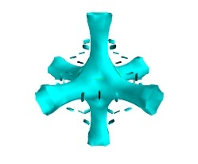
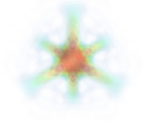
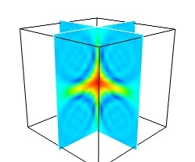

.. _an-overview-of-mayavi:

An overview of Mayavi
=====================

.. topic:: Section summary

    This section gives a quick summary of what is Mayavi, and should help
    you understand where, in this manual, find relevant information to
    your use case.

Introduction
-------------

Mayavi2 seeks to provide easy and interactive visualization of 3D
data, or 3D plotting.  It does this by the following:

    * an (optional) rich user interface with dialogs to interact with
      all data and objects in the visualization.

    * a simple and clean scripting interface in Python_, including ready
      to use 3D visualization functionality similar to matlab or
      `matplotlib`_ (using :ref:`mlab <simple-scripting-with-mlab>`), or 
      an object-oriented programming interface.

    * harnesses the power of VTK_ without forcing you to learn it.

Additionally, Mayavi2 strives to be a reusable tool that can be embedded
in your libraries and applications in different ways or be combined with
the Envisage_ application-building framework to assemble domain-specific
tools.

.. _Python: http://www.python.org
.. _VTK: http://www.vtk.org
.. _Envisage: http://docs.enthought.com/envisage
.. _matplotlib: http://matplotlib.sf.net

What is Mayavi2?
..................

Mayavi2 is a general purpose, cross-platform tool for 3-D scientific
data visualization. Its features include:

    * Visualization of scalar, vector and tensor data in 2 and 3
      dimensions.

    * Easy scriptability using Python.

    * Easy extendibility via custom sources, modules, and data filters.

    * Reading several file formats: VTK_ (legacy and XML), PLOT3D,
      etc.

    * Saving of visualizations.

    * Saving rendered visualization in a variety of image formats.

    * Convenient functionality for rapid scientific plotting via mlab
      (see :ref:`simple-scripting-with-mlab`).

Unlike its predecessor Mayavi1_, Mayavi2 has been designed with
scriptability and extensibility in mind from the ground up.  Mayavi2
provides a ``mayavi2`` application which is usable by itself.  However,
Mayavi2 may also be used as a plotting engine, in scripts, like with
matplotlib or gnuplot, as well as a library for interactive
visualizations in any other application.  It may also be used as an
`Envisage`_ plug-in which allows it to be embedded in other `Envisage`_
based applications natively.

.. _Mayavi1: http://mayavi.sourceforge.net

Technical details
...................

Mayavi2 provides a general purpose visualization engine based on pipeline architecture similar to that used in VTK.  Mayavi2 also provides
an `Envisage`_ plug-in for 2D/3D scientific data visualization. Mayavi2
uses the Enthought Tool Suite (ETS_) in the form of Traits_, TVTK_ and
Envisage_. Here are some of its features:

    * Pythonic API which takes full advantage of Traits_.

    * Mayavi can work natively and transparently with numpy_ arrays
      (this is thanks to its use of TVTK_).

    * Easier to script than Mayavi-1 due to a much cleaner MVC_ design.

    * Easy to extend with added sources, components, modules and data
      filters.

    * Provides an `Envisage`_ plug-in. This implies that it is:

          - easy to use other Envisage plugins in Mayavi.  For
            example, Mayavi provides an embedded Python shell.  This
            is an Envisage plug-in and requires one line of code to
            include in Mayavi.

          - easy to use Mayavi inside Envisage based applications.
            Thus, any envisage based application can readily use
            the mayavi plug-in and script it to visualize data.

    * wxPython/Qt4 based GUI (thanks entirely to Traits, PyFace and
      Envisage).  It is important to note that there is no wxPython or
      Qt4 code used directly in the Mayavi source. 

    * A non-intrusive reusable design. It is possible to use Mayavi
      without a wxPython or Qt4 based UI.

.. _ETS: http://code.enthought.com/projects/tool-suite.php
.. _Traits: https://docs.enthought.com/traits
.. _TVTK: https://docs.enthought.com/mayavi/tvtk
.. _MVC: http://en.wikipedia.org/wiki/Model-view-controller
.. _numpy: http://numpy.scipy.org

.. note::

    All the following sections assume you have a working Mayavi, for
    information on downloading and installing Mayavi, see the next section,
    :ref:`installation`.

Using Mayavi as an application, or a library?
-----------------------------------------------

As a user there are three primary ways to use Mayavi:

  1. Use the ``mayavi2`` application completely graphically.  More
     information on this is in the :ref:`using-the-mayavi-application` 
     section.

  2. Use Mayavi as a plotting engine from simple Python scripts, for
     example from Ipython, in combination with numpy.  The
     ``mlab`` scripting API provides a simple way of using Mayavi in
     batch-processing scripts, see :ref:`simple-scripting-with-mlab` for
     more information on this.

  3. Script the Mayavi application from Python. The Mayavi application 
     itself features a powerful and general purpose scripting API that
     can be used to adapt it to your needs.

      a. You can script Mayavi while using the ``mayavi2`` application
         in order to automate tasks and extend Mayavi's behavior.

      b. You can script Mayavi from your own Python based application.

      c. You can embed Mayavi into your application in a variety of
         ways either using Envisage_ or otherwise.

     More details on this are available in the 
     :ref:`advanced-scripting-with-mayavi` chapter.

.. _pipeline_model:

Scenes, data sources, and visualization modules: the pipeline model
--------------------------------------------------------------------

Mayavi uses pipeline architecture like VTK_.  As far as a user is
concerned this basically boils down to a simple hierarchy.

  * Data is loaded into Mayavi and stored in a **data source** 
    (either using a file or created from a script). Any number of data 
    files or data objects may be opened. Data sources are rich objects
    that describe the data, but not how to visualize it.

  * This data is optionally processed using :ref:`filters` that operate on
    the data and visualized using visualization :ref:`modules`.  The
    filters and **modules** are accessible in the application via the 
    `Visualize` menu on the UI or context menus on the pipeline. They may 
    also be instantiated as Python objects when scripting Mayavi.

    The reasons for separation between `data source`, the data container,
    and the visualizations tools used to look at it, the `modules`, is
    that there are many different ways of looking at the same data. For
    instance the following images are all made by applying different
    `modules` to the same data source:

    |volumetric_cut_plane| |volumetric_contour3d| |volumetric_volume_tweaked| 

  * All objects belong to a `Scene` -- this is an area
    where the 3D visualization is performed.  In the interactive
    application, new scenes may be created by using the 
    `File->New->VTK Scene` menu.

Loading data into Mayavi
-------------------------

Mayavi is a scientific data visualizer. There are two primary ways to
make your data available to it:

  1. Store your data in a supported file format like VTK legacy or 
     VTK XML files etc. See `VTK file formats`_ for more information on the 
     VTK formats. These files can be loaded in the interactive application 
     using the menus.

  2. Generate a TVTK dataset via numpy_ arrays or any other sequence.
     This is easiest done by using the scripting APIs, for instance `mlab`
     (see the paragraph on 
     :ref:`creating data sources with mlab <mlab_data_source>`, or simply
     the 3D plotting functions: :ref:`mlab_plotting_functions`).

Alternatively, if you wish to gain a deeper understanding by
creating VTK data structures or files, more information on datasets in general
is available in the :ref:`data-structures-used-by-mayavi` section.

.. _VTK file formats: http://www.vtk.org/VTK/img/file-formats.pdf 
.. _numpy: http://numpy.scipy.org
.. _VTK: http://www.vtk.org

..
   Local Variables:
   mode: rst
   indent-tabs-mode: nil
   sentence-end-double-space: t
   fill-column: 70
   End:

