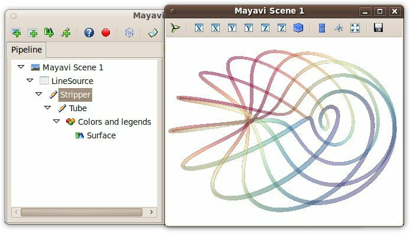
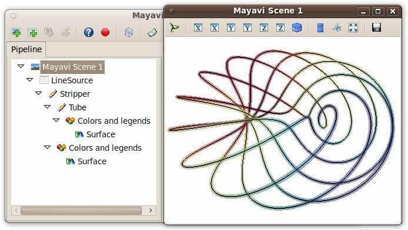

.. _organisation_mayavi_visualisations:

Organisation of Mayavi visualizations: the pipeline
====================================================

.. topic:: Mayavi and VTK pipelines

    Mayavi uses `VTK <http://www.vtk.org>`_ for all its visualization needs. 
    A pipeline concept underlies all the visualization in VTK. However,
    it is important to note that the pipeline used by Mayavi does not
    correspond to the VTK pipeline creating the visualization: the layout
    is different, the objects are not the same, and there are more nodes
    in a VTK pipeline. The two pipelines share some similarities, but in
    this section, we are only concerned by the Mayavi pipeline.

Anatomy of a Mayavi pipeline
------------------------------

Layout of a pipeline
.....................

* The top node of a Mayavi pipeline is called the `Engine`. It is
  responsible of the creation and destruction of the scenes. It is not
  displayed in the pipeline view.

* Below the `Engine`, you find `Scenes`.

* Each `Scene` has a set of data `Sources`: they expose the data to
  visualize to Mayavi.

* `Filters` can be applied to the `Sources` to transform the data they
  wrap.

* A `Module Manager` controls the colors used to represent the scalar or
  vector data. It is represented in the pipeline view as the node called
  `Colors and legends`.

* Visualization `Modules` finally display a reprensation of the data in
  the Scene, such as a surface, or lines.

Navigating in the pipeline
............................

Each object in the pipeline has a `parent` attribute that points to its
parent in the pipeline, as well as a `children` attribute, giving the
list of its children. The `name` attribute of the objects gives the name
of the node as it appears in the pipeline view. The edition dialog to
modify graphicaly the properties of an object can be displayed by calling
the `edit_traits()` method of this object.

In addition, Mayavi pipeline objects can only be in one scene, and their
`.scene` attribute point to this scene (see the
:ref:`example_volume_slicer` for an example of how the data can be shared
between scenes).

The link between different Mayavi entry points
------------------------------------------------

Every visualization created in Mayavi is constructed with a pipeline,
although the construction of the pipeline may be hidden from the user:

* The easiest way to make a Mayavi visualization is to create a pipeline
  via the user interface, as, for instance, exposed in the
  :ref:`Parametric surfaces examples <parametric_surfaces_example>`.

* The :ref:`mlab 3d plotting functions <mlab_plotting_functions>`,
  create full piplelines, comprising sources, modules, and possibly
  filters, to visualize numpy arrays. Displaying the 
  :ref:`pipeline view <mlab-changing-objects-interactively>` is the
  easiest way to understand what pipeline was built.

* Pipelines can also be built node-by-node with mlab, using the
  :ref:`mlab.pipeline functions<controlling-the-pipeline-with-mlab-scripts>`. 
  The name of the functions to call can simply be deduced 
  from the names of the pipeline nodes as they appear in the pipeline
  view.

* The objects composing a pipeline can be instantiated and added to the
  pipeline manually, as exposed 
  :ref:`further below <oo_construction_visualization>`.

A pipeline example examined
------------------------------------------------

Let us study the pipeline created by the `mlab.plot3d` function to
represent lines::

    import numpy as np
    phi = np.linspace(0., 2*np.pi, 1000)
    x	= np.cos(6*phi)*(1 + .5*np.cos(11*phi))
    y	= np.sin(6*phi)*(1 + .5*np.cos(11*phi))
    z	= .5*np.sin(11*phi)

    from mayavi import mlab
    surface = mlab.plot3d(x, y, z, np.sin(6*phi), tube_radius=0.025, colormap='Spectral', opacity=.5)

The `mlab.plot3d` function first creates a source made of points
connected by lines. Then it applies the `Stripper` filter, which
transforms this succession of lines in a 'strip'. Second, a `Tube`
filter is applied: from the 'strip' it creates tubes with a given radius.
Finally, the `Surface` module is applied to display the surface of the
tubes. The `surface` object returned by the `mlab.plot3d` function is
that final `Surface` module.

Let us have a look at the data in the pipeline before the tube filter was
applied. First we retrive the `Stripper` filter::

    stripper = surface.parent.parent.parent

Then we apply on it a `Surface` module to represent the `strip`::

    lines = mlab.pipeline.surface(stripper, color=(0, 0, 0))

All the properties of the different steps can be adjusted in the pipeline
view. In addition, they correspond to attributes on the various objects::

    >>> tubes = surface.parent.parent
    >>> tubes.filter.radius
    0.025000000000000001

The names in the dialogs of the various properties gives hints to which
attributes in the objects they correspond to. However, it can be fairly
challenging to find this correspondance. We suggest to use the 
:ref:`record feature <record_feature>` for this purpose.

